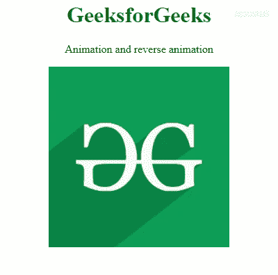
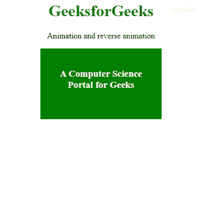

# 鼠标悬停后如何反转鼠标上的动画？

> 原文:[https://www . geesforgeks . org/如何在鼠标悬停后翻转动画/](https://www.geeksforgeeks.org/how-to-reverse-an-animation-on-mouse-out-after-hover/)

CSS 动画让网页上的各种元素逐渐从一种风格变成另一种风格。这些让网站看起来更加吸引人和有趣**反转一个动画**意味着向后播放。

**方法 1:** 此示例说明了使用**@关键帧从**到**@关键帧到**反转动画，反之亦然。

*   **语法:**
    *   ```html
        elementSelector {
          animation-name: myanimation;
        }
        @keyframes myanimation {
        from {
               //code        
           }
        to {
              //code
          }
        }
        ```

    *   ```html
        element.classList.add("myclassname");
        ```

*   **程序:**

    ```html
    <!DOCTYPE html>
    <html lang="en">

    <head>
        <meta charset="utf-8">
        <title>animation</title>
        <style>
            h1 {
                color: green;
            }

            .mystyle:hover {
                background-color: aqua;
                animation-name: myanimation;
                animation-duration: 2s;
                animation-fill-mode: forwards;
            }

            .mystyle {
                animation-name: reverse;
                animation-duration: 1s;
            }

            @keyframes myanimation {
                from {
                    transform: rotate(0deg) scale(1);
                    border-radius: 0px;
                }
                to {
                    border-radius: 100px;
                    transform: rotate(360deg) scale(0.7);
                }
            }

            @keyframes reverse {
                from {
                    border-radius: 100px;
                    transform: rotate(360deg) scale(0.7);
                }
                to {
                    border-radius: 0px;
                    transform: rotate(0deg) scale(1);
                }
            }
        </style>

    </head>

    <body>
        <center>
            <h1>GeeksforGeeks</h1>
            <p>Animation and reverse animation</p>
            
        </center>
    </body>

    </html>                                                                      
    ```

*   **输出:**
    

**方法 2:** 此示例说明了如何使用 transition 属性在鼠标悬停时创建动画效果，以及在鼠标移出事件时创建反转动画。

*   **程序:**

    ```html
    <!DOCTYPE html>
    <html lang="en">

    <head>
        <meta charset="utf-8">
        <title>animation</title>
        <style>
            h1 {
                color: green;
            }

            .div1 {
                padding: 20px;
                background: green;
                border-radius: 0px;
                cursor: pointer;
                color: white;
                text-align: center;
                transition-duration: 5s;
                height: 100px;
                width: 200px;
                -webkit-transition: all 1s ease;
                -moz-transition: all 1s ease;
                -o-transition: all 1s ease;
                -ms-transition: all 1s ease;
                transition: all 1s ease;
            }

            .div1:hover {
                background: #ff7b29;
                border-radius: 30px;
                transform: scale(1.5);
            }
        </style>
    </head>

    <body>
        <center>
            <h1>GeeksforGeeks</h1>
            <p>Animation and reverse animation</p>
            <div class="div1">
                <h3>A Computer Science Portal for Geeks</h3>
            </div>
        </center>
    </body>

    </html>                                         
    ```

*   **输出:**
    