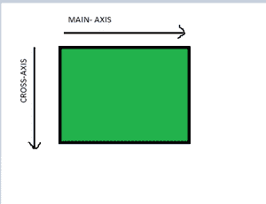
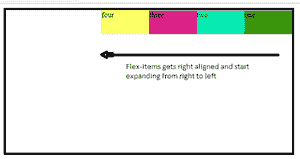
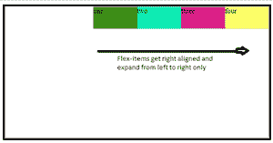

# 如何右对齐伸缩项？

> 原文:[https://www.geeksforgeeks.org/how-to-right-align-flex-item/](https://www.geeksforgeeks.org/how-to-right-align-flex-item/)

CSS | flex box

Flex-box 是一种简单的网页布局方法，它允许开发人员更容易地对齐元素。柔性盒的整个概念依赖于两大支柱:主轴和横轴。



柔性盒的表示

为了左/右对齐伸缩项，我们需要处理主轴，这可以使用伸缩框属性来完成。详细解释如下:

**示例 1:** 使用 **[弯曲方向属性](https://www.geeksforgeeks.org/css-flex-direction-property/)** 右对齐弯曲项

```
<!DOCTYPE html>
<html>
<head>
<title>Right Alignment</title>
<style>
  #container 
       { 
            width:600px;
            height: 300px; 
            border: 5px solid black; 
            display: flex; 
            flex-direction: row-reverse;
        } 
  #container div 
        { 
            width: 100px; 
            height: 50px; 
        } 
</style>  
</head>
<body>
<div id="container"> 
        <div style="background-color:#389900;">one</div> 
        <div style="background-color:#08ebb2;">two</div> 
        <div style="background-color:#dd2289;">three</div> 
        <div style="background-color:#fcff66;">four</div>     
 </div> 
</body>
</html>
```

当伸缩方向设置为“行反转”时，它不仅会右对齐伸缩项目，还会反转项目的顺序。简单地说，flex-items 现在从右向左扩展，如给定的图所示。

**输出:**



图 1

**示例 2:** 使用 **[对齐内容属性](https://www.geeksforgeeks.org/css-justify-content-property/)** 来右对齐伸缩项

```
<!DOCTYPE html>
<html>
<head>
<title>Right alignment</title>
<style>
  #container 
       { 
            width:600px;
            height: 300px; 
            border: 5px solid black; 
            display: flex; 
            justify-content: flex-end;
        } 
  #container div 
       { 
            width: 100px; 
            height: 50px; 
        } 
</style>
</head>
<body>
<div id="container"> 
        <div style="background-color:#389900;">one</div> 
        <div style="background-color:#08ebb2;">two</div> 
        <div style="background-color:#dd2289;">three</div> 
        <div style="background-color:#fcff66;">four</div>
 </div>
</body>
</html>
```

当调整内容设置为“伸缩结束”时，它会立即将所有伸缩项沿着主轴移动到伸缩容器的末端，即伸缩项右对齐。它与上面使用的方法的不同之处仅在于方向，因为在这种情况下，flex-item 将仅从左向右扩展。给定的数字会更清楚。

**输出**:



图 2