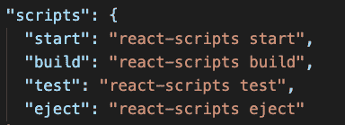
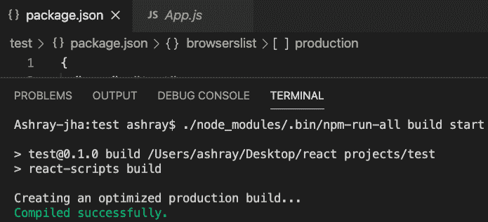
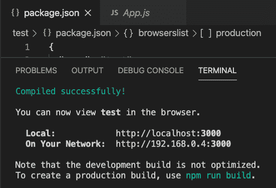
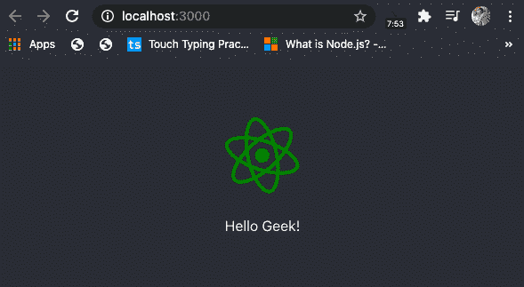
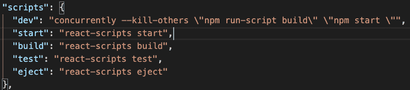
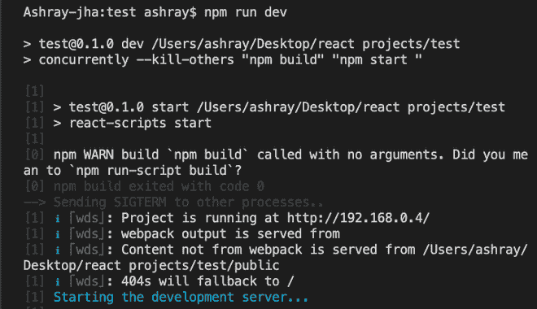

# 如何并行运行多个 npm 脚本？

> 原文:[https://www . geesforgeks . org/how-to-run-multi-NPM-scripts-in-parallel/](https://www.geeksforgeeks.org/how-to-run-multiple-npm-scripts-in-parallel/)

由于 npm 没有提供并行运行多个脚本的简单方法，我们可以尝试通过以下方式提出解决方案:

在 Localhost 服务器上创建一个基本的 React App 项目，同时，我们希望运行项目的构建操作。现在我们可以做的是，我们可以利用 **npm-run-all 包**，这将使我们能够轻松地在 Localhost 服务器上托管项目，并且我们还可以同时运行优化的构建以用于生产。

**方法 1(NPM-运行所有包):**我们可以使用“NPM-运行所有”包同时运行不同的脚本。首先，我们必须使用命令来安装包本身。

```
npm install npm-run-all — save-dev
```

安装完包后，我们必须导航到项目的 package.json 文件，我们可以看到“脚本”中列出了两个操作，即**【开始】** & **【构建】**，我们需要这两个操作来在服务器上托管项目并同时运行构建操作。



现在，我们的下一步将是在 Mac 上打开一个终端或在 Windows 上打开命令提示符，并将**“CD”**放入项目目录并键入命令**。/node_modules/。bin/NPM-运行-所有构建开始”**并按回车键。

在我们所做的本地安装案例中，npm-run-all 将被安装到我们项目的 node_modules
目录中。PATH 环境变量不包括那里，所以我们必须使用

```
./node_modules/.bin/npm-run-all 
(or $(npm bin)/npm-run-all)  to run npm-run-all command.
```

**控制台输出:**



生成操作已成功执行



该应用程序已成功托管在服务器上

因此，我们现在可以看到我们的应用程序成功地托管在本地服务器上，并且构建操作在单个包“npm-run-all”的帮助下完美地执行。

**浏览器输出:** 

**方法 2(使用并发包):**在此方法中，我们将使用**并发包。**使用这个包，我们可以将“npm run start”和“npm run build”等不同的脚本命令组合成单个脚本，然后在命令行中运行。

首先，使用以下命令在项目目录中安装包:

```
npm install concurrently --save
```

同样，在安装包之后，我们必须导航到项目的 package.json 文件，我们可以看到“脚本”中列出了两个操作，即“启动”和“构建”，我们需要这两个操作来将项目托管在服务器上并同时运行构建操作。

现在我们必须在 package.json 文件的**脚本**中包含一个 **dev** 脚本，它将保存我们不同的命令。



使用**–杀死其他人**开关，如果一个人死亡，所有命令都会被杀死。

我们可以按照这个来创建我们自己的开发脚本:

```
"dev": "concurrently \"command1 arg\" \"command2 arg\""
```

现在，我们只需使用以下命令即可运行整个命令:

```
npm run dev
```

**控制台输出:**

