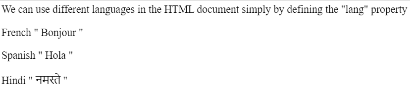
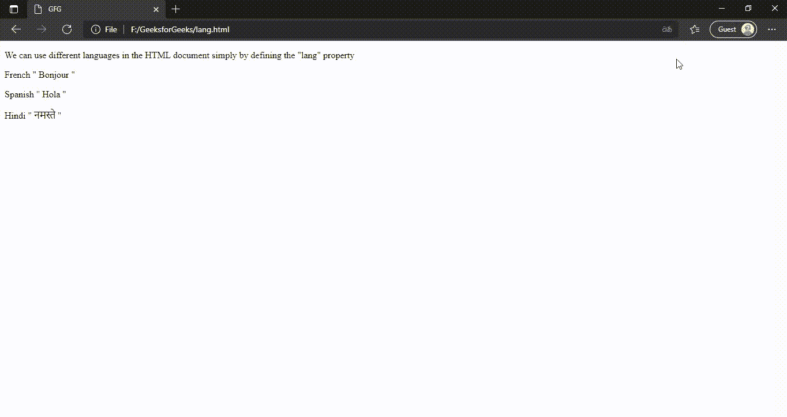

# 如何为一个页面提供多种语言的内容？

> 原文:[https://www . geeksforgeeks . org/如何提供多语言内容页面/](https://www.geeksforgeeks.org/how-to-serve-a-page-with-content-in-multiple-languages/)

在本文中，我们将了解如何以多种语言提供页面内容。我们可以通过在代码中设置 **lang** 属性来设置 HTML 文档中的语言。默认情况下，指定的语言是英语，但可以在我们方便的时候更改。有一种方法可以通过使用谷歌来改变内容语言，你可以查看这篇文章，[如何在你的网页上添加谷歌翻译按钮？](https://www.geeksforgeeks.org/add-google-translate-button-webpage/)、
**默认:**

```html
<html lang="en">
```

要更改语言，只需简单设置 **lang** 属性即可。我们可以在文档的任何地方定义它，例如在正文、段落、标题或 span 标签中。但最好的做法是在跨度标签中设置**朗**。

*   **例 1:** 和这里一样，我们在 span 标签中把语言改成了法语。

    ```html
    <p> French " <span lang="fr"> Bonjour </span> " </p>
    ```

*   **例 2:**

    ```html
    <p> Spanish " <span lang="es">Hola</span> "</p>
    ```

现在让我们看看整个 HTML 代码，通过它我们可以更好地理解它。请注意，通过更改 **lang** 属性，HTML 文档的视觉效果保持不变。唯一不同的是那种语言的翻译。

为了完成这项任务，我们有两种方法来达到同样的结果。首先，我们遵循下面的方法，其中 HTML strong lang 属性设置为英语或法语或任何合适的语言&第二种方法，我们将使用谷歌翻译应用编程接口引用&将该应用编程接口添加到我们的 Html 代码中。让我们从第一种方法开始讨论。

在下面，有两个例子显示了当您更改 HTML 文档的语言而不是浏览器语言时会发生什么。在第一个示例中，HTML 文档以“英语”语言提供服务，而在第二个示例中，HTML 文档以“法语”语言提供服务。

**示例 1:** 英语的 HTML 文档

## 超文本标记语言

```html
<!DOCTYPE html>
<html lang="en">

<body>
    <p>
        We can use different languages in the HTML
        document simply by defining the
        "lang" property
    </p>

    <p>French " <span lang="fr">Bonjour</span> "</p>
    <p>Spanish " <span lang="es">Hola</span> "</p>
    <p>Hindi " <span lang="hi">नमस्ते</span> "</p>
</body>

</html>
```

**输出:**



使用英语时的输出

**示例 2:** 不同语言(英语除外)的 HTML 文档(此处使用法语)

## 超文本标记语言

```html
<!DOCTYPE html>
<html lang="fr">

<body>
    <p>
        We can use different languages in the HTML
        document simply by defining the
        "lang" property
    </p>

    <p>French " <span lang="fr">Bonjour</span> "</p>
    <p>Spanish " <span lang="es">Hola</span> "</p>
    <p>Hindi " <span lang="hi">नमस्ते</span> "</p>

</body>

</html>
```

**输出:**在这里，可以看到 HTML 文档中没有区别。除了语言是英语还是法语之外，它看起来完全一样。唯一的区别是，浏览器将能够理解或识别整个 HTML 文档的语言是法语或英语或其他语言，并基于此将页面翻译成您首选的语言。



语言翻译