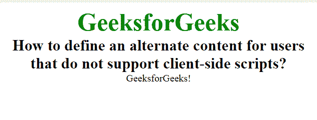

# 如何为不支持客户端脚本的用户设置替代内容？

> 原文:[https://www . geesforgeks . org/如何为不支持客户端脚本的用户设置替代内容/](https://www.geeksforgeeks.org/how-to-set-alternate-content-for-users-that-do-not-support-client-side-scripts/)

在本文中，我们通过在 HTML 文档中使用 **< noscript >** 标签，为不支持客户端脚本的用户定义了一个替代内容。它用于显示那些不支持脚本标记的浏览器的文本，或者浏览器为用户禁用脚本。

**语法:**

```htmlhtml
<noscript> Contents... </noscript>
```

**示例:**

```htmlhtml
<!DOCTYPE html>
<html>

<head>
    <style>
        body {
            text-align: center;
        }

        .gfg {
            font-size: 40px;
            font-weight: bold;
            color: green;
        }

        .geeks {
            font-size: 25px;
            font-weight: bold;
        }
    </style>

    <noscript>
        Sorry, your browser does 
        not support JavaScript!
    </noscript>
</head>

<body>
    <div class="gfg">
        GeeksforGeeks
    </div>

    <div class="geeks">
        How to define an alternate content
        for users that do not support 
        client-side scripts?
    </div>

    <script>
        document.write("GeeksforGeeks!") 
    </script>
</body>

</html>           
```

**输出:**


**支持的浏览器如下:**

*   谷歌 Chrome
*   微软公司出品的 web 浏览器
*   火狐浏览器
*   歌剧
*   旅行队