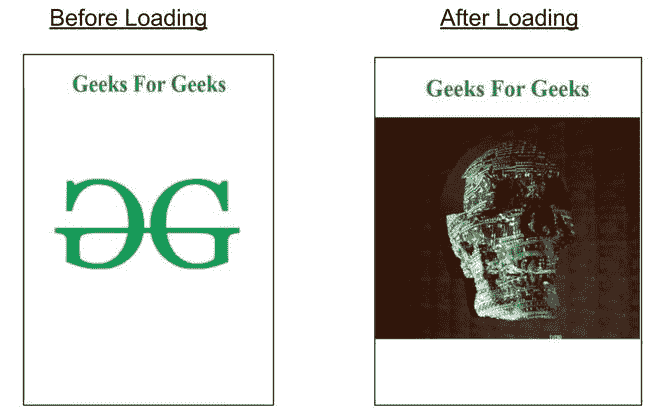

# 如何在谷歌 amp 中为 amp-anim 设置图像占位符？

> 原文:[https://www . geesforgeks . org/如何设置图像占位符-amp-anim-in-google-amp/](https://www.geeksforgeeks.org/how-to-set-an-image-placeholder-for-amp-anim-in-google-amp/)


如果你想在你的放大器网页上嵌入一个动画，那么你可以使用这个标签。它帮助开发者在你的网络平台中嵌入动画、gif、webp 等。这真的是一个非常有用的标签，因为在你的网站上有动画真的使它俗气和好看。

**设置:**要在你的 amp 网页中使用 amp-anim，你必须导入这个脚本。

## 超文本标记语言

```
<script async custom-element="amp-anim" src=
"https://cdn.ampproject.org/v0/amp-anim-0.1.js">
</script>
```

它在大多数方面与 amp-img 相似。

为了添加一个占位符，我们将使用 amp-img 来添加一个占位符，如果动画没有被加载，它将被显示。

## 超文本标记语言

```
<amp-img placeholder
   src="#">
</amp-img>
```

**示例:**

## 超文本标记语言

```
<!doctype html>
<html amp>

<head>
    <meta charset="utf-8">
    <title>Google AMP amp-anim</title>

    <script async src=
        "https://cdn.ampproject.org/v0.js">
    </script>

    <!-- Import animation component in header -->
    <script async custom-element=
        "amp-anim" src=
"https://cdn.ampproject.org/v0/amp-anim-0.1.js">
    </script>

    <meta name="viewport" content=
"width=device-width,minimum-scale=1,initial-scale=1">

    <link rel="canonical" href=
"https://amp.dev/documentation/examples/components/amp-anim/index.html">

    <style amp-boilerplate>
        body {
            -webkit-animation: -amp-start 8s 
                steps(1, end) 0s 1 normal both;

            -moz-animation: -amp-start 8s 
                steps(1, end) 0s 1 normal both;

            -ms-animation: -amp-start 8s 
                steps(1, end) 0s 1 normal both;

            animation: -amp-start 8s 
                steps(1, end) 0s 1 normal both
        }

        @-webkit-keyframes -amp-start {
            from {
                visibility: hidden
            }

            to {
                visibility: visible
            }
        }

        @-moz-keyframes -amp-start {
            from {
                visibility: hidden
            }

            to {
                visibility: visible
            }
        }

        @-ms-keyframes -amp-start {
            from {
                visibility: hidden
            }

            to {
                visibility: visible
            }
        }

        @-o-keyframes -amp-start {
            from {
                visibility: hidden
            }

            to {
                visibility: visible
            }
        }

        @keyframes -amp-start {
            from {
                visibility: hidden
            }

            to {
                visibility: visible
            }
        }
    </style>
    <noscript>
        <style amp-boilerplate>
            body {
                -webkit-animation: none;
                -moz-animation: none;
                -ms-animation: none;
                animation: none
            }
        </style>
    </noscript>
    <style amp-custom>
        h1 {
            color: forestgreen;
        }
    </style>
</head>

<body>
    <center>
        <h1>
            Geeks For Geeks
        </h1>
    </center>

    <amp-anim height="300" src=
"https://media.giphy.com/media/xULW8rv9NSbHaEe9Ak/giphy.gif" 
        alt="an animation"
        attribution="GeeksForGeeks">

        <amp-img placeholder height="300"
            src=
"https://media.geeksforgeeks.org/wp-content/uploads/20200811003251/logo.png">
        </amp-img>
    </amp-anim>
</body>

</html>
```

**输出:**

