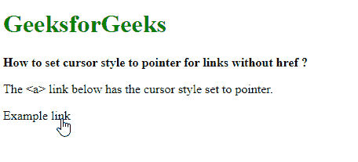
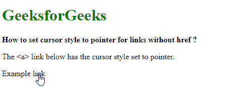

# 对于没有 href 的链接，如何将光标样式设置为指针？

> 原文:[https://www . geeksforgeeks . org/如何设置光标样式的无 href 链接指针/](https://www.geeksforgeeks.org/how-to-set-cursor-style-to-pointer-for-links-without-href/)

**方法 1:为链接使用 CSS 类**
创建一个 CSS 类来改变光标属性。**光标**属性用于指定当鼠标指向元素时要显示的鼠标光标。在此属性中使用“指针”值会将光标更改为指示链接的“指针”。

然后，这个类可以用在任何没有 href 属性来显示指针的链接上。

**语法:**

```
.pointer-link {
  cursor: pointer;
}
```

**示例:**

```
<!DOCTYPE html>
<html>

<head>
    <title>How to set cursor style 
      to pointer for links without href ?</title>
    <style>
        .pointer-link {
            cursor: pointer;
        }
    </style>
</head>

<body>
    <h1 style="color: green">
      GeeksforGeeks
  </h1>
    <b>How to set cursor style to
      pointer for links without href ?</b>

    <p>The <a> link below
      has the cursor style set to pointer.</p>

    <a class="pointer-link">Example link</a>
</body>

</html>
```

**输出:**


**方法 2:对每个链接使用 onmouseover 事件来更改样式**
**onmouseover**事件在鼠标指针移动到元素或其子元素上时触发。访问元素的样式属性并更改光标属性。
光标属性用于指定鼠标光标指向元素时显示的光标。在此属性中使用“指针”值会将光标更改为指示链接的指针。

这个事件可以用在任何没有 href 属性来显示指针的链接上。

**语法:**

```
<a onmouseover="this.style.cursor='pointer'>Example link</a>
```

**示例:**

```
<!DOCTYPE html>
<html>

<head>
    <title>How to set cursor style
      to pointer for links without href ?</title>
</head>

<body>
    <h1 style="color: green">
      GeeksforGeeks
  </h1>
    <b>How to set cursor style 
      to pointer for links without href ?</b>

    <p>The <a> link below 
      has the cursor style set to pointer.</p>

    <a onmouseover="this.style.cursor='pointer'">Example link</a>
</body>

</html>
```

**输出:**
