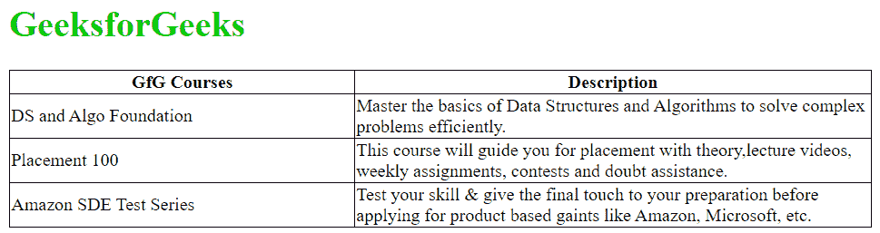

# 如何在表格中设置的固定宽度？

> Original: [https://www.geeksforgeeks.org/How to set the fixed width of td in the table/](https://www.geeksforgeeks.org/how-to-set-fixed-width-for-td-in-a-table/)

在设计网页的过程中，对表格的要求是很正常的。HTML 提供了 [**<表>** **标签**](https://www.geeksforgeeks.org/html-tables/) 来构造表并定义行和列[**<tr>**](https://www.geeksforgeeks.org/html-tr-align-attribute/)和[**<TD>**](https://www.geeksforgeeks.org/html-td-align-attribute/)标签分别使用。

默认情况下，表格中的行和列的尺寸由浏览器以适合内容的方式自动调整。但是，可能存在需要固定列宽的情况。 **< td >** **标签**的宽度有多种固定方式。下面提到了其中的一些:

*   [**Use the width attribute:**](https://www.geeksforgeeks.org/html-td-width-attribute/) **< TD >** The tag has the **width** attribute to control the width of a specific column. Specify a number between 0 and 100 for this attribute based on the percentage (or you can use pixel format). We can limit the column width to a percentage of the total table width. Invalid width, has been rejected, **HTML5** is no longer supported.

## html

```htmlhtml
<!DOCTYPE html>
<html>
    <head>
        <title>
          Set up fixed width for
        </title>
        <meta charset="UTF-8" />
        <meta name="viewport" 
              content="width=device-width, 
                       initial-scale=1.0" />

        <style>
            table,
            th,
            td {
                border: 1px solid black;
                border-collapse: collapse;
            }
        </style>
    </head>
    <body>
        <h1 style="color: #00cc00;">
         GeeksforGeeks
        </h1>

        <!-- Making the table responsive -->
        <div style="overflow-x: auto;">

            <!-- Adding table in the web page -->
            <table width="50%">
                <tr>
                    <th>GfG Courses</th>
                    <th>Description</th>
                </tr>
                <tr>
                    <td width="40%">
                      DS and Algo Foundation
                    </td>
                    <td width="60%">
                      Master the basics of Data Structures
                      and Algorithms to solve complex 
                      problems efficiently.
                    </td>
                </tr>
                <tr>
                    <td width="40%">Placement 100</td>
                    <td width="60%">
                      This course will guide you for 
                      placement with theory,lecture videos,
                      weekly assignments, contests and doubt 
                      assistance.
                    </td>
                </tr>
                <tr>
                    <td width="40%">
                      Amazon SDE Test Series
                    </td>
                    <td width="60%">
                      Test your skill & give the final 
                      touch to your preparation before 
                      applying for product based against 
                      like Amazon, Microsoft, etc.
                    </td>
                </tr>
            </table>
        </div>
    </body>
</html>
```

*   **Using CSS:** Cascading Style Sheets (CSS) are widely used to decorate huge web pages. With CSS, the style of HTML elements can be easily modified. In order to fix the width of **TD** tag, the nth child CSS is used to set the attributes of specific columns in each row of the table (determined by the value of **n** ).

## html

```htmlhtml
<!DOCTYPE html>
<html>
    <head>
        <title>Set up fixed width for <td></title>
        <meta charset="UTF-8" />
        <meta name="viewport"
              content="width=device-width, 
                       initial-scale=1.0" />

        <style>
            table,
            th,
            td {
                border: 1px solid black;
                border-collapse: collapse;
            }

            table {
                width: 50%;
            }

            // Fixing width of first 
            // column of each row 
            td:nth-child(1) {
                width: 40%;
            }

            // Fixing width of second 
            // column of each row 
            td:nth-child(2) {
                width: 60%;
            }
        </style>
    </head>
    <body>
        <h1 style="color: #00cc00;">
         GeeksforGeeks
        </h1>

        <!-- Making the table responsive -->
        <div style="overflow-x: auto;">

            <!-- Adding table in the web page -->
            <table>
                <tr>
                    <th>GfG Courses</th>
                    <th>Description</th>
                </tr>

                <tr>
                    <td>DS and Algo Foundation</td>
                    <td>
                       Master the basics of Data Structures 
                       and Algorithms to solve complex 
                       problems efficiently.
                    </td>
                </tr>

                <tr>
                    <td>Placement 100</td>
                    <td>
                     Test your skill & give the final touch
                     to your preparation before applying for
                     product based against like Amazon, 
                     Microsoft, etc.
                    </td>
                </tr>
                <tr>
                    <td>Amazon SDE Test Series</td>
                    <td>
                     Test your skill & give the final touch 
                     to your preparation before applying for
                     product based gaints like Amazon, 
                     Microsoft, etc.
                    </td>
                </tr>
            </table>
        </div>
    </body>
</html>
```

*   **Use col tag and fix table layout attributes:** If every row of the table should follow the same column attribute, it is a good idea to use **COL** tag to define column attributes. If the **Col** tag is written in the HTML document for the first time and its attributes are set, then those all attributes refer to the first column of each row in the table, in which it is mentioned. Similarly, using the **Col** tag for the second time and defining its attributes will affect the second column in each row of the table. In addition, adjust the long text **CSS attribute** table layout in the column: fixed; Be used. The following is the implementation.

## html

```htmlhtml
<!DOCTYPE html>
<html>
    <head>
        <title>Set up fixed width for</title>
        <meta charset="UTF-8" />
        <meta name="viewport" 
              content="width=device-width, 
                       initial-scale=1.0" />

        <style>
            table,
            th,
            td {
                border: 1px solid black;
                border-collapse: collapse;
            }

            table {
                width: 50%;
            }

            table.fixed {
                table-layout: fixed;
            }
            table.fixed td {
                overflow: hidden;
            }
        </style>
    </head>
    <body>
        <h1 style="color: #00cc00;">
         GeeksforGeeks
        </h1>

        <!-- Making the table responsive -->
        <div style="overflow-x: auto;">
            <!-- Adding table in the web page -->
            <table>
                <!-- Assigning width of first
                     column of each row as 40% -->
                <col style="width: 40%;" />

                <!-- Assigning width of second 
                     column of each row as 60% -->
                <col style="width: 60%;" />

                <tr>
                    <th>GfG Courses</th>
                    <th>Description</th>
                </tr>

                <tr>
                    <td>DS and Algo Foundation</td>
                    <td>
                      Master the basics of Data Structures
                      and Algorithms to solve complex 
                      problems efficiently.
                    </td>
                </tr>

                <tr>
                    <td>Placement 100</td>
                    <td>
                      This course will guide you for 
                      placement with theory,lecture 
                      videos, weekly assignments,
                      contests and doubt assistance.
                    </td>
                </tr>

                <tr>
                    <td>Amazon SDE Test Series</td>
                    <td>
                     Test your skill & give the final touch
                     to your preparation before applying for
                     product based against like Amazon, 
                     Microsoft, etc.
                    </td>
                </tr>
            </table>
        </div>
    </body>
</html>
```

*   **Output:** The output of each method will be the same.



HTML 是网页的基础，是通过结构化网站和 web apps 用于网页开发的。跟随本 [HTML 教程](https://www.geeksforgeeks.org/html-tutorials/)和 [HTML 示例](https://www.geeksforgeeks.org/html-examples/)可以从头开始学习 HTML。

CSS 是网页的基础，是通过样式化网站和 web apps 来进行网页开发的。遵循本 [CSS 教程](https://www.geeksforgeeks.org/css-tutorials/)和 [CSS 示例](https://www.geeksforgeeks.org/css-examples/)可以从头开始学习 CSS。