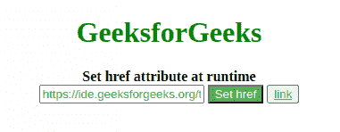

# 如何在运行时设置 href 属性？

> 原文:[https://www . geesforgeks . org/how-set-href-attribute-at-runtime/](https://www.geeksforgeeks.org/how-to-set-href-attribute-at-runtime/)

我们知道如何设置锚点标签 int [**HTML**](https://www.geeksforgeeks.org/html-tutorials/) 的 [**href 属性**](https://www.geeksforgeeks.org/html-a-href-attribute/) ，但有时我们可能会要求在运行时设置 href 属性，例如，当用户向我们提供一个 url 并且我们想要在运行时设置它时。我们可以借助 [**jQuery**](https://www.geeksforgeeks.org/jquery-tutorials/) 来做到这一点。

**示例 1:** 在本例中，使用 jquery，当用户点击 set href 按钮时，我们将 [**attr()**](https://www.geeksforgeeks.org/jquery-attr-method/) 方法设置为用户在输入标签中输入的 url。

## 超文本标记语言

```
<!DOCTYPE html>
<html lang="en">
    <head>
        <meta charset="UTF-8" />
        <meta name="viewport"
              content="width=device-width, initial-scale=1.0" />
        <meta http-equiv="X-UA-Compatible" content="ie=edge" />
        <script src=
"https://code.jquery.com/jquery-2.1.1.min.js">
        </script>
        <title>Set href attribute at runtime</title>
        <style>
            #btn {
                background-color: #4caf50;
                color: white;
            }
            input {
                color: #4caf50;
            }
            a {
                color: #4caf50;
            }
            h1 {
                color: green;
            }
        </style>
    </head>
    <body>
        <center>
            <h1>GeeksforGeeks</h1>
            <b>Set href attribute at runtime</b>
            <br>
            <input type="text" name="url" />
            <button id="btn">Set href</button>
            <button>
                <a id="click" href="#"
                   target="_blank">
                    link
                </a>
           </button>
        </center>
    </body>

    <script>
        $(document).ready(function () {
            $("#btn").click(function () {
                $("#click").attr("href",
                $('input[name$="url"]').val());
            });
        });
    </script>
</html>
```

**输出:**



**示例 2:** 在本例中，我们用另一个锚标记替换 div‘link’中的锚标记，以更改 **href** 值。这是我们可以更改**属性的值的另一种方式。**

## 超文本标记语言

```
<!DOCTYPE html>
<html lang="en">
    <head>
        <meta charset="UTF-8" />
        <meta name="viewport"
              content="width=device-width, initial-scale=1.0" />
        <meta http-equiv="X-UA-Compatible"
                   content="ie=edge" />
        <script src=
"https://code.jquery.com/jquery-2.1.1.min.js">
        </script>
        <title>Set href attribute at runtime</title>
        <style>
            #btn {
                background-color: #4caf50;
                color: white;
            }
            input {
                color: #4caf50;
            }
            a {
                color: #4caf50;
            }
            h1 {
                color: green;
            }
        </style>
    </head>
    <body>
        <center>
            <h1>GeeksforGeeks</h1>
            <b>Set href attribute at runtime</b>
            <br>
            <div id="link">
                <a id="click" href=
"https://practice.geeksforgeeks.org/"
                     target="_blank">
                  https://practice.geeksforgeeks.org/
              </a>
              <button id="btn">Change url</button>
            </div>
        </center>
    </body>

    <script>
        $(document).ready(function () {
            $("#btn").click(function () {
                $("#link").html(
"<a href='https://www.geeksforgeeks.org/'>
       https://www.geeksforgeeks.org</a>");
  alert("Url changed to https://www.geeksforgeeks.org/");
            });
        });
    </script>
</html>
```

**输出:**

