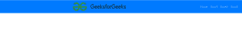

# 如何将图像设置到响应导航条的中心？

> 原文:[https://www . geeksforgeeks . org/如何将图像设置到响应中心-navbar/](https://www.geeksforgeeks.org/how-to-set-image-to-center-of-an-responsive-navbar/)

为了让网站反应灵敏，聪明的做法是使用 Bootstrap。通过使用 Bootstrap，我们可以使我们的网站看起来很好，反应迅速。

有两种方法可以在响应式导航条的中央设置图像或徽标。它们是:

*   **使用 CSS**
*   **使用自举**

现在让我们了解他们每个人。

**使用 CSS:** 在这个方法中，我们使用自己的样式将图像居中放置在导航栏中。我们将把 **CSS** 代码嵌入到 **HTML** 代码中。在这里，我们已经将 **flex** 属性赋予了我们的品牌(图像或徽标)**的宽度为 100%** ，并将内容调整为****中心**。这些属性将我们的徽标设置在导航栏的中心。**

****示例:****

```html
<!DOCTYPE html>
<html>

<head>
    <link rel="stylesheet" href=
"https://stackpath.bootstrapcdn.com/bootstrap/4.4.1/css/bootstrap.min.css"
        integrity=
"sha384-Vkoo8x4CGsO3+Hhxv8T/Q5PaXtkKtu6ug5TOeNV6gBiFeWPGFN9MuhOf23Q9Ifjh"
        crossorigin="anonymous" />

    <link rel="stylesheet" href=
"https://cdnjs.cloudflare.com/ajax/libs/font-awesome/4.7.0/css/font-awesome.min.css" />

    <link rel="stylesheet" href=
"https://cdnjs.cloudflare.com/ajax/libs/font-awesome/4.7.0/css/font-awesome.min.css" />

    <style type="text/css">
        .navbar-brand {
            display: flex;
            width: 100%;
            justify-content: center;
        }
    </style>
</head>

<body>
    <nav class="navbar navbar-expand-lg 
                    navbar-dark bg-primary">

        <!-- Brand and toggle get grouped 
            for better mobile display -->
        <a class="navbar-brand" href="#">
            
        </a>

        <button class="navbar-toggler" type="button"
            data-toggle="collapse" data-target=
            "#bs-example-navbar-collapse-1"
            aria-controls="bs-example-navbar-collapse-1"
            aria-expanded="false" 
            aria-label="Toggle navigation">

            <span class="navbar-toggler-icon"></span>
        </button>

        <!-- Anything inside of collapse 
            navbar-collapse goes into the "hamburger" -->
        <div class="collapse navbar-collapse" 
            id="bs-example-navbar-collapse-1">

            <ul class="navbar-nav ml-auto">
                <li class="nav-item">
                    <a class="nav-link" href="#">
                        Home
                        <span class="sr-only">
                            (current)
                        </span>
                    </a>
                </li>

                <li class="nav-item">
                    <a class="nav-link" href="#">
                        Item1
                    </a>
                </li>

                <li class="nav-item">
                    <a class="nav-link" href="#">
                        Item2
                    </a>
                </li>

                <li class="nav-item">
                    <a class="nav-link" href="#">
                        Item3</a>
                </li>
            </ul>
        </div>
    </nav>

    <script src="https://code.jquery.com/jquery-3.4.1.js" integrity=
        "sha256-WpOohJOqMqqyKL9FccASB9O0KwACQJpFTUBLTYOVvVU=" 
        crossorigin="anonymous">
    </script>

    <script src=
"https://maxcdn.bootstrapcdn.com/bootstrap/4.4.1/js/bootstrap.min.js">
    </script>

    <script src=
"https://cdnjs.cloudflare.com/ajax/libs/web-animations/2.3.1/web-animations.min.js">
    </script>
</body>

</html>
```

****输出:****

****

**我们可以看到 GeeksforGeeks 标志对齐在导航栏的中央，而其他所有导航栏项目都在右侧。**

****使用 Bootstrap:** 在这个方法中，我们可以省去自己编写额外的 **CSS** 代码。我们只需要添加一个带有类的 div 标签作为**容器**，并将 navbar-brand(图像或标志)放入这个 div 中。之后，我们只需要在 navbar 品牌类中添加类 **mx-auto** 。 **mx-auto** 类是 **Bootstrap** 类，只是调整左右两边的边距，使内容在**中心**对齐。**

****示例:****

```html
<!DOCTYPE html>
<html>

<head>
    <title>Navbar</title>
    <link rel="stylesheet" href=
"https://stackpath.bootstrapcdn.com/bootstrap/4.4.1/css/bootstrap.min.css"
        integrity=
"sha384-Vkoo8x4CGsO3+Hhxv8T/Q5PaXtkKtu6ug5TOeNV6gBiFeWPGFN9MuhOf23Q9Ifjh"
        crossorigin="anonymous" />

    <link rel="stylesheet" href=
"https://cdnjs.cloudflare.com/ajax/libs/font-awesome/4.7.0/css/font-awesome.min.css" />

    <link rel="stylesheet" href=
"https://cdnjs.cloudflare.com/ajax/libs/font-awesome/4.7.0/css/font-awesome.min.css" />

    <link rel="stylesheet" type="text/css" 
        href="gfg.css" />
</head>

<body>
    <nav class="navbar navbar-expand-lg 
        navbar-dark bg-primary">

        <!-- Brand and toggle get grouped for 
            better mobile display -->
        <div class="container">
            <a class="navbar-brand mx-auto" href="#">
                
            </a>
        </div>

        <button class="navbar-toggler" type="button"
            data-toggle="collapse" data-target
            ="#bs-example-navbar-collapse-1"
            aria-controls="bs-example-navbar-collapse-1"
            aria-expanded="false" 
            aria-label="Toggle navigation">

            <span class="navbar-toggler-icon"></span>
        </button>

        <!-- Anything inside of collapse navbar-collapse
            goes into the "hamburger" -->
        <div class="collapse navbar-collapse" 
            id="bs-example-navbar-collapse-1">

            <ul class="navbar-nav ml-auto">
                <li class="nav-item">
                    <a class="nav-link" href="#">
                        Home<span class="sr-only">(current)</span>
                    </a>
                </li>

                <li class="nav-item">
                    <a class="nav-link" href="#">Item1</a>
                </li>

                <li class="nav-item">
                    <a class="nav-link" href="#">Item2</a>
                </li>

                <li class="nav-item">
                    <a class="nav-link" href="#">Item3</a>
                </li>
            </ul>
        </div>
    </nav>

    <script src="https://code.jquery.com/jquery-3.4.1.js"
        integrity="sha256-WpOohJOqMqqyKL9FccASB9O0KwACQJpFTUBLTYOVvVU=" 
        crossorigin="anonymous">
    </script>

    <script src=
"https://maxcdn.bootstrapcdn.com/bootstrap/4.4.1/js/bootstrap.min.js">
    </script>

    <script src=
"https://cdnjs.cloudflare.com/ajax/libs/web-animations/2.3.1/web-animations.min.js">
    </script>
</body>

</html>
```

****输出:****

****

**我们可以看到 GeeksforGeeks 标志与导航栏的中心对齐，而所有其他导航栏项目都在右侧。通过这两种方式，我们可以想象在一个反应灵敏的导航条中央。**