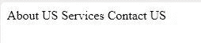

# 如何使用 UI-Router 设置或更新页面标题？

> 原文:[https://www . geesforgeks . org/如何设置或更新页面标题-使用 ui-router/](https://www.geeksforgeeks.org/how-to-set-or-update-page-title-using-ui-router/)

**UI-Router:** UI-Router 是客户端路由器。它是为单页 web 应用程序制作的。当用户浏览单页应用程序时，客户端路由器会更新浏览器网址。

AngularJS 允许您在不同阶段更改页面标题

让我们看看如何更改标题

*   在我们的$状态中使用解析函数来告诉标题*   使用$rootScope。$on(…)函数。奔跑*   by updating the title in our controller, good for dynamic page titles, like blog posts, etc.
    This is the way you can set page title using UI-Router

    **使用解析:**
    安装 **angular-ui-title** 并像往常一样追加到你的 angular 项目中，然后别忘了在你的父应用模块中注入 **ui-router-title** 。

    ```html
    angular.module('codeSide', [
                    'ui.router', 'ui.router.title'])

    .config(['$stateProvider',
             '$urlRouterProvider', 
          function($stateProvider, $urlRouterProvider) {

      $stateProvider
        .state('home', {
          url: '/',
          templateUrl: 'home/home.html',
          controller: 'HomeController',
          resolve: function() {
            $title: 'Homepage'
          }
        })
       // other states here
       .....

    )]);
    ```

    在你的*索引文件*中代码应该是

    ```html
    <head>
        <title ng-bind=
             "($title || 'Home') + ' :: CodeBySide'">
         CodeBySide
        </title>
    </head>
    About US
    Services
    Contact US
    <head>
        <title ng-bind=
              "($title || 'Home') + ' :: CodeBySide'">
             CodeBySide
         </title>
    </head>
    ```

    **输出:**
    

    我们的标题不是在上面的代码中动态生成的。

    **获取要动态生成的标题**
    angular-ui-router 更改$rootScope 以使$title 变量在整个站点可用。

    **示例:**

    ```html
    codeObject.$loaded()
      .then(function(data) {

      $rootScope.$title = data.title; 
       // update title with detail page
      // other code here
      }
    ```

    **是使用角度-ui-title 方法。**

    使用 **$rootScope。$on(…)**
    在这种方法中 **ui-router** 允许在我们的$state 配置中添加任意键:value 东西，可以随时随地被引用。

    **示例:**

    ```html
    .state('detail', {
      url: '/codes/:codeId',
      templateUrl: 'codes/detail.html',
      controller: 'DetailController',
      data: {
         title: 'Code Detail'
      }
    })
    ```

    通过这种方法，我们需要在*内有一个额外的中介方法。运行我们 app 的*功能。

    ```html
    .run(['$rootScope', '$state',
      function($rootScope, $state) {

        $rootScope.$on('$stateChangeSuccess', function() {
          $rootScope.title = $state.current.data.title;
        });
      }
    ])
    ```

    在这种方法的索引文件中，将 **$title** 变量替换为这样的标题

    ```html
    <head>
        <title ng-bind="(title || 'Home') + ' :: CodeBySide'">
               CodeBySide
        </title>
    </head>
    About US
    Services
    Contact US
    <head>
        <title ng-bind="(title || 'Home') + ' :: CodeBySide'">
               CodeBySide
         </title>
    </head>
    ```

    **输出:**
    

    然后做上面的代码片段，稍加修改，让我们开始运行:

    ```html
    codeObject.$loaded()
      .then(function(data) {

      $rootScope.title = data.title; 
      // update title with detail page
      // many code here
      }
    ```