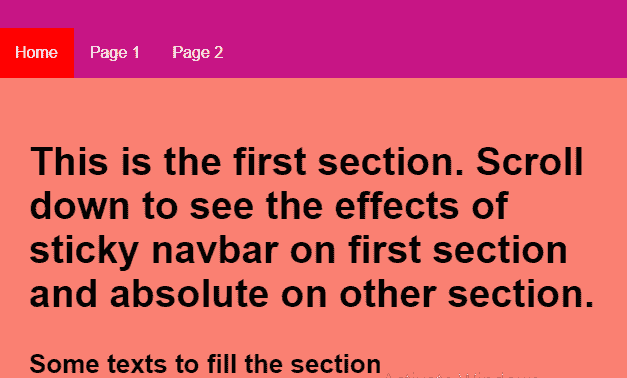
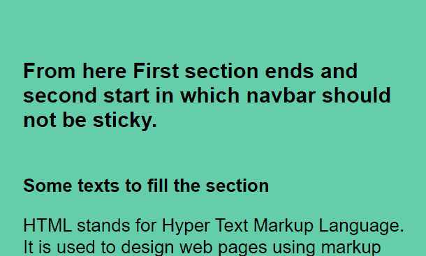

# 如何只为页面第一节设置粘性导航栏？

> 原文:[https://www . geeksforgeeks . org/how-set-sticky-nav bar-仅适用于页面的第一部分/](https://www.geeksforgeeks.org/how-to-set-sticky-navbar-only-for-first-section-of-page/)

早期的 Bootstrap 在**词缀 jQuery 插件**中给出了为某些部分设置固定 navbar 和为其他部分设置绝对 nav bar 的选项，但是新的 Bootstrap 4.0 放弃了这个选项，并建议为此使用 javascript。

我们可以使用 Javascript 将 navbar 设置为第一部分是粘性的，其余部分是绝对的。要做到这一点，你只需要使用**窗口。点击**功能，该功能将确定屏幕的位置，然后根据它应用粘性或绝对位置。

**方法:**
这里我们设置了一个 **window.onscroll** 函数，其中我们将变量 **navbarConst** 设置为 id 为“navbarSection”的元素，然后变量 **stickyConst** 使用“offsetTop”返回 navbarConst 相对于文档的偏移坐标。

**语法**
让我们看看如何使用:
在最后一个**正文**标签中的**脚本**标签中键入以下代码。

```htmlhtml
window.onscroll = function() {myFunction()};

var navbar = document.getElementById("nav_bar");
var sticky = navbar.offsetTop;

function myFunction() {
  if (window.pageYOffset >= sticky) {
    navbar.classList.remove("sticky");
  } else {
    navbar.classList.add("sticky");
  }
}

```

**示例:**
为了更好地理解 HTML，我们来看看下面的示例:

```htmlhtml
<html>
    <head>
        <title>GeeksforGeeks</title>
        <meta name="viewport" 
              secondSection="width=device-width, 
                             initial-scale=1" />
        <style>
            body {
                margin: 0;
                font-size: 26px;
                font-family: sans-serif;
            }

            .firstSection {
                background-color: #fa8072;
                padding: 30px;
                text-align: left;
            }

            #navbarSection {
                overflow: hidden;
                background-color: #c71585;
            }

            #navbarSection a {
                float: left;
                display: block;
                color: #f2f2f2;
                text-align: center;
                padding: 16px 16px;
                text-decoration: none;
                font-size: 16px;
            }

            #navbarSection a:hover {
                background-color: #ffe4b5;
                color: black;
            }

            #navbarSection a.active {
                background-color: red;
                color: white;
            }

            #secondSection {
                padding: 16px 35px;
                padding-top: 0;
                background-color: #66cdaa;
            }

            .stickyNavbar {
                position: sticky;
                top: 0;
                width: 100%;
            }

            .stickyNavbar,
            #secondSection {
                padding-top: 30px;
            }
        </style>
    </head>
    <body>
        <div id="navbarSection">
            <a class="active" href="#">Home</a>
            <a href="#">Page 1</a>
            <a href="#">Page 2</a>
        </div>

        <div class="firstSection">
            <h2>This is the first section. Scroll down 
              to see the effects of sticky navbar on
              first section and absolute on other 
              section.</h2>
            <b> Some texts to fill the section </b>
            <p>
                HTML stands for Hyper Text Markup
              Language. It is used to design web pages
              using markup language. HTML is the 
              combination of Hypertext and Markup 
              language. Hypertext defines the link
              between the web pages. Markup language is
                used to define the text document 
              within tag which defines the structure
              of web pages. HTML is a markup language
              which is used by the browser to manipulate
              text, images and other content to display 
              it in required format.
            </p>
        </div>

        <div id="secondSection">
            <br />
            <br />
            <br />
            <h3>From here First section ends and second
              start in which navbar should not be sticky.
          </h3>
            <br />
            <b> Some texts to fill the section </b>
            <p>
                HTML stands for Hyper Text Markup Language.
              It is used to design web pages using markup
              language. HTML is the combination of Hypertext
              and Markup language. Hypertext defines the
              link between the web pages. Markup language is
                used to define the text document within 
              tag which defines the structure of web pages.
              HTML is a markup language which is used by 
              the browser to manipulate text, images and 
              other content to display it in required format.
            </p>
        </div>

        <script>
            window.onscroll = function () {
                myFunction();
            };

            var navbarConst = 
                document.getElementById("navbarSection");
            var stickyConst = navbarConst.offsetTop;
            var navbarOther = 
                document.getElementById("secondSection");
            var stickyOther = navbarOther.offsetTop;

            function myFunction() {
                if (window.pageYOffset >= stickyOther) {
                    navbarSection.classList.remove(
                      "stickyNavbar");
                } else {
                    navbarSection.classList.add(
                      "stickyNavbar");
                }
            }
        </script>
    </body>
</html>
```

**解释:**
这里我们设置了一个 **window.onscroll** 函数，在这个函数中我们将变量 **navbarConst** 设置为 id 为“navbarSection”的元素，然后变量 **stickyConst** 使用“offsetTop”返回 navbarConst 相对于文档的偏移坐标。

然后根据屏幕的 Y 坐标，设置它的位置。当屏幕的 Y 坐标大于第一个部分的 Y 坐标时，我们移除 stickyNavbar 类。这里的 stickyNavbar 是我们将位置设为粘性的类。

**输出:**


