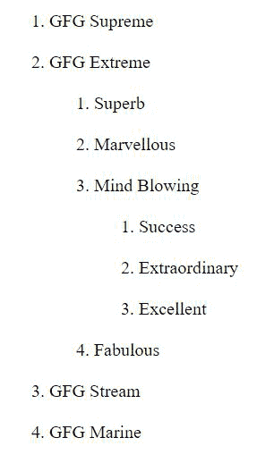
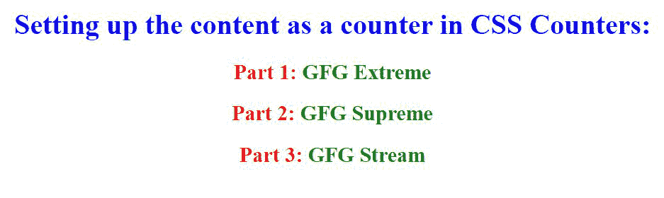
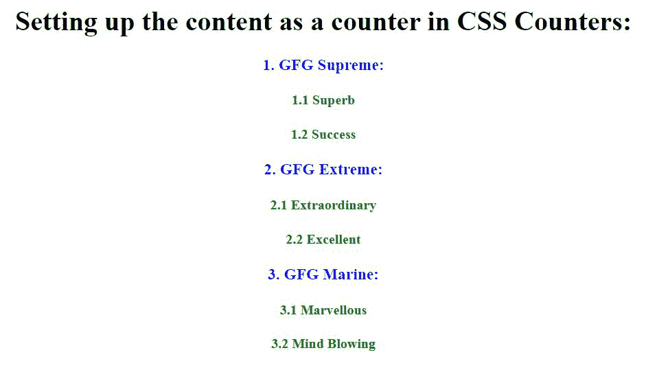

# 如何将内容设置为计数器？

> 原文:[https://www . geeksforgeeks . org/如何将内容设置为计数器/](https://www.geeksforgeeks.org/how-to-set-the-content-as-a-counter/)

任务是将内容设置为计数器。 [CSS 计数器](https://www.geeksforgeeks.org/css-counters/)区域单位“*变量”*由 CSS 维护，其值也根据 CSS 规则递增(以跟踪它们被使用的次数)。计数器允许您管理内容在文档中的位置所支持的内容外观。

**将内容设置为计数器的方式:**

CSS 计数器面积单位像“*变量“*”。变量值可以通过 CSS 规则来增加(可以跟踪它们被使用的百分比次数)。要使用 CSS 计数器，首先应该使用**计数器重置**来创建，为了使用 CSS 计数器，我们将使用后续属性:

*   **计数器复位:**创建或复位计数器
*   **计数器增量:**增加计数器值
*   **内容:**插入生成的内容
*   **counter()或 counters()函数:**将计数器的值添加到组件中

**计数器下的计数器(嵌套计数器):**

计数器可能有助于形成打印列表，因为计数器的替换实例是在子零件中机械创建的。

**示例 1:** 这里我们倾向于使用 counters()执行在完全不同级别的嵌套计数器之间插入一个字符串:

## 超文本标记语言

```
<!DOCTYPE html>
<html>

<head>
    <style>
        /* It sets the CSS property to the webpage */

        ol {
            counter-reset: section;
            /* Creates or resets a counter */
            list-style-type: none;
            /* Sets the marker of a list 
               item element to be none */
        }

        li::before {
            counter-increment: section;
            /* Increments a counter value */
            content: "Part " counters(section, ".") " ";
            /* Inserts generated content */
        }
    </style>
</head>

<body>

    <ol>
        <li>GFG Supreme</li><br>
        <li>GFG Extreme
            <ol>
                <br>
                <li>Superb</li><br>
                <li>Marvellous</li><br>
                <li>Mind Blowing
                    <ol>
                        <br>
                        <li>Success</li><br>
                        <li>Extraordinary</li><br>
                        <li>Excellent</li>
                    </ol>
                </li><br>
                <li>Fabulous</li>
            </ol>
        </li><br>
        <li>GFG Stream</li><br>
        <li>GFG Marine</li>
    </ol>
</body>

</html>
```

**输出:**



**例 2:** 这是一个设置计数器的例子，这里计数器的值用 1 来增加它的值，并将其与每个部分的开始相连接:

## 超文本标记语言

```
<!DOCTYPE html>
<html>

<head>
    <style>
        h2::before {
            color: red;
            counter-increment: section;
            content: "Part " counter(section) ": ";
            /* Inserts generated content */
        }

        h2 {
            color: green;
        }

        h1 {
            color: blue;
        }
    </style>
</head>

<body style="counter-reset: section;text-align:center">
    <!--Creates or resets a counter-->

    <h1>Setting up the content as a counter in CSS Counters:</h1>
    <h2>GFG Extreme</h2>
    <h2>GFG Supreme</h2>
    <h2>GFG Stream</h2>

</body>

</html>
```

**输出:**



**例 3:** 这是一个设置计数器的例子，这里计数器的值用 1 增加它的值，并将其与每个部分的开始相连接，并且它还增加了子部分的值:

## 超文本标记语言

```
<!DOCTYPE html>
<html>

<head>
    <style>
        h3 {
            counter-reset: SS;
            color: blue;
        }

        h3::before {
            counter-increment: S;
            content: counter(S) ". ";
            <!--Inserts generated content-->
        }

        h4::before {
            counter-increment: SS;
            content: counter(S) "." counter(SS) " ";
            <!--Inserts generated content-->
        }

        h4 {
            color: green;
        }
    </style>
</head>

<body style="counter-reset: S;text-align:center">
    <!--Creates or resets a counter-->

    <h1>Setting up the content as a counter in CSS Counters:</h1>
    <h3>GFG Supreme:</h3>
    <strong>Superb</strong>
    <strong>Success</strong>

    <h3>GFG Extreme:</h3>
    <strong>Extraordinary</strong>
    <strong>Excellent</strong>

    <h3>GFG Marine:</h3>
    <strong>Marvellous</strong>
    <strong>Mind Blowing</strong>

</body>

</html>
```

**输出:**

