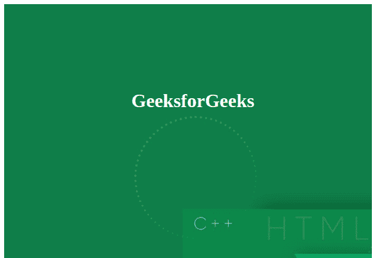

# 如何设置 div 高度自动调整到背景尺寸？

> 原文:[https://www . geeksforgeeks . org/如何将 div 高度设置为自动调整为背景尺寸/](https://www.geeksforgeeks.org/how-to-set-the-div-height-to-auto-adjust-to-background-size/)

有时，在创建网站时，需要使 div 根据背景自动调整其高度，而不需要设置特定的高度或最小高度。这使得开发人员在编写代码时很方便。

我们将在 div 中创建一个 img 元素，并将其 src 设置为与背景图像相同。它的可见性将被设置为隐藏，以便只显示背景图像。将 div 元素的 [**背景-重复属性**](https://www.geeksforgeeks.org/css-background-repeat-property/) 设置为“不重复”，以免重复图像。

**示例:**由于图像是 div 的背景图像，因此，标题 GeeksforGeeks 出现在图像上方。

## 超文本标记语言

```htmlhtml
<!DOCTYPE html>
<html>
    <head>
        <title>Title of the document</title>
        <style>
            div {
                background-image: 
url(https://media.geeksforgeeks.org/wp-content/uploads/20200602195146/0.jpeg);
                background-repeat: no-repeat;
            }
            img {
                visibility: hidden;
            }
            h1 {
                position: absolute;
                left: 35%;
                top: 30%;
                color: white;
            }
        </style>
    </head>
    <body>
        <div>
            <h1>GeeksforGeeks</h1>
            
        </div>
    </body>
</html>
```

**输出:**

