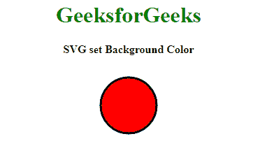

# 如何设置 SVG 背景色？

> 原文:[https://www . geesforgeks . org/如何设置-svg-background-color/](https://www.geeksforgeeks.org/how-to-set-the-svg-background-color/)

有两种类型的图像可以在背景中使用，在这两种情况下，您都可以更改图像的背景颜色。

*   **光栅:**每个像素代表图像中各个颜色的图像。所以当我们放大时，像素开始放大，因此在某个点之后，图像开始变得模糊。
*   **Vector:** 这些是存储了绘图信息的图像。因此，当它们被缩放时，图像会根据页面的大小重新绘制。因此，它们不会像素化，我们会得到清晰的图像。因为这些图像是可缩放的，所以它们被称为可缩放矢量图形。

**SVG** 代表*可缩放矢量图形*。SVG 背景用于绘制任何类型的形状，通过 set 属性设置您想要的任何颜色。下面的例子更具体地说明了 SVG 设置背景色的概念。SVG 允许 CSS 的背景尺寸、位置和更复杂的属性。

**示例:**CX 和 cy 属性定义了圆心的 x 和 y 坐标。如果省略 cx 和 cy，则将圆心设置为(0，0)。r 属性定义了圆的半径。要将背景颜色设置为此 SVG，有两种方法。

## 超文本标记语言

```html
<!DOCTYPE html>
<html>

<head>
    <title>
        SVG set Background Color
    </title>
</head>

<body>
    <center>
        <h1 style="color:green;">GeeksforGeeks</h1>
        <h4>SVG set Background Color</h4>

        <svg height="100" width="100">
            <circle cx="50" cy="50" r="40" stroke="black" 
                    stroke-width="3" fill="red" />
        </svg>
    </center>
</body>

</html>
```

**Output:**


要设置 SVG 主体的背景颜色，背景可以通过两种方式完成:

*   **方法一:**可以给 SVG 主体本身添加背景色。

    ## 超文本标记语言

    ```html
    <!DOCTYPE html>
    <html>

    <head>
        <title>
            SVG set Background Color
        </title>
    </head>

    <body>
        <center>
            <h1 style="color:green;">GeeksforGeeks</h1>
            <h4>SVG set Background Color</h4>

            <svg height="100" width="100" style="background-color:green">
                <circle cx="50" cy="50" r="40" stroke="black" 
                        stroke-width="3" fill="red" />
            </svg>
        </center>
    </body>

    </html>
    ```

    **输出:**
    
*   **方法二:**你可以添加一个矩形作为第一层或者最下层，宽度 100%，高度 100%，设置你想要的背景颜色的颜色，然后我们就可以开始画形状了。

    ## 超文本标记语言

    ```html
    <!DOCTYPE html>
    <html>

    <head>
        <title>
            SVG set Background Color
        </title>
    </head>

    <body>
        <center>
            <h1 style="color:green;">GeeksforGeeks</h1>
            <h4>SVG set Background Color</h4>

            <svg height="100" width="100">
                <rect width="100%" height="100%" fill="green" />
                <circle cx="50" cy="50" r="40" stroke="black"
                        stroke-width="3" fill="red" />
            </svg>
        </center>
    </body>

    </html>
    ```

    **输出:**
    

HTML 是网页的基础，通过构建网站和网络应用程序用于网页开发。您可以通过以下 [HTML 教程](https://www.geeksforgeeks.org/html-tutorials/)和 [HTML 示例](https://www.geeksforgeeks.org/html-examples/)从头开始学习 HTML。