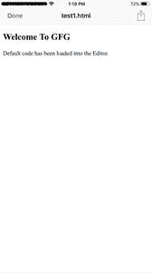
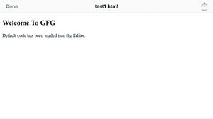

# 如何为 iPhone 设置正确处理旋转的视图端口元标签？

> 原文:[https://www . geeksforgeeks . org/如何正确设置 iphone 的视图端口元标签处理旋转/](https://www.geeksforgeeks.org/how-to-set-the-view-port-meta-tag-for-iphone-that-handles-rotation-properly/)

视图端口元是一个包含在 HTML 文档头部的短标签，它告诉浏览器页面应该如何呈现。视图端口元元素将一个普通的网站页面变成了一个响应页面。

**视图端口元标签的选项:**元视图端口的内容部分可以包含许多选项:

*   **宽度:**用于设置布局视图-端口的宽度。在我们的例子中，我们将其设置为“设备宽度”，这将覆盖苹果的默认设置 960 像素。
*   **初始缩放:**用于设置页面的初始缩放和布局视图端口的宽度。我们将其设置为 1，这是默认视图，但是您可以轻松增加这个数字(不推荐)。
*   **最小比例:**用于设置最小缩放级别，即用户可以缩小多少。
*   **最大比例:**用于设置最大缩放级别，即用户可以放大多少。
*   **用户可缩放:**用于设置是否允许用户缩放内容。将其设置为“否”将阻止缩放。

默认情况下，视图端口标记的使用如下:

## 超文本标记语言

```htmlhtml
<!DOCTYPE html>
<html>

<head>
    <title>Page Title</title>
    <meta name="viewport" content=
        "width=device-width;
        initial-scale=1.0;
        maximum-scale=1.0;" />
</head>

<body>
    <h2>Welcome To GFG</h2>

    <p>
        Default code has been 
        loaded into the Editor.
    </p>
</body>

</html>
```

**某些设备上此元标签的问题:**元标签的默认用法会在 iPhone 设备和某些 Android 手机上引起一些问题。当屏幕方向发生变化(纵向变为横向)时，就会出现这种情况。

出现这种情况是因为即使设备已旋转到横向模式，内容的大小仍与纵向模式下的大小相同。这通常是由于在元标签中设置为“设备宽度”的“宽度”属性造成的。由于观察口和设备的宽度不同，当屏幕旋转到横向模式时，理论上观察口宽度应该改变为设备高度，但这不能有效实现。

对此的解决方案可以如下实现:

## 超文本标记语言

```htmlhtml
<!DOCTYPE html>
<html>

<head>
    <title>Page Title</title>
    <meta name="viewport" content=
            "initial-scale=1.0; 
            maximum-scale=1.0" />
</head>

<body>
    <h2>Welcome To GFG</h2>

    <p>
        Default code has been 
        loaded into the Editor.
    </p>
</body>

</html>
```

**使用该方法的优势:**

*   这似乎将设备锁定在 1.0 比例，无论其方向如何。

**使用该方法的缺点:**

*   它完全禁用用户缩放(收缩缩放等)。

**iPhone 设备上的输出:**

**人像模式:**

*   
*   **风景模式:**

    