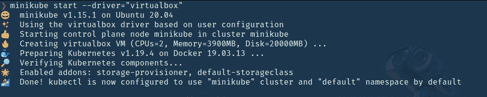
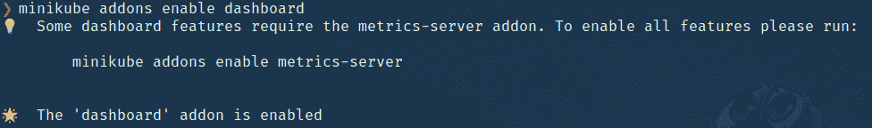
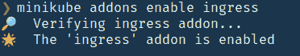
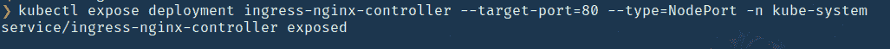
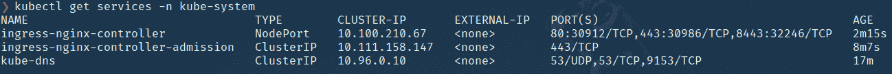

# 如何使用 minikube 在本地机器上设置 Kubernetes 集群？

> 原文:[https://www . geeksforgeeks . org/how-setup-kubernetes-cluster-on-local-machine-use-minikube/](https://www.geeksforgeeks.org/how-to-set-up-kubernetes-cluster-on-local-machine-using-minikube/)

在 AWS、谷歌云等上创建一个库本内斯集群可能会有点困难，而且会花掉你相当多的钱。如果你有一台 Windows 机器或一台 mac，那么很容易使用 Docker Desktop 为 windows/mac 创建一个多容器集群，并使用 **Kubernetes** 来管理集群。

**额外收获:**对 Docker 和 Kubernetes 有一定的基础知识。

但是对于基于 Linux 的系统，你要么选择基于云的解决方案，这是昂贵的。因此，我们可以使用 **minikube** 在本地机器上创建自己的集群。它是当地的 Kubernetes，专注于让 Kubernetes 更容易学习和发展。您只需要安装 docker 或任何虚拟机环境。在下面的例子中，我们使用了虚拟盒子。

**安装 Minikube:** 要在 Linux 上安装 Minikube，请使用以下命令:

> curl-LO https://storage . googleapi . com/minikube/releases/latest/minikube-Linux-amd64
> sudo install minikube-Linux-amd64/usr/local/bin/minikube

**示例:**为了测试这一点，我们将使用一个售票 web 应用程序，该应用程序使用 NodeJS、ExpressJS、NextJS 构建，并使用 nats-streaming 进行事件传输，使用 *ingress-nginx* 进行联网和负载平衡。不同服务的不同 docker 映像，并使用 minikube 在本地使用 minikube 运行集群。

回购的 **Github 链接:**使用*https://github.com/afif1400/gittix-micro*链接分叉项目。

**注意:**在你安装了 docker 或者 virtual box 和 minikube 之后，我们只需要启动 minikube，使用 skaffold 运行所有的容器或者不同的微服务。

因此，克隆 repo 后，转到根目录，首先启动 minikube–driver 用于指定环境，您也可以将其更改为 docker。但是在使用 docker 环境的入口中有一个错误。

```html
minikube start --driver="virtualbox"
```



现在 minikube 已经在里面启动了 Kubernetes 集群，你也可以通过查看参考资料中提供的官网文档来配置它所使用的资源。

我们需要在 minikube 上启用几个附加组件来运行应用程序。第一个是**仪表盘**，这是一个用于监控集群部署服务等的图形用户界面，第二个插件是**入口**。

**启用仪表板的命令:**

```html
minikube addons enable dashboard
```



**启用入口的命令:**

```html
minikube addons enable ingress
```



现在我们需要暴露 ***入口-nginx*** 部署，以便可以从外部世界到达。使用以下命令进行操作:

```html
kubectl expose deployment ingress-nginx-controller --target-port=80 
--type=NodePort -n kube-system
```



现在验证服务是否正在运行:输出应该类似于下面给出的输出。

```html
kubectl get services -n kube-system
```



接下来，设置一个环境变量，它是一个 ***jwt-secret*** ，要设置它，运行以下命令:

```html
kubectl create secret generic jwt-secret --from-literal=JWT_KEY=asdf
```

我们将在认证服务中使用它来生成 ***jwt*** 令牌。

**运行应用程序的步骤:**

使用以下命令运行应用程序:

```html
skaffold dev
```

当您运行此命令时，将安装每个服务的所有依赖项并构建映像，从而启动群集。如果 skaffold 在这两者之间失败，只需重新运行上述命令。

**输出:**

<video class="wp-video-shortcode" id="video-541369-1" width="640" height="360" preload="metadata" controls=""><source type="video/mp4" src="https://media.geeksforgeeks.org/wp-content/uploads/20210111214106/skaffold-dev.mp4?_=1">[https://media.geeksforgeeks.org/wp-content/uploads/20210111214106/skaffold-dev.mp4](https://media.geeksforgeeks.org/wp-content/uploads/20210111214106/skaffold-dev.mp4)</video>

**停止迷你库:**以下是停止迷你库的命令:

```html
minikube stop
```

**删除集群:**以下是删除集群的命令:

```html
minikube delete
```

**参考文献:**

*   **码头工人:https://docs.docker.com/get-started/overview/**
*   **输入引擎:**https://kubrintes . github . io/input-engine/
*   **斯卡福德:**https://skaffold.dev/docs/
*   **迷你裙:**https://迷你裙. sigs.k8s.io/docs