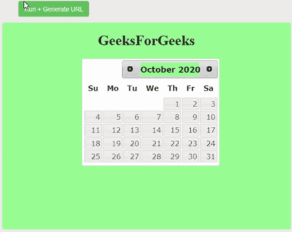

# 如何在日期选择器中设置年份？

> 原文:[https://www . geesforgeks . org/how-to-set-in-year-date picker/](https://www.geeksforgeeks.org/how-to-set-year-in-datepicker/)

在本文中，我们将了解 jQuery 中的日期选择器。在许多形式中，您可以从日历中选择日期和年份。日期选择器是输入字段的标准形式，用于通过查看日历来选择日期和年份。它是一个指定覆盖的交互式日历。

当您点击日历中提到的任何日期时，反馈将出现在输入文本中。

**使用的方法–**date picker()方法用于创建交互式日历的覆盖。

**进场–**

*   首先，您需要创建一个 HTML 文件并导入 jQuery 库。
*   之后，您必须使用 datepicker 方法在脚本标记中编写代码。
*   主要任务已经完成，是否将 CSS 应用到您的应用程序取决于您。

**示例:**

## 超文本标记语言

```html
<!DOCTYPE html>
<html lang="en">

<head>
    <meta charset="utf-8">
    <link rel="stylesheet" href=
"//code.jquery.com/ui/1.12.1/themes/smoothness/jquery-ui.css">
    <script src="//code.jquery.com/jquery-1.12.4.js"></script>
    <script src="//code.jquery.com/ui/1.12.1/jquery-ui.js">
    </script>

    <style>
        body {
            background-color: lightgreen;
            text-align: center;
        }

        div {
            background-color: lightgreen;
            margin-left: 85px;
        }
    </style>
</head>

<body>
    <h1>GeeksForGeeks</h1>
    <div id="datepicker"></div>

    <script>
        $("#datepicker").datepicker();
    </script>
</body>

</html>
```

**输出:**



**说明:**在上面的例子中，我们已经看到了如何用几行代码创建日历。如果你想选择年份，你只需要点击日历中的下一个箭头按钮。