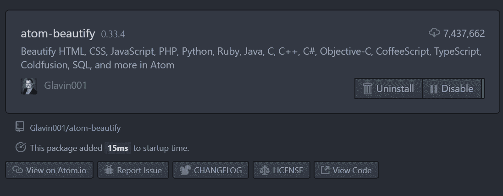
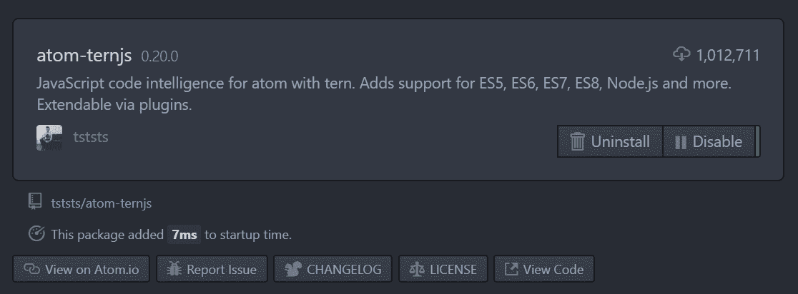
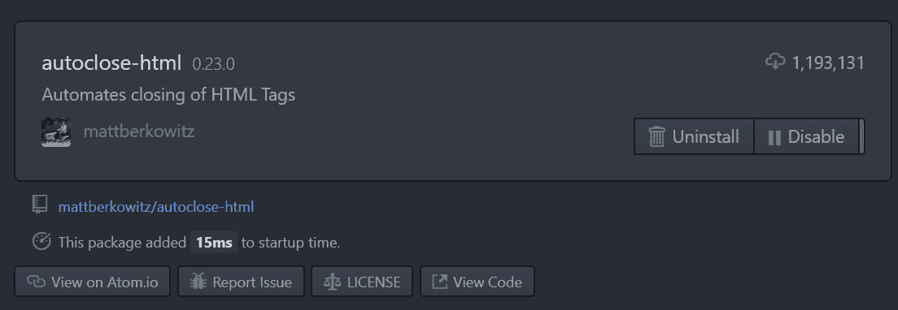
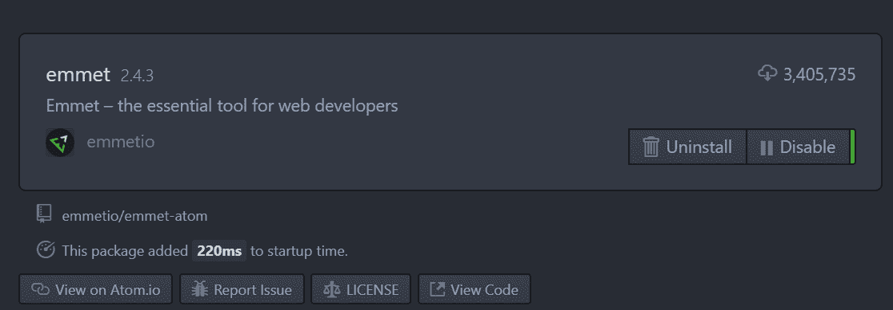
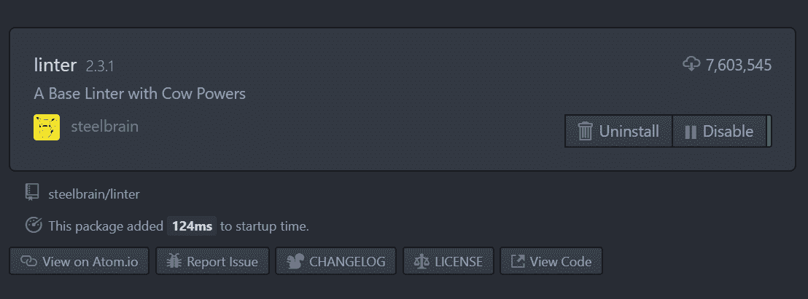
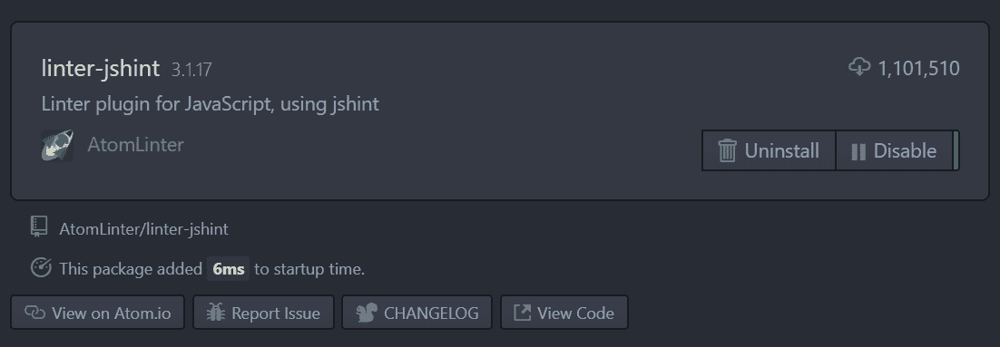
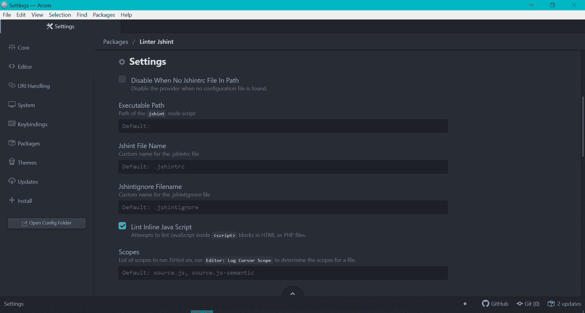
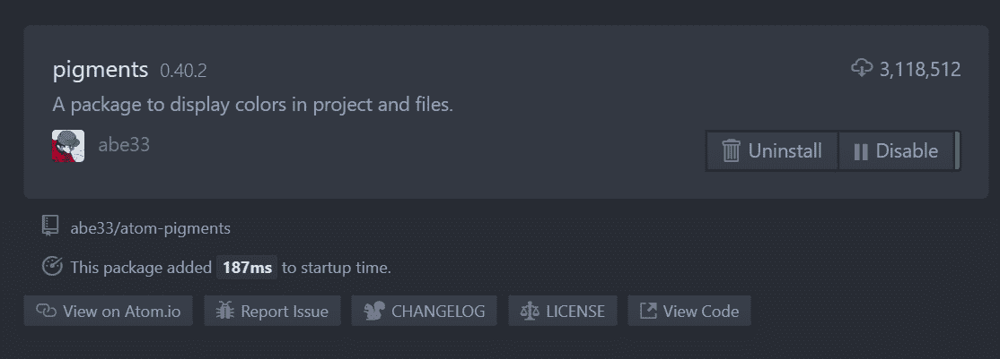
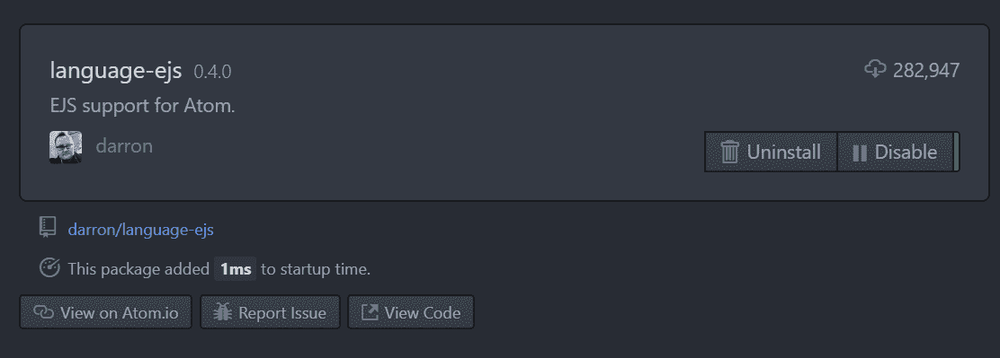

# 如何用所有需要的包设置 Atom 编辑器？

> 原文:[https://www . geesforgeks . org/如何设置-atom-editor-with-all-required-packages/](https://www.geeksforgeeks.org/how-to-setup-atom-editor-with-all-the-required-packages/)

要开始使用 Atom，首先，我们需要在您的系统上安装它。本节将讨论如何在您的系统上安装 Atom，以及如何使用 Web 开发人员所需的适当包从源代码构建 Atom 的基础知识。

### 下载和安装

原子编辑器可以从其官方网站 [atom.io](https://atom.io/) 下载。对于安装:

#### 在窗口上

**第一步:**点击按钮，下载。exe 文件。
T3】

**步骤 2:** 运行。exe 包和 Atom 可以轻松地自行安装在 Windows 操作系统上。

#### 在 Mac 上

**第一步:**点击按钮，下载。exe 文件。
T3】

**步骤 2:** 运行。exe 包和 Atom 可以轻松地自行安装在 MacOS 上。

#### 在 Linux 上

您可以在终端上使用发行版的包管理器在 Linux 上安装 Atom Editor，方法是将其配置为使用 Atom 的官方包存储库之一。

> $ wget-qO–https://packagecloud.io/AtomEditor/atom/gpgkey | sudo apt-key add–
> $ sudo sh-c ' echo " deb[arch = amd64]https://packagecloud.io/AtomEditor/atom/any/ any main ">/etc/apt/sources . list . d/atom . list '
> $ sudo apt-get update

现在，您可以使用 apt-get(或 Ubuntu 上的 apt)轻松安装 Atom:

> #安装 Atom
> $ sudo apt-get 安装 Atom
> 
> #安装 Atom Beta 版
> $ sudo apt-get 安装 atom-beta 版

或者，您可以下载 [Atom。deb 包](https://atom.io/download/deb)也可以直接安装:

> #安装 atom
> $ sudo dpkg-I atom-amd64 . deb
> 
> #安装 Atom 的依赖项，如果它们缺少的话
> $ sudo apt-get -f 安装

这样，Atom 可以很容易地安装在 Debian 和 Ubuntu Linux 操作系统上。

### 设置正确的软件包

#### 如何安装软件包？

安装 Atom 软件包的方法主要有两种:

*   在终端上输入 *apm 安装包名称*。显然，必须安装 Atom 包管理器 apm(您可以输入 apm 来验证安装)。
*   打开 Atom，转到*编辑>偏好设置>安装*，然后搜索想要安装的软件包。
    T3】

单击“安装”按钮，软件包安装完毕。

> **注意:**对于某些包装，需要一些附加设置，具体视情况而定。

#### 社区套餐列表如下:

*   **原子-美化**
    
*   **原子三元组**
    
*   **自动保存-html**
    
*   **埃米特**
    
*   
*   **L inter**
    

    > **Note:** Click OK when installing short pile. (It will require you to install the dependencies of the software package)

*   **临帖**T2
    *   **步骤 1:** 安装完 linter-jshint 后，进入其设置。
        T3】
    *   **步骤 2:** 在 linter-jshint 的设置页面上，向下滚动并启用“Lint 内联 Java 脚本
        复选框
*   **颜料**
    
*   **语言-ejs**
    