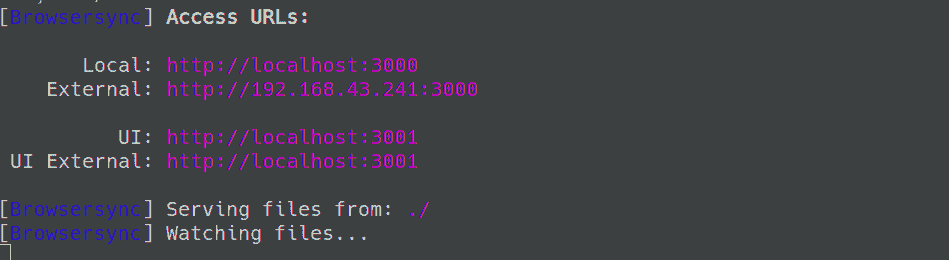

# 如何在 Ubuntu 中设置 Web 开发的 Browsersync？

> 原文:[https://www . geeksforgeeks . org/how-setup-browser sync-for-web-development-in-Ubuntu/](https://www.geeksforgeeks.org/how-to-setup-browsersync-for-web-development-in-ubuntu/)

BrowserSync 是一个自动化工具，广泛用于 web 开发。这个工具通过在许多设备上同步文件更改和交互，使我们的测试和调整变得更快。

**Features of BrowserSync.**

*   实时重装*   交互同步*   模拟较慢的连接*   网址历史记录*   兼容任务跑者，如 Grunt 和 Grunt*   Work across many operating systems

    ### 浏览器同步的工作方式

    如果您缺少服务器设置，BrowserSync 会创建一个小型服务器。否则，它可以连接到您的服务器并充当代理。之后，它会在每个页面上添加一个 javascript 文件。该文件使用网络套接字在客户端和服务器之间建立通信，以观察对代码或浏览器操作的更改。一旦 browsersync 检测到一个动作，它就会重新加载页面。

    ### 安装浏览器同步

    BrowserSync 是一个 npm 包，因此您必须确保安装了`Node.js`。要安装浏览器同步，只需打开终端并执行以下命令。

    ```html
    sudo npm install -g browser-sync

    ```

    要检查是否安装了浏览器同步，请输入以下命令。

    ```html
    browser-sync --version

    ```

    ### 使用浏览器同步

    转到项目目录的根目录，运行以下命令。

    ```html
    browser-sync start --server --files "*.html, css/*.css"

    ```

    执行命令后，它会触发服务于目录根文件的默认浏览器。
    