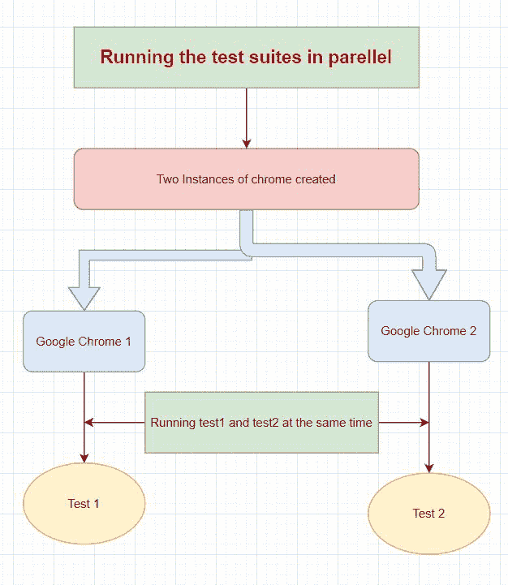
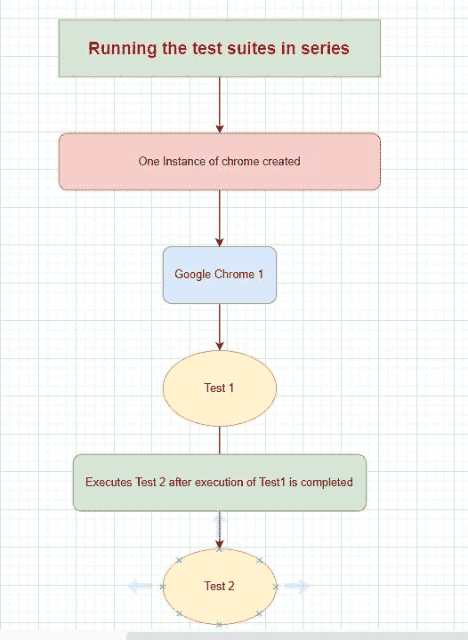

# 如何在量角器中分片测试文件？

> 原文:[https://www . geesforgeks . org/如何分割测试文件量角器/](https://www.geeksforgeeks.org/how-to-shard-test-files-in-protractor/)

**量角器**是为 Angular 和 AngularJS 应用开发的端到端测试框架。它像一个真正的用户一样，在一个真正的浏览器中运行与它交互的应用程序。在本文中，我们将讨论如何在量角器中分割测试套件。

**先决条件:** [量角器](https://www.geeksforgeeks.org/angularjs-end-to-end-e2e-testing-protractor-installation-and-setup/)的安装和设置

测试套件的分割意味着并行运行测试套件。假设有两个测试套件，那么将这两个测试套件并行分割意味着将创建 chrome 的两个实例，并且这两个测试套件将分别在 chrome 的两个不同实例上运行(即，它们将彼此独立运行)，而如果这两个测试套件将串行运行，那么将只创建一个 chrome 实例，然后第二个测试套件将必须等待第一个测试套件运行完成(即，它们不能独立运行)。现在，由于分片有助于测试套件并行运行，它将减少执行时间并提高测试效率。

以下是上述解释的流程图表示:

**并行运行测试**



**连续运行测试**



**进场:**

*   我们将创建一个基本的测试程序，在其中我们将看到如何分割测试套件
*   所有量角器测试都将有一个包含配置的文件，这将是启动测试的初始文件。
*   让我们创建一个名为 conf.js 的文件。
*   对于分片，在 conf.js 文件的 capabilities 块中声明两个功能。
    *   shardTestFiles–允许不同规格并行运行。如果设置为真，规格将按文件分割(即，由这组功能运行的所有文件将并行运行)。默认值为 false。
    *   最大实例数–对于这组功能，可以并行运行的浏览器实例的最大数量。只有当 shardTestFiles 为真时，才需要这样做。默认值为 1。

**第一步:**我们首先要创建一个 conf.js 文件，该文件由将要与量角器一起使用的配置组成。

## conf.js(通用报告格式)

```
// An example configuration file to
// illustrate sharding
exports.config = {
  directConnect: true,

  // Capabilities to be passed to the 
  // webdriver instance for sharding
  capabilities: {
    'browserName': 'chrome',

    // Sharding
    'shardTestFiles': true,
    'maxInstances': 2, 
  },

  // Framework to use. Jasmine is
  // recommended
  framework: 'jasmine',

  // Spec patterns are relative to the
  // current working directory when
  // protractor is called.
  specs: ['test1.js','test2.js'],
  SELENIUM_PROMISE_MANAGER: false,
  // Options to be passed to Jasmine.
  jasmineNodeOpts: {
    defaultTimeoutInterval: 30000
  }
};
```