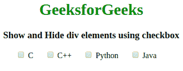
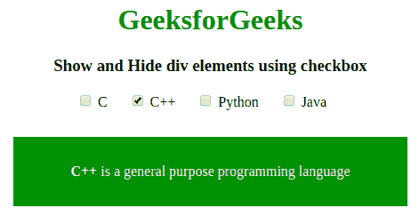
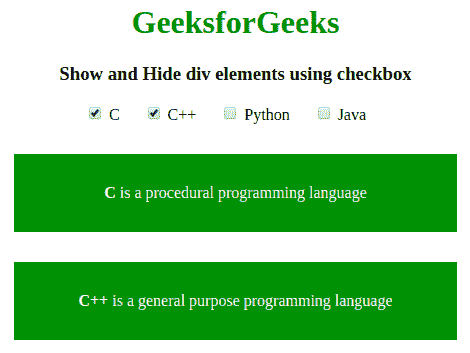
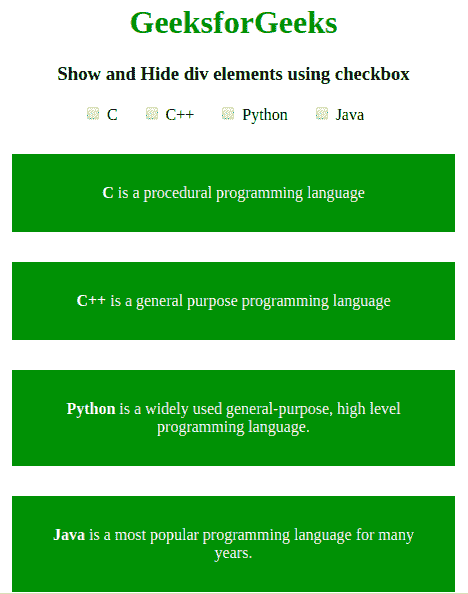
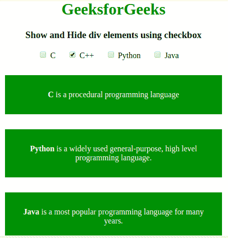
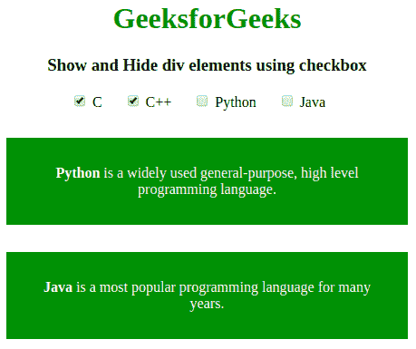
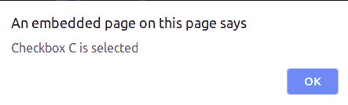
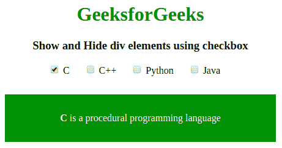

# 如何使用复选框显示和隐藏 div 元素？

> 原文:[https://www . geeksforgeeks . org/如何使用复选框显示和隐藏 div 元素/](https://www.geeksforgeeks.org/how-to-show-and-hide-div-elements-using-checkboxes/)

为了通过选择 jQuery 中的特定复选框来显示特定元素的数据/内容，我们可以使用 [**切换()方法**](https://www.geeksforgeeks.org/jquery-toggle-method/) 。
使用**切换()方法**检查选定元素的可见性，以在选定元素的隐藏()和显示()之间切换。

**语法:**

```html
$(selector).toggle(speed, easing, callback)
```

**进场:**

*   复选框的选择器名称与用于显示
    内容的元素相同。
*   使用**显示将每个元素的 CSS 显示属性设置为无:无；**用于最初隐藏元素。
*   使用**。切换()方法**显示和隐藏选中和取消选中框的元素。

**示例 1:** 使用复选框显示内容。

```html
<!DOCTYPE html>
<html>

<head>
    <title>
      Show and Hide div elements using checkbox
    </title>
    <script src=
"https://code.jquery.com/jquery-1.12.4.min.js"></script>
    <style type="text/css">
        .selectt {
            color: #fff;
            padding: 30px;
            display: none;
            margin-top: 30px;
            width: 60%;
            background: green
        }

        label {
            margin-right: 20px;
        }
    </style>
</head>

<body>
    <center>
        <h1 style="color:green;"> 
          GeeksforGeeks 
        </h1>
        <h3>
          Show and Hide div elements using checkbox
        </h3>
        <div>
            <label>
                <input type="checkbox" name="colorCheckbox" 
                       value="C"> C</label>
            <label>
                <input type="checkbox" name="colorCheckbox" 
                       value="Cplus"> C++</label>
            <label>
                <input type="checkbox" name="colorCheckbox" 
                       value="Python"> Python</label>
            <label>
                <input type="checkbox" name="colorCheckbox" 
                       value="Java"> Java</label>
        </div>
        <div class="C selectt">
          <strong>C</strong>
          is a procedural programming language</div>
        <div class="Cplus selectt">
          <strong>C++</strong> 
          is a general purpose programming language</div>
        <div class="Python selectt">
          <strong>Python</strong> 
          is a widely used general-purpose, high level 
          programming language.</div>
        <div class="Java selectt">
          <strong>Java</strong> 
          is a most popular programming language 
          for many years.</div>
        <script type="text/javascript">
            $(document).ready(function() {
                $('input[type="checkbox"]').click(function() {
                    var inputValue = $(this).attr("value");
                    $("." + inputValue).toggle();
                });
            });
        </script>
    </center>
</body>

</html>                  
```

**输出:**

*   在选择任何复选框之前:
    [](https://media.geeksforgeeks.org/wp-content/uploads/20190917152606/Screenshot-from-2019-09-17-15-23-30.png)
*   选中一个复选框后:
    [](https://media.geeksforgeeks.org/wp-content/uploads/20190917152608/Screenshot-from-2019-09-17-15-23-34.png)
*   选中两个复选框后:
    [](https://media.geeksforgeeks.org/wp-content/uploads/20190917152610/Screenshot-from-2019-09-17-15-23-44.png)

**示例 2:** 使用复选框隐藏内容

```html
<!DOCTYPE html>
<html>

<head>
    <title>
      Show and Hide div elements using checkbox
    </title>
    <script src=
"https://code.jquery.com/jquery-1.12.4.min.js">
    </script>
    <style type="text/css">
        .selectt {
            color: #fff;
            padding: 30px;
            margin-top: 30px;
            width: 60%;
            background: green
        }

        label {
            margin-right: 20px;
        }
    </style>
</head>

<body>
    <center>
        <h1 style="color:green;"> 
         GeeksforGeeks 
        </h1>
        <h3>
          Show and Hide div elements using checkbox
        </h3>
        <div>
            <label>
                <input type="checkbox" name="colorCheckbox"
                       value="C"> C</label>
            <label>
                <input type="checkbox" name="colorCheckbox"
                       value="Cplus"> C++</label>
            <label>
                <input type="checkbox" name="colorCheckbox" 
                       value="Python"> Python</label>
            <label>
                <input type="checkbox" name="colorCheckbox" 
                       value="Java"> Java</label>
        </div>
        <div class="C selectt">
          <strong>C</strong> 
          is a procedural programming language</div>
        <div class="Cplus selectt">
          <strong>C++</strong>
          is a general purpose programming language</div>
        <div class="Python selectt">
          <strong>Python</strong>
          is a widely used general-purpose, high level
          programming language.</div>
        <div class="Java selectt">
          <strong>Java</strong>
          is a most popular programming language for
          many years.</div>
        <script type="text/javascript">
            $(document).ready(function() {
                $('input[type="checkbox"]').click(function() {
                    var inputValue = $(this).attr("value");
                    $("." + inputValue).toggle();

                });
            });
        </script>
    </center>
</body>

</html>                    
```

**输出:**

*   在选择任何复选框之前:
    [](https://media.geeksforgeeks.org/wp-content/uploads/20190917153458/Screenshot-from-2019-09-17-15-30-57.png)
*   选中一个复选框后:
    [](https://media.geeksforgeeks.org/wp-content/uploads/20190917153453/Screenshot-from-2019-09-17-15-30-23.png)
*   选中两个复选框后:
    [](https://media.geeksforgeeks.org/wp-content/uploads/20190917153455/Screenshot-from-2019-09-17-15-30-31.png)

**例 3:** 连同报警方法

```html
<!DOCTYPE html>
<html>

<head>
    <title>
      Show and Hide div elements using checkbox
    </title>
    <script src=
"https://code.jquery.com/jquery-1.12.4.min.js">
    </script>
    <style type="text/css">
        .selectt {
            color: #fff;
            padding: 30px;
            display: none;
            margin-top: 30px;
            width: 60%;
            background: green
        }

        label {
            margin-right: 20px;
        }
    </style>
</head>

<body>
    <center>
        <h1 style="color:green;"> 
          GeeksforGeeks 
        </h1>
        <h3>
          Show and Hide div elements using checkbox
        </h3>
        <div>
            <label>
                <input type="checkbox" name="colorCheckbox" 
                       value="C"> C</label>
            <label>
                <input type="checkbox" name="colorCheckbox" 
                       value="Cplus"> C++</label>
            <label>
                <input type="checkbox" name="colorCheckbox" 
                       value="Python"> Python</label>
            <label>
                <input type="checkbox" name="colorCheckbox" 
                       value="Java"> Java</label>
        </div>
        <div class="C selectt">
          <strong>C</strong> 
          is a procedural programming language</div>
        <div class="Cplus selectt">
          <strong>C++</strong> 
          is a general purpose programming language</div>
        <div class="Python selectt">
          <strong>Python</strong> 
          is a widely used general-purpose, high level 
          programming language.</div>
        <div class="Java selectt">
          <strong>Java</strong> 
          is a most popular programming language for
          many years.</div>
        <script type="text/javascript">
            $(document).ready(function() {
                $('input[type="checkbox"]').click(function() {
                    var inputValue = $(this).attr("value");
                    $("." + inputValue).toggle();
                    alert("Checkbox " + inputValue + " is selected");
                });
            });
        </script>
    </center>
</body>

</html>   
```

**输出:**

*   在选择任何复选框之前:
    [](https://media.geeksforgeeks.org/wp-content/uploads/20190917152606/Screenshot-from-2019-09-17-15-23-30.png)
*   选中复选框后:
    [](https://media.geeksforgeeks.org/wp-content/uploads/20190917154732/Screenshot-from-2019-09-17-15-44-23.png)
*   点击提醒后确定按钮:
    [](https://media.geeksforgeeks.org/wp-content/uploads/20190917154733/Screenshot-from-2019-09-17-15-44-44.png)

jQuery 是一个开源的 JavaScript 库，它简化了 HTML/CSS 文档之间的交互，它以其“少写多做”的理念而闻名。
跟随本 [jQuery 教程](https://www.geeksforgeeks.org/jquery-tutorials/)和 [jQuery 示例](https://www.geeksforgeeks.org/jquery-examples/)可以从头开始学习 jQuery。