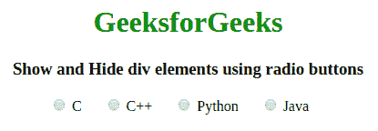
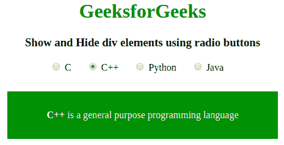
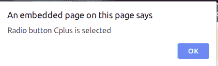

# 如何使用单选按钮显示和隐藏 div 元素？

> 原文:[https://www . geeksforgeeks . org/如何使用单选按钮显示和隐藏 div 元素/](https://www.geeksforgeeks.org/how-to-show-and-hide-div-elements-using-radio-buttons/)

为了通过在 jQuery 中选择特定的单选按钮来显示特定元素的数据/内容，我们可以使用以下两种方法:

1.  **hide()方法:**这个方法用来隐藏你想要隐藏的 html 的语法或者元素。
    **语法:**

    ```html
    $(selector).hide(speed, callback);
    ```

2.  **show()方法:**这个方法用来显示你希望用户看到的 html 的语法或者元素。
    **语法:**

    ```html
    $(selector).show(speed, callback);
    ```

**进场:**

*   单选按钮的选择器名称与用于显示
    内容的元素相同。
*   使用**显示将每个元素的 CSS 显示属性设置为无:无；**
*   使用 **show()** 方法显示元素，否则使用 **hide()** 方法隐藏。

**例 1:**

```html
<!DOCTYPE html>
<html>

<head>
    <title>
      Show and Hide div elements using radio buttons
    </title>
    <script src=
"https://code.jquery.com/jquery-1.12.4.min.js">
    </script>
    <style type="text/css">
        .selectt {
            color: #fff;
            padding: 30px;
            display: none;
            margin-top: 30px;
            width: 60%;
            background: green
        }

        label {
            margin-right: 20px;
        }
    </style>
</head>

<body>
    <center>
        <h1 style="color:green;"> 
          GeeksforGeeks 
        </h1>
        <h3> 
          Show and Hide div elements using radio buttons
        </h3>
        <div>
            <label>
                <input type="radio" name="colorRadio" 
                       value="C"> C</label>
            <label>
                <input type="radio" name="colorRadio" 
                       value="Cplus"> C++</label>
            <label>
                <input type="radio" name="colorRadio" 
                       value="Python"> Python</label>
            <label>
                <input type="radio" name="colorRadio" 
                       value="Java"> Java</label>
        </div>
        <div class="C selectt">
          <strong>C</strong>
          is a procedural programming language</div>
        <div class="Cplus selectt">
          <strong>C++</strong>
          is a general purpose programming language</div>
        <div class="Python selectt">
          <strong>Python</strong> 
          is a widely used general-purpose, high level
          programming language.</div>
        <div class="Java selectt">
          <strong>Java</strong> 
          is a most popular programming language for
          many years.</div>
        <script type="text/javascript">
            $(document).ready(function() {
                $('input[type="radio"]').click(function() {
                    var inputValue = $(this).attr("value");
                    var targetBox = $("." + inputValue);
                    $(".selectt").not(targetBox).hide();
                    $(targetBox).show();
                });
            });
        </script>
    </center>
</body>

</html>
```

**输出:**

*   选择任意单选按钮前:
    [](https://media.geeksforgeeks.org/wp-content/uploads/20190917142105/Screenshot-from-2019-09-17-14-18-43.png)
*   选择单选按钮后:
    [](https://media.geeksforgeeks.org/wp-content/uploads/20190917142107/Screenshot-from-2019-09-17-14-18-47.png)

**例 2:** 连同预警方法。

```html
<!DOCTYPE html>
<html>

<head>
    <title>
      Show and Hide div elements using radio buttons
    </title>
    <script src=
"https://code.jquery.com/jquery-1.12.4.min.js">
    </script>
    <style type="text/css">
        .selectt {
            color: #fff;
            padding: 30px;
            display: none;
            margin-top: 30px;
            width: 60%;
            background: green
        }

        label {
            margin-right: 20px;
        }
    </style>
</head>

<body>
    <center>
        <h1 style="color:green;"> 
          GeeksforGeeks 
        </h1>
        <h3>
          Show and Hide div elements using radio buttons
        </h3>
        <div>
            <label>
                <input type="radio" name="colorRadio" 
                       value="C"> C</label>
            <label>
                <input type="radio" name="colorRadio" 
                       value="Cplus"> C++</label>
            <label>
                <input type="radio" name="colorRadio" 
                       value="Python"> Python</label>
            <label>
                <input type="radio" name="colorRadio" 
                       value="Java"> Java</label>
        </div>
        <div class="C selectt">
          <strong>C</strong> 
          is a procedural programming language</div>
        <div class="Cplus selectt">
          <strong>C++</strong>
          is a general purpose programming language</div>
        <div class="Python selectt">
          <strong>Python</strong>
          is a widely used general-purpose, high level
          programming language.</div>
        <div class="Java selectt">
          <strong>Java</strong> 
          is a most popular programming language for
          many years.</div>
        <script type="text/javascript">
            $(document).ready(function() {
                $('input[type="radio"]').click(function() {
                    var inputValue = $(this).attr("value");
                    var targetBox = $("." + inputValue);
                    $(".selectt").not(targetBox).hide();
                    $(targetBox).show();
                    alert("Radio button " + inputValue + " is selected");
                });
            });
        </script>
    </center>
</body>

</html>
```

**输出:**

*   选择任意单选按钮前:
    [](https://media.geeksforgeeks.org/wp-content/uploads/20190917142105/Screenshot-from-2019-09-17-14-18-43.png)
*   选择单选按钮后:
    [](https://media.geeksforgeeks.org/wp-content/uploads/20190917143037/Screenshot-from-2019-09-17-14-27-35.png)
*   选择单选按钮后:
    [](https://media.geeksforgeeks.org/wp-content/uploads/20190917142107/Screenshot-from-2019-09-17-14-18-47.png)

jQuery 是一个开源的 JavaScript 库，它简化了 HTML/CSS 文档之间的交互，它以其“少写多做”的理念而闻名。
跟随本 [jQuery 教程](https://www.geeksforgeeks.org/jquery-tutorials/)和 [jQuery 示例](https://www.geeksforgeeks.org/jquery-examples/)可以从头开始学习 jQuery。