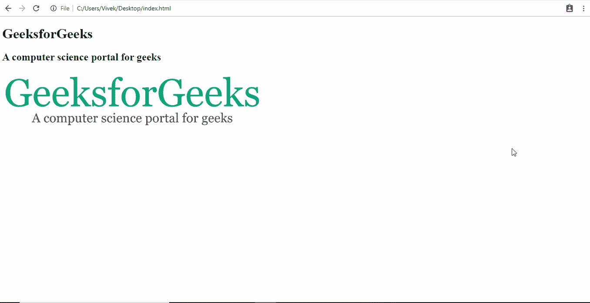
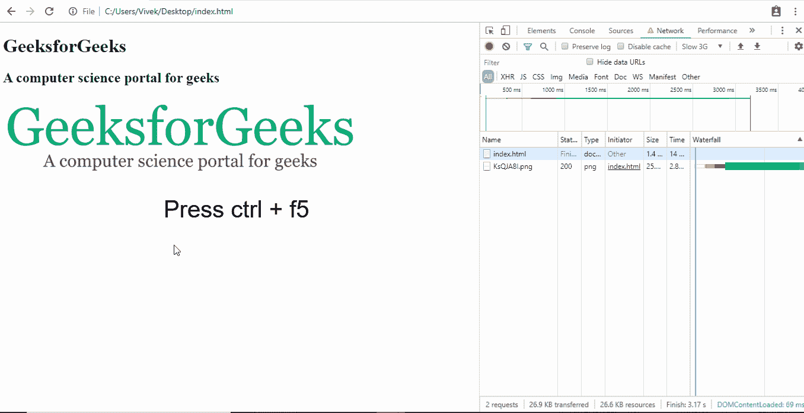

# 如何显示页面加载 div，直到页面加载完毕？

> 原文:[https://www . geesforgeks . org/how-show-page-loading-div-直到页面完成加载/](https://www.geeksforgeeks.org/how-to-show-page-loading-div-until-the-page-has-finished-loading/)

有很多方法可以显示加载`div`，但是我们已经为您找到了最理想的解决方案，并且在纯普通的 JavaScript 中也是如此。我们将使用`document.readyState`属性。当该属性的值改变时，在文档对象上触发`readystatechange`事件。

`document.readyState`属性可以返回这三个字符串值:

**`loading` :** 文档还在加载的时候。

**`interactive` :** 当文档加载完毕，但子资源如样式表、图像和框架仍在加载时。

**`complete` :** 文档和所有子资源加载完毕。

**我们来看看 JavaScript 代码:**

```html
document.onreadystatechange = function() {
    if (document.readyState !== "complete") {
        document.querySelector("body").style.visibility = "hidden";
        document.querySelector("#loader").style.visibility = "visible";
    } else {
        document.querySelector("#loader").style.display = "none";
        document.querySelector("body").style.visibility = "visible";
    }
};
```

当`document.readyState`改变时，`readystatechange`事件触发，我们的功能执行。如果文档还没有被加载，那么主体应该对用户隐藏，只有加载器应该是可见的。一旦页面完全加载，我们将 loader 的显示设置为无，并使正文可见。

**示例:**

```html
<!DOCTYPE html>
<html lang="en">

<head>
    <meta charset="utf-8" />
    <meta name="viewport"
          content="width=device-width, initial-scale=1.0" />
    <meta http-equiv="X-UA-Compatible" content="ie=edge" />
    <title>Loader Demo</title>
    <style>
        #loader {
            border: 12px solid #f3f3f3;
            border-radius: 50%;
            border-top: 12px solid #444444;
            width: 70px;
            height: 70px;
            animation: spin 1s linear infinite;
        }

        @keyframes spin {
            100% {
                transform: rotate(360deg);
            }
        }

        .center {
            position: absolute;
            top: 0;
            bottom: 0;
            left: 0;
            right: 0;
            margin: auto;
        }
    </style>
</head>

<body>
    <div id="loader" class="center"></div>
    <h1>GeeksforGeeks</h1>
    <h2>A computer science portal for geeks</h2>
    
    <script>
        document.onreadystatechange = function() {
            if (document.readyState !== "complete") {
                document.querySelector(
                  "body").style.visibility = "hidden";
                document.querySelector(
                  "#loader").style.visibility = "visible";
            } else {
                document.querySelector(
                  "#loader").style.display = "none";
                document.querySelector(
                  "body").style.visibility = "visible";
            }
        };
    </script>
</body>

</html>
```

要查看运行中的代码，您需要遵循这些简单的步骤:
**步骤 1:** 在文本编辑器中复制并粘贴上面的示例代码，并用*保存。html 扩展*。

**第二步:**打开*。你保存的 html* 文件然后打开浏览器的开发者工具，转到网络选项卡，将节流设置为 Slow 3G。这里有一个 GIF 来告诉你怎么做:



在开发者工具中将网络节流设置为慢速 3G

**第三步:**使用 **ctrl + f5** 重新加载页面。以下是最终输出的样子:



最终输出