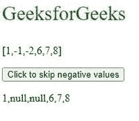
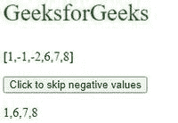
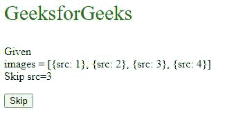
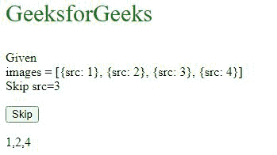

# 如何跳过中的一个元素。map()？

> 原文:[https://www . geesforgeks . org/如何跳过地图中的元素/](https://www.geeksforgeeks.org/how-to-skip-over-an-element-in-map/)

JavaScript 中的 **map()** 函数用于通过为每个数组元素调用函数来生成一个新数组。

**注:**

*   map()方法按顺序调用每个数组元素的函数。
*   map_)不为没有值的数组 lemon 执行。
*   map()不会更改原始数组。

有多种方法可以跳过地图中的元素:

*   在要执行的函数中使用 if 循环来添加跳过该元素的约束。
*   使用过滤方法。
*   使用箭头功能。

**示例 1:** 在循环内部添加约束。

## 超文本标记语言

```html
<!DOCTYPE html>
<html>

<body>
    <p style="color: green; 
        font-size: 30px;">
        GeeksforGeeks
    </p>

    <p>[1,-1,-2,6,7,8]</p>

    <button onclick="myFunction()">
        Click to skip negative values
    </button>

    <p id="demo"></p>

    <script>
        function display(num) {
            if (num > 0) {
                return num;
            }
            else {
                return "null";
            }
        }
        var values = [1, -1, -2, 6, 7, 8]
        var filtered = values.map(display)
        function myFunction() {
            x = document.getElementById("demo")
            x.innerHTML = filtered;
        }
    </script>
</body>

</html>
```

**输出:**



**例 2:** 使用过滤方法。

## 超文本标记语言

```html
<!DOCTYPE html>
<html>

<body>
    <p style="color: green; 
        font-size: 30px;">
        GeeksforGeeks
    </p>

    <p>[1,-1,-2,6,7,8]</p>

    <button onclick="myFunction()">
        Click to skip negative values
    </button>

    <p id="demo"></p>

    <script>
        function isPositive(value) {
            return value > 0;
        }
        function display(num) {
            return num;
        }
        var values = [1, -1, -2, 6, 7, 8]
        var filtered = 
            values.map(display).filter(isPositive);

        function myFunction() {
            x = document.getElementById("demo")
            x.innerHTML = filtered;
        }
    </script>
</body>

</html>
```

**输出:**



**示例 3:** 使用箭头功能。

## 超文本标记语言

```html
<!DOCTYPE html>
<html>

<body>
    <p style="color: green; 
        font-size: 30px;">
        GeeksforGeeks
    </p>

    <p>Given<br>images = [{src: 1}, {src: 2}, 
        {src: 3}, {src: 4}]<br>Skip src=3</p>

    <button onclick="myFunction()">Skip</button>
    <p id="demo"><br></p>

    <script>
        let images = [{ src: 1 }, { src: 2 }, 
                        { src: 3 }, { src: 4 }];
        let sources = images.filter(
            img => img.src != 3).map(img => img.src);

        function myFunction() {
            x = document.getElementById("demo")
            x.innerHTML = sources;
        }
    </script>
</body>

</html>
```

**输出:**

**点击按钮前:**



点击前

**点击按钮后:**



点击按钮后