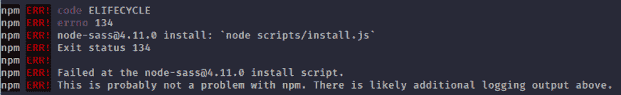
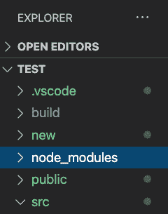
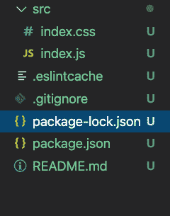

# 如何解决 npm 错误 npm ERR！代码 ELIFECYCLE？

> 原文:[https://www . geesforgeks . org/how-solution-NPM-error-NPM-err-code-elifeccycle/](https://www.geeksforgeeks.org/how-to-solve-npm-error-npm-err-code-elifecycle/)

为了解决“ **npm ERR！代码 elifeccycle**“错误是在我们的命令提示符或终端上进行 npm 操作(例如安装 npm 或 npm 包)期间发生的一种非常常见的错误，请遵循以下步骤:

**错误的终端输出:**

按照以下步骤修复错误:

**步骤 1 :** 在我们的第一步中，我们将尝试清理安装在项目目录中的 npm 的缓存。npm 将缓存数据存储在配置的缓存中的一个不透明目录中，名为 **_cacache** 。

npm 将缓存数据存储在配置的缓存内的隐藏目录中，该缓存的名称为 **_cacache** 。“ **_cacache** ”代表**内容可寻址缓存**，用于存储所有 HTTP 请求数据以及其他包相关数据。

> **$ npm 缓存清理–强制**

**步骤 2(删除 node_modules) :** 在我们的第二步中，我们将删除 node_modules 文件夹，该文件夹将以这种方式在您的项目目录中构建。

只需将光标悬停在 node_modules 文件夹上并右键单击它，然后从显示的选项中选择**“删除”**。此操作将从项目结构中删除 node_modules 文件夹。

**第三步(删除包-lock.json ):** 与第二步类似，我们现在也将从项目目录中删除**“包-lock . JSON”**文件。但是这个**“package-lock . JSON”**可能会再次出现在项目目录中，因为我们将在下一步中再次执行“$ npm install”。

**步骤 4 :** 在这一步中，我们必须再次将 npm 安装到我们的项目目录中，因为我们已经在第二步中删除了 **node_modules** 文件夹，该文件夹删除了项目中安装的 npm。因此，要在项目目录中再次安装 npm，请使用以下命令。

> **$ npm 安装**

这将解决冲突/错误。请确保 npm 安装正确，并且您已经在同一位置再次获得了您的 **node_modules** 文件夹。