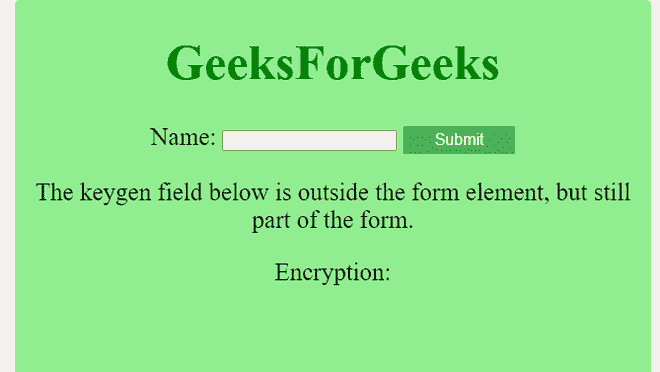

# 如何指定 keygen 元素所属的一个或多个表单？

> 原文:[https://www . geeksforgeeks . org/如何指定一个或多个表单-key gen-element-attribute/](https://www.geeksforgeeks.org/how-to-specify-one-or-more-forms-the-keygen-element-belongs-to/)

任务是指定 keygen 元素所属的一个或多个窗体。您可以通过使用表单属性轻松做到这一点，表单属性是 keygen 元素的一个属性。 [**表单元素**](https://www.geeksforgeeks.org/html-form-tag/) 用于创建一个 HTML 表单供用户输入。 [**keygen 元素**](https://www.geeksforgeeks.org/html-keygen-tag/) 用于在表单中指定密钥对生成器字段，并用于提供安全的用户身份验证方式。它在 Internet Explorer 中不受支持。 [**表单属性**](https://www.geeksforgeeks.org/html-form-attribute/) 用于指定< keygen >元素所属的一个或多个表单。

**进场:**

*   创建带有特定 *id* 名称的表单元素的 HTML 页面。
*   使用*表单 _id* 创建一个 keygen 元素。

**示例:**

## 超文本标记语言

```html
<!DOCTYPE html>
<html>

<head>
    <title>
        Form Attribute
    </title>
    <style>
        body {
            text-align: center;
            background-color: lightgreen;
            font-size: 25px;
        }

        button {
            background-color: #4CAF50;
            /* Green */
            border: none;
            color: white;
            padding: 5px 32px;
            text-align: center;
            text-decoration: none;
            display: inline-block;
            font-size: 16px;
        }
    </style>
</head>

<body>
    <h1 style="color:green">GeeksForGeeks</h1>

    <form id="form1">
        Name: <input type="text" name="usr_name">
        <button>Submit</button>
    </form>

    <p>
       The keygen field below is outside the form element,
       but still part of the form.
   </p>

    Encryption: <keygen name="security" form="form1">

</body>
</html>
```

**输出:****键根元素**是形态的一部分，但它是在形态元素之外创建的。

