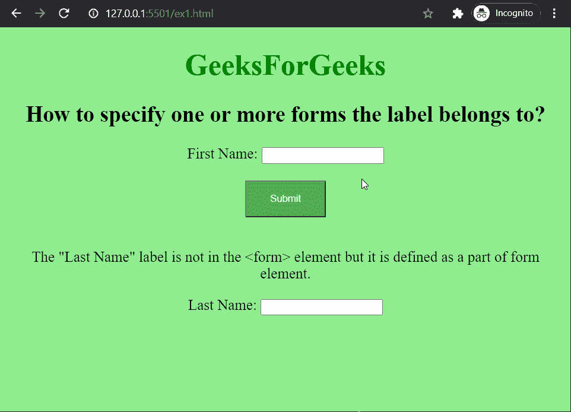
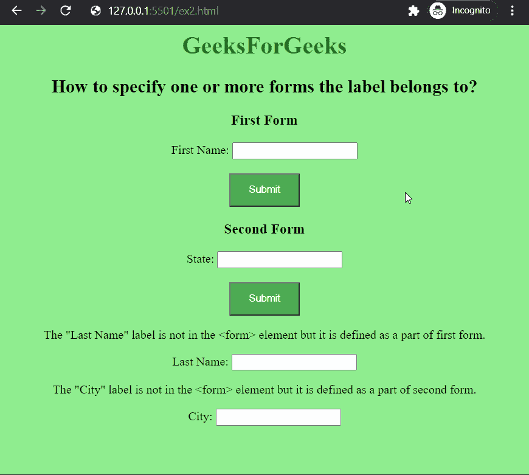

# 如何指定标签所属的一个或多个表单？

> 原文:[https://www . geeksforgeeks . org/如何指定标签所属的一个或多个表单/](https://www.geeksforgeeks.org/how-to-specify-one-or-more-forms-the-label-belongs-to/)

在本文中，我们将学习如何指定标签所属的一个或多个表单。这可用于标签在表单元素之外定义并且需要链接回表单的情况。

**方法:**我们将使用标签的 **[表单](https://www.geeksforgeeks.org/html-form-attribute/)** 属性来指定标签所属的一个或多个表单。该属性接受标签所属表单的 *id* 。下面的例子演示了这种方法。

**示例 1:** 在本例中，我们在表单元素之外创建了输入和标签元素，并使用*表单*属性来定义标签如何属于表单。

## 超文本标记语言

```html
<html>
  <body>
    <style>
      body {
        text-align: center;
        background-color: lightgreen;
        font-size: 20px;
      }

      .btn {
        background-color: #4caf50;
        color: white;
        padding: 15px 32px;
      }
    </style>

    <h1 style="color: green">GeeksForGeeks</h1>
    <h2>
      How to specify one or more forms 
      the label belongs to?
    </h2>

    <form id="form1">
      <label for="fname">First Name:</label>
      <input type="text" id="fname" name="fname" />
      <br /><br />
      <button class="btn" type="submit">
        Submit
      </button>
    </form>
    <br />
    <p>
      The "Last Name" label is not in the 
      <form> element but it is defined
      as a part of form element.
    </p>

    <!-- Specify the name of the above form 
         that is label will belong -->
    <label for="lname" form="form1"> 
      Last Name: 
    </label>
    <input type="text" id="lname" 
           name="lname" form="form1" />
  </body>
</html>
```

**输出:**



**例 2:** 在这个例子中，我们有两种形式。姓氏是第一个元素的一部分，城市是第二个形式的一部分。我们使用*表单*属性来定义两个标签的归属。

## 超文本标记语言

```html
<html>
  <body>
    <style>
      body {
        text-align: center;
        background-color: lightgreen;
        font-size: 16px;
      }

      .btn {
        background-color: #4caf50;
        color: white;
        padding: 12px 24px;
      }
    </style>

    <h1 style="color: green">GeeksForGeeks</h1>
    <h2>
       How to specify one or more forms
       the label belongs to?
    </h2>

    <h3>First Form</h3>
    <form id="form1">
      <label for="fname"> First Name: </label>
      <input type="text" id="fname" name="fname" />
      <br /><br />
      <button class="btn" type="submit">Submit</button>
    </form>
    <h3>Second Form</h3>
    <form id="form2">
      <label for="state">State:</label>
      <input type="text" id="state" name="state" />
      <br /><br />
      <button class="btn" type="submit">Submit</button>
    </form>
    <p>
      The "Last Name" label is not in the <form>
      element but it is defined
      as a part of first form.
    </p>

    <!-- Specify the name of the above form 
         that is label will belong -->
    <label for="lname" form="form1"> Last Name: </label>
    <input type="text" id="lname" name="lname" form="form1" />

    <p>
      The "City" label is not in the <form> 
      element but it is defined as a
      part of second form.
    </p>

    <!-- Specify the name of the above form 
         that is label will belong -->
    <label for="city" form="form2">City:</label>
    <input type="text" id="city" name="city" form="form2" />
  </body>
</html>
```

**输出:**

