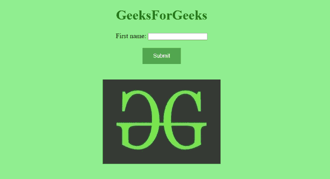
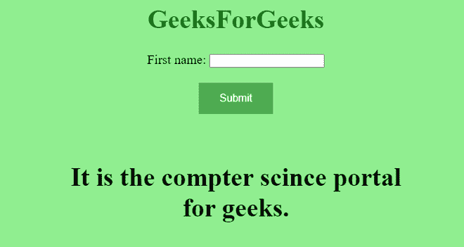

# 如何指定对象所属的一个或多个表单？

> 原文:[https://www . geesforgeks . org/如何指定对象所属的一个或多个表单/](https://www.geeksforgeeks.org/how-to-specify-one-or-more-forms-the-object-belongs-to/)

本文的目的是指定对象所属的一个或多个表单。简单来说，我们只需要创建一个表单，然后在创建一个对象之后，我们只需要指定它属于哪个表单。 [**表单**](https://www.geeksforgeeks.org/html-form-tag/) **元素**用于创建一个 HTML 表单供用户输入。 [**对象**](https://www.geeksforgeeks.org/html-object-tag/) **元素**用于定义外部资源的容器。

[**形态属性**](https://www.geeksforgeeks.org/html-form-attribute/) 用于指定对象属于哪个形态。该属性被对象元素接受。

**进场:**

*   首先，我们将创建一个带有表单元素的 HTML 页面。
*   创建一个对象并指定它属于哪种形式。

**例 1:**

## 超文本标记语言

```html
<!DOCTYPE html>
<html>

<head>
    <title> Form attribute </title>
    <style>
        body {
            text-align: center;
            background-color: lightgreen;
            font-size: 20px;
        }

        button {
            background-color: #4CAF50;
            /* Green */
            border: none;
            color: white;
            padding: 15px 32px;
            text-align: center;
            text-decoration: none;
            display: inline-block;
            font-size: 16px;
        }
    </style>
</head>

<body>

    <h1 style="color:green">GeeksForGeeks</h1>

    <form id="form1">
        First name: <input type="text" name="fname">
        <br><br>
        <button>Submit</button>

    </form>
    <br><br>
    <object data="gfg.jpg" 
            width="350" 
            height="250" 
            form="form1">
    </object>

</body>

</html>
```

**输出:**在本例中，我们单独创建了对象，但它也是表单的一部分。



**例 2:**

## gfg.html 格式

```html
<!DOCTYPE html>
<html>
  <head>
    <title>Form attribute</title>
    <style>
      body {
        text-align: center;
        background-color: lightgreen;
        font-size: 20px;
      }
      button {
        background-color: #4caf50; /* Green */
        border: none;
        color: white;
        padding: 15px 32px;
        text-align: center;
        text-decoration: none;
        display: inline-block;
        font-size: 16px;
      }
    </style>
  </head>
  <body>
    <h1 style="color: green">GeeksForGeeks</h1>

    <form id="form1">
      First name: <input type="text" name="fname" />
      <br /><br />
      <button>Submit</button>
    </form>
    <br /><br />
    <object data="new.html" width="550" 
            height="250" form="form1">
    </object>
  </body>
</html>
```

## new.html

```html
<!DOCTYPE html>
<html>
    <head>
        <title>
            Form attribute
        </title>
        <style>
                body{
                    text-align: center;
                    font-size: 20px;

                }
        </style>
    </head>

    <body>
        <h1>
         It is the compter science portal for geeks.
        </h1>
    </body>
</html>
```

**输出:**

