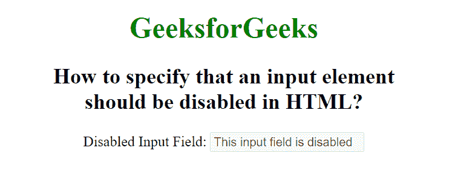

# 如何指定某个输入元素应该被禁用？

> 原文:[https://www . geesforgeks . org/如何指定输入元素应该被禁用/](https://www.geeksforgeeks.org/how-to-specify-that-an-input-element-should-be-disabled/)

在本文中，我们将使用 HTML 禁用输入字段。<input>元素的禁用属性用于指定输入字段被禁用。禁用的输入不可点击且不可用。它是一个布尔属性。表单中未提交禁用的<input>元素。

**语法:**

```htmlhtml
<input disabled>
```

当禁用属性存在时，它指定输入字段被禁用。我们无法在禁用的输入字段中写入任何内容。

**示例:**

## 超文本标记语言

```htmlhtml
<!DOCTYPE html>
<html>

<head>
    <title>
        How to specify that an input element 
        should be disabled in HTML?
    </title>
</head>

<body style="text-align:center">
    <h1 style="color: green;">
        GeeksforGeeks
    </h1>

    <h2>
        How to specify that an input element 
        <br>should be disabled in HTML?
    </h2>

    <label>Disabled Input Field:

        <!--A disabled input-->
        <input type="text" name="value" 
            value="This input field 
            is disabled" disabled>
    </label>
</body>

</html>
```

**输出:**



**支持的浏览器:**

*   苹果 Safari 1.0
*   谷歌 Chrome 1.0
*   Firefox 1.0
*   Opera 1.0
*   Internet Explorer 6.0