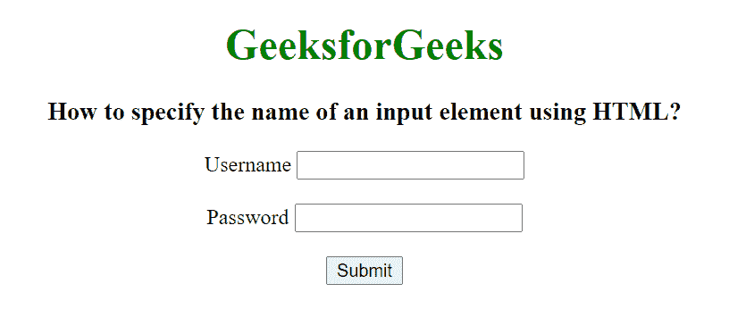
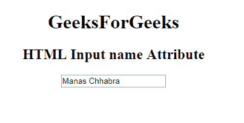

# 如何指定输入元素的名称？

> 原文:[https://www . geesforgeks . org/如何指定输入元素的名称/](https://www.geeksforgeeks.org/how-to-specify-the-name-of-an-input-element/)

在本文中，我们将使用 HTML 指定输入元素的名称。要添加输入元素的名称，我们使用 [**HTML <输入>名称属性**](https://www.geeksforgeeks.org/html-input-name-attribute/) 。HTML <输入>名称属性用于指定<输入>元素的名称。它用于在提交表单后引用表单数据，或者在 JavaScript 中引用元素。

**语法:**

```htmlhtml
<input name="name">
```

**属性值:**它包含描述<输入>元素名称的单个值名称。

**示例-1:**

## 超文本标记语言

```htmlhtml
<!DOCTYPE html>
<html lang="en">

<head>
    <title>
        How to specify the name of an
        input element using HTML?
    </title>
</head>

<body style="text-align: center;">
    <h1 style="color: green;">
        GeeksforGeeks
    </h1>

    <h3>
        How to specify the name of an
        input element using HTML?
    </h3>

    <form id="myGeeks">
        <label for="GFG">Username</label>
        <input type="text" id="GFG" name="GFG">
        <br><br>

        <label for="GFG1">Password</label>
        <input type="password" id="GFG1" name="GFG1">
        <br><br>

        <input type="submit" name="submit">
    </form>
</body>

</html>
```

**输出:**



**示例-2:**

## 超文本标记语言

```htmlhtml
<!DOCTYPE html> 
<html> 

<head> 
    <title> 
        HTML Input name Attribute 
    </title> 
</head> 

<body style="text-align:center;"> 

    <h1>GeeksForGeeks</h1> 

    <h2>HTML Input name Attribute</h2> 
    <form id="myGeeks"> 
        <input type="text"
            id="text_id"
            name="geeks"
            pattern="[A-Za-z]{3}"
            value="Manas Chhabra"> 
    </form> 
    <br> 
</body> 

</html> 
```

**输出:**

