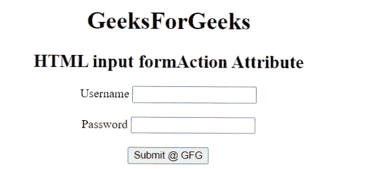

# 如何指定提交表单时将处理通过输入提供的数据的网址？

> 原文:[https://www . geesforgeks . org/如何指定将在提交表单时处理通过输入提供的数据的 URL/](https://www.geeksforgeeks.org/how-to-specify-the-url-that-will-process-the-data-supplied-through-inputs-when-the-form-is-submitted/)

HTML <input> [*表单*](https://www.geeksforgeeks.org/html-formaction-attribute/) 属性用于指定提交表单时处理输入控件的文件的 URL。表单提交后，调用*表单*属性。表单数据将在表单提交后发送到服务器。它覆盖了 [<表单>](https://www.geeksforgeeks.org/html-form-tag/) 元素的动作属性。

**语法:**

```htmlhtml
<input type = "submit" formaction = "URL">
```

网址的可能值如下。

*   **绝对 URL:** 包含页面的完整地址。例如“https://www . geesforgeks . org/c-plus-plus/”
*   **相对 URL:** 指向当前网页内的文件。例如“gfg.php”

**示例:**以下示例定义了指定 URL，该 URL 将处理提交表单时提供的数据。

## 超文本标记语言

```htmlhtml
<!DOCTYPE html>
<html>
  <body style="text-align: center">
    <h1>GeeksForGeeks</h1>

    <h2>HTML input formAction Attribute</h2>
    <!--Form stays in the same page -->
    <form action="#" method="get" target="_self">
      <label for="fname">Username</label>
      <input type="text" 
             id="userName" 
             name="userName" />
      <br /><br />
      <label for="lname">Password</label>
      <input type="password" 
             id="password" 
             name="password" />
      <br /><br />
      <!--The data is send to "test.php" after submit -->
      <input
        type="submit"
        id="gfg"
        name="geeks"
        value="Submit @ GFG"
        formtarget="_blank"
        formmethod="post"
        formaction="test.php"
      />
    </form>
  </body>
</html>
```

**输出:**

