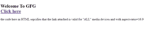

# 如何指定目标 URL 针对什么媒体/设备进行优化？

> 原文:[https://www . geeksforgeeks . org/如何为/](https://www.geeksforgeeks.org/how-to-specify-what-media-device-the-target-url-is-optimized-for/) 指定优化了什么媒体设备目标 url

HTML 的**媒体属性用于指定浏览器，链接文档针对哪些设备进行了优化。这个属性通常用于 CSS 样式表，但是也可以用于简单的 HTML 构建的网页。该属性允许用户从多种设备中进行选择，并且可以接受多个值。该属性用于指定目标网址是为特殊设备(如 iPhone、安卓等)、语音或打印媒体、投影仪、电视等设计的。**

**注意:**只有当 *href* 属性用作 *href* 指定链接文档时，才能使用该属性，因此媒体属性用于指定链接文档将如何以及在哪些设备中出现并兼容。

我们可以指定的各种设备值如下:

<figure class="table">

| **<u>sl。没有。</u>T3】** | **<u>价值观</u>** | **<u>描述</u>** |
| 1。 | all | 如果未指定，则为默认值。

它最适合所有媒体类型的设备。语法-<a href = " # " media = " all target = " _ blank ">点击此处</a> |
| 2。 | screen | 用于电脑屏幕、智能手机等。语法-<a href = " # " media = " screen " target = " _ blank ">点击此处</a> |
| 3。 | give a lecture | 它是用于屏幕的——做“朗读”的读者大声朗读页面。语法-<a href = " # " media = " speech " target = " _ blank ">点击此处</a> |
| 4。 | print | 用于打印预览模式/打印页面的模式。语法-<a href = " # " media = " print " target = " _ blank ">点击此处</a>

 |
| 5。 | TV | 用于电视类设备(低分辨率，或者滚动能力有限的设备)。语法-<a href = " # " media = " TV " target = " _ blank ">点击此处</a> |

</figure>

我们还可以在指定媒体设备类型的同时添加一些额外的特定信息，以显示链接文档的优化方式。

<figure class="table">

| **<u>Sl 号</u>T3】** | **<u>价值</u>** | **<u>描述</u>** |
| 1。 | width | 用于指定目标媒体显示区域的宽度。语法-<a href = " # " media = " screen and(min-width:100px)" target = " _ blank ">点击此处</a> |
| 2。 | height | 用于指定目标媒体显示区域的高度。语法-<a href =“#”media =“屏幕和(最大高度:700 px)”target =“_ blank”>点击此处</a> |
| 3。 | Equipment-width | 用于指定目标媒体显示区域的宽度。。语法- < a href="#" media= "屏幕和(设备-宽度:100px)" target="_blank" >点击此处</a> |
| 4。 | length-width ratio | 用于指定目标媒体显示区域的宽高比。

语法-<a href = " # " media = " screen and(长宽比:4/3)" target="_blank" >点击此处</a> |
| 5。 | Equipment-height | 用于指定目标媒体显示/纸张的高度。语法- < a href="#" media= "屏幕和(设备-高度:400px)" target="_blank" >点击此处</a> |
| 6。 | position | 用于指定媒体设备显示器/纸张的方位。语法-<a href = " # " media = " all and(orientation:landscape)" target = " _ blank ">点击此处</a> |
| 7。 | Equipment width-height ratio | 用于指定媒体设备显示器/纸张的设备宽高比。语法- < a href="#" media= "屏幕和(长宽比:4/3)" target="_blank" >点击此处</a> |
| 8。 | colour | 用于指定媒体设备显示的每种颜色的位数。语法- < a href="#" media= "屏幕和(颜色:1)" target="_blank" >点击此处</a> |
| 9。 | Color index | 用于指定媒体设备显示可以支持的颜色数量。

语法- < a href="#" media= "屏幕和(min-color-index:250)" target = " _ blank ">点击此处</a> |
| 10。 | resolution ratio | 用于指定媒体设备显示器/纸张的像素密度。语法-<a href = " # " media = " print and(resolution:400 dpi)" target = " _ blank ">单击此处</a> |

</figure>

**语法:**

```htmlhtml
<a href="#" media="all" target="_blank"></a>
```

下面是说明如何指定媒体属性的代码。

**示例:**

## 超文本标记语言

```htmlhtml
<!DOCTYPE html>
<html>

<body>
  <h2>Welcome To GFG</h2><br>
  <a href="https://ide.geeksforgeeks.org/"
     media="all and (aspect-ratio:16/9)"
     target="_blank">
    Click here
  </a>

<p>
    the code here in HTML specifies that the
    link attached is valid for "ALL" media
    devices and with aspect-ratio=16:9
  </p>

</body>

</html>
```



Microsoft edge 上的示例输出。