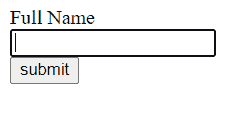
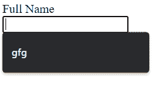

# 如何指定输入元素是否应该禁用自动完成？

> 原文:[https://www . geeksforgeeks . org/如何指定输入元素是否应该具有自动完成功能/是否禁用/](https://www.geeksforgeeks.org/how-to-specify-whether-an-input-element-should-have-autocomplete-disabled-or-not/)

[](https://www.geeksforgeeks.org/html-autocomplete-attribute/)**自动完成属性指定是否应启用自动完成输入字段。浏览器可以使用自动完成来预测值。在输入字段时，应该向用户显示基于先前输入值的填充字段的浏览选项。**

**如果启用了**自动完成**功能，浏览器将根据用户之前在字段中输入的内容来建议值。如果**自动完成**功能被禁用，浏览器将不会自动显示值，这取决于以前的用户。**

****注意:**文本、搜索、网址、手机、电子邮件、密码、日期选择器、范围和颜色都使用**自动完成**属性。**

****语法:****

```htmlhtml
<input autocomplete="on|off">
```

****值:****

*   ****开:**这是默认设置。说明**自动完成**已启用。**
*   ****关闭:**表示**自动完成**被禁用。**

****示例 1:** 以下示例演示了**自动完成**功能的禁用状态。在这种情况下，浏览器不会自动显示先前用户输入的值。**

## **超文本标记语言**

```htmlhtml
<!DOCTYPE html>
<html>
   <head>
      <title>OFF</title>
   </head>
   <body>
      <form action = "/gfg" method = "post" 
            autocomplete="off">
         Full Name
         <br>
         <input type = "text" name = "full_name">
         <br>
         <input type = "submit" value = "submit" />
      </form>
   </body>
</html>
```

****输出:****

**

自动完成关闭** 

****示例 2:** 以下示例演示了**自动完成**功能的启用状态。当**自动完成功能**打开时，浏览器将根据用户之前输入的字段建议值。**

## **超文本标记语言**

```htmlhtml
<!DOCTYPE html>
<html>
   <head>
      <title>ON</title>
   </head>
   <body>
      <form action = "/gfg" method = "post" 
            autocomplete="on">
         Full Name
         <br>
         <input type = "text" name = "full_name">
         <br>
         <input type = "submit" value = "submit" />
      </form>
   </body>
</html>
```

****输出:****

**

自动完成已打开**