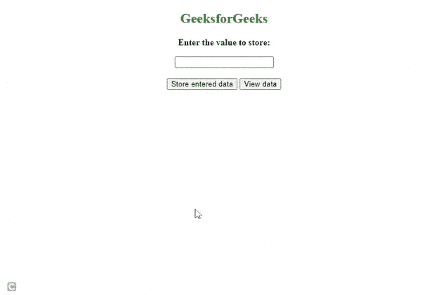

# 如何在 DOM 中存储数据？

> 原文:[https://www.geeksforgeeks.org/how-to-store-data-in-the-dom/](https://www.geeksforgeeks.org/how-to-store-data-in-the-dom/)

在本文中，我们将学习将数据存储到 [DOM](https://www.geeksforgeeks.org/html-dom-html-object/) 元素中。

如果我们想在一个 HTML 标签中保存一些数据，我们可以使用 [](https://www.geeksforgeeks.org/jquery-data-with-examples/) jQuery [**。data()**](https://www.geeksforgeeks.org/jquery-data-with-examples/) 方法存储数据，以后也可以用同样的方法检索。

**语法:**

```htmlhtml
$(selector).data(name)
```

**属性值:**

*   **名称:**定义要存储的数据的名称，是可选参数。

**注:**如未注明姓名，**。data()** 方法返回该特定元素的所有存储数据。

**HTML 代码:**我们来看一个例子，了解如何使用**将数据存储到 DOM 中。data()** 方法。

## 超文本标记语言

```htmlhtml
<!DOCTYPE HTML>
<html>
<head>
    <script src=
"https://ajax.googleapis.com/ajax/libs/jquery/3.5.1/jquery.min.js">
    </script>

</head>

<body style="text-align:center;" id="body">
    <h2 style="color:green">GeeksforGeeks</h2>
    <p><b>Enter the value to store:</b></p>

    <input type="text" id="data" name="input"><br/>
    <br/>
    <button id="b1">Store entered data</button>
    <button id="b2">View data </button><br/><br/>
    <div id="display"></div>

    <script>
    $(document).ready(function(){
     // We are setting user data to data tag 
         $("#b1").click(function(){
         var d=($("#data").val());
         $("#data").data("userdata",d);
      });
      //Displaying data after accessing from data tag 
      $("#b2").click(function(){
         $("#display").html($("#data").data("userdata")) ;

      });
    });
   </script>
</body>

</html>
```

**输出:**



data()方法