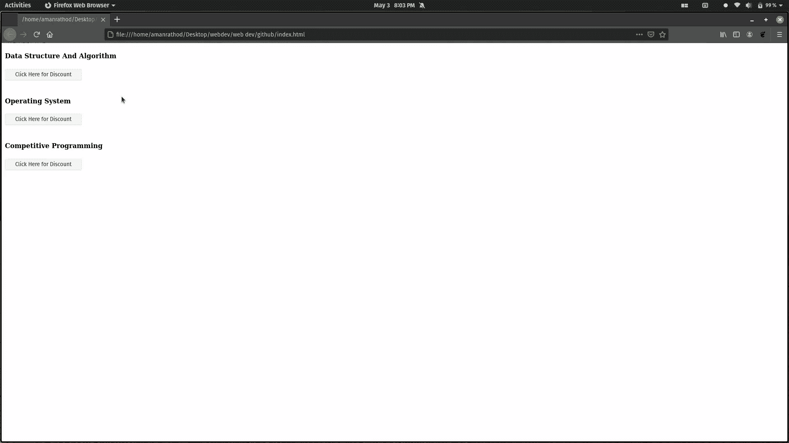

# 如何将数据存储到 DOM？

> 原文:[https://www.geeksforgeeks.org/how-to-store-data-to-dom/](https://www.geeksforgeeks.org/how-to-store-data-to-dom/)

在本文中，我们将学习如何将数据存储到 DOM 中。可以使用 [**数据-*属性**](https://www.geeksforgeeks.org/html-data-attributes/) 在 DOM 上存储数据或信息。**数据-*** 属性可以用来定义我们自己的自定义数据属性。它用于存储页面或应用程序私有的自定义数据。

**数据属性主要有 2 部分:**

*   **属性名:**属性名至少一个字符长，不含大写字母，前缀为*‘数据-’。*
*   **属性值:**可以是任意字符串。

**语法:**

```htmlhtml
<div data-row = "value" data-column = "value"
     data-index = "value">
</div>
```

**注:**

1.  存储在 DOM 中的任何数据都可以在源代码中查看(开发人员工具)。
2.  数据-*属性不能使用大写

**例 1:**

## 超文本标记语言

```htmlhtml
<!DOCTYPE html>

<body>
  <div>
    <h4>Data Structure And Algorithm</h4>
    <button onclick="showDetails(this)" id="one"
        data-discount="60%">Click Here for Discount
    </button>
  </div>
  <br>

  <div>
    <h4>Operating System</h4>
    <button onclick="showDetails(this)" id="one"
        data-discount="60%">Click Here for Discount
    </button>
  </div>
  <br>

  <div>
    <h4>Competitive Programming</h4>
    <button onclick="showDetails(this)" id="one"
        data-discount="60%">Click Here for Discount
    </button>
  </div>

  <script>
    function showDetails(book) {
      var discount =
        book.getAttribute("data-discount");
        alert(discount);
    }
  </script>
</body>

</html>
```

**输出:**



**例 2:**

您也可以使用 jQuery 中的 **data()方法**将数据存储在 DOM 上，这是 **jQuery 中的一种内置方法**，用于附加数据或获取所选元素的数据。

**语法:**

```htmlhtml
$(selector).data(para1);
```

## 超文本标记语言

```htmlhtml
<html>

<head>
  <script src="https://ajax.googleapis.com/ajax/libs/
      jquery/3.3.1/jquery.min.js">
  </script>

  <style>
    div {
      display: block;
      width: 500px;
      font-size: 37px;
      padding: 50px;
      background-color: lightgrey;
    }

    span {
       color: green;
    }
  </style>
</head>

<body>
  <div>
    Course Includes
    <span></span> and <span></span>!
  </div>

  <script>
    // <!-- jQuery code to perform data method -->
    $("div").data("test", {
        first: "Operative System",
        last: "Competitive Programming"
    });
    $("span:first").text($("div").data("test").first);
    $("span:last").text($("div").data("test").last);
  </script>
</body>

</html>
```

**输出:**

