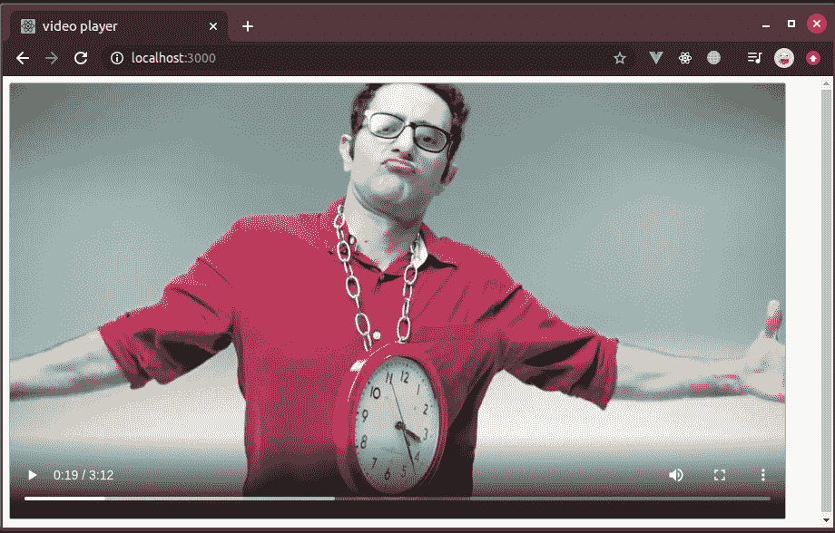

# 如何流式传输大型. mp4 文件？

> 原文:[https://www . geesforgeks . org/how-to-stream-large-MP4-files/](https://www.geeksforgeeks.org/how-to-stream-large-mp4-files/)

将大型视频文件从服务器流式传输到客户端，这可能是网络应用程序或移动应用程序的低效方式！

我们不能将整个视频一次发送给客户。因为有用户的带宽和数据限制之类的条件。

**示例:**

比如说 youtube，用户可能看了视频的某个部分，因为某种原因离开了，如果他再打开那个视频，应该不会从头加载整个视频。

这是我们需要某种机制来处理这种情况的部分。

*Nodejs 流 API* 进入画面，它比用常规方式读取一个文件，等待回调解决更有效率。

创建了一个基本的视频流服务器来更好地解释它。

**系统流量:**

*   用户访问网站(index.html)
*   *index.html*中的 html5 视频组件指向服务器正在流式传输的视频的 URL
*   视频请求由服务器通过处理范围头部来处理，并且发送部分视频作为部分内容

**设置项目:**

*   开放式终端
*   mkdir〔t0〕
*   cd
*   npm 初始 y
*   打开您最喜欢的文本编辑器
*   在那个文件夹上创建**index.html**(检查下面的 html 代码，在那里使用它)
*   创建一个 **server.js** 文件(检查下面提供的 js 代码)
*   运行**“节点服务器. js”**命令
*   打开浏览器，导航至**“localhost:3000”**

**完整源代码:**

[https://github . com/varapasadh/gfg 博客/tree/master/streamvideo](https://github.com/varaprasadh/gfg-blogs/tree/master/streamvideo)

**我们将需要一个 index.html 文件显示来自服务器的视频！**

## 超文本标记语言

```html
<!DOCTYPE html>
<html lang="en">
<head>
    <meta charset="UTF-8">
    <meta name="viewport"
          content="width=device-width,
                   initial-scale=1.0">
    <meta http-equiv="X-UA-Compatible"
            content="ie=edge">
    <title>video player</title>
</head>
<body>
    <video src="http://localhost:3000/video" controls>
   </video>
</body>
</html>
```

## java 描述语言

```html
const http=require('http');
const fs=require("fs");
const path=require("path");

/* http.createServer takes a handler
   function and returns a server instance;*/
const server=http.createServer((req, res)=>{
    // return res.end(req.url+req.method);
    if(req.method==='GET' && req.url==="/"){
        /*we will send a index.html page when
          user visits "/" endpoint*/
        /*index.html will have video component
          that displays the video*/

        fs.createReadStream(path.resolve(
                        "index.html")).pipe(res);
        return;
    }
    //if video content is requesting
    if(req.method==='GET' && req.url==="/video"){
        const filepath = path.resolve("video.mp4");
        const stat = fs.statSync(filepath)
        const fileSize = stat.size
        const range = req.headers.range
        /*when we seek the video it will put
          range header to the request*/
        /*if range header exists send some
            part of video*/
        if (range) {
            //range format is "bytes=start-end",
            const parts =
                range.replace(/bytes=/, "").split("-");

            const start = parseInt(parts[0], 10)
            /*in some cases end may not exists, if its
                          not exists make it end of file*/
            const end =
                 parts[1] ?parseInt(parts[1], 10) :fileSize - 1

            //chunk size is what the part of video we are sending.
            const chunksize = (end - start) + 1
            /*we can provide offset values as options to
           the fs.createReadStream to read part of content*/
            const file = fs.createReadStream(filepath, {start, end})

            const head = {
                'Content-Range': `bytes ${start}-${end}/${fileSize}`,
                'Accept-Ranges': 'bytes',
                'Content-Length': chunksize,
                'Content-Type': 'video/mp4',
            }
            /*we should set status code as 206 which is
                    for partial content*/
            // because video is continuously fetched part by part
            res.writeHead(206, head);
          file.pipe(res);

        }else{

        //if not send the video from start.
        /* anyway html5 video player play content
          when sufficient frames available*/
        // It doesn't wait for the entire video to load.

           const head = {
               'Content-Length': fileSize,
               'Content-Type': 'video/mp4',
           }
           res.writeHead(200, head);
           fs.createReadStream(path).pipe(res);
        }
    }
    /*if anything other than handler routes then send
      400 status code, is for bad request*/
    else{
        res.writeHead(400);
        res.end("bad request");
    }
})

/*check if system has environment variable
   for the port, otherwise defaults to 3000*/
const PORT = process.env.PORT || 3000;

//start the server
server.listen(PORT, () => {
  console.log(`server listening on port:${PORT}`);
})
```

最后我们可以在浏览器中看到结果



决赛成绩