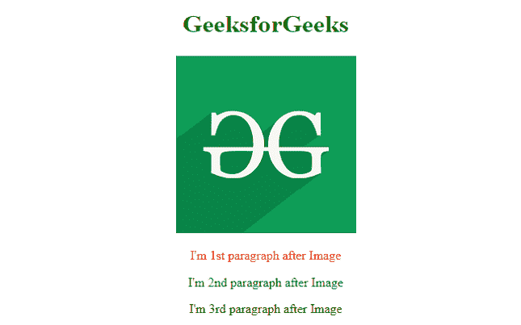
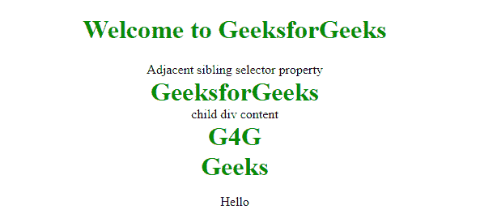

# 如何给每个前面有相邻项的元素设置样式？

> 原文:[https://www . geeksforgeeks . org/how-style-每一个在它前面有相邻项的元素/](https://www.geeksforgeeks.org/how-to-style-every-element-that-have-adjacent-item-right-before-it/)

您可以使用**相邻同级选择器(+)，轻松地为每个有相邻项目的元素设置样式。**相邻的同级选择器用于选择相邻的元素或指定选择器标签旁边的元素。这个组合器只选择紧挨着指定标签的一个标签。

**注意:** [选择器](https://www.geeksforgeeks.org/advanced-selectors-in-css/)用于选择属性中的 HTML 元素，相邻的兄弟选择器(+)是选择器的一种。语法很简单，两个或更多的选择器用一个加号 **(+)** 隔开。

**先决条件:**对 [**组合子**](https://www.geeksforgeeks.org/css-combinators/) 有很好的理解

**语法:**

```html
former_element + target_element { style properties }  
```

**示例 1:** 相邻的同级选择器将只选择紧随另一个同级元素之后的同级元素。两个元素共享同一个父元素(中心)。

## 超文本标记语言

```html
<!DOCTYPE html>
<html>

<head>
    <style>
        h1 {
            color: green;
        }

        /* styling the paragraph just after
           image tag p elements directly 
           following after img elements 
           will be selected Both share 
           same parent */
        img + p {
            color: red;
        }

        img + p + p {
            color: green;
        }
    </style>
</head>

<body>
    <center>
        <h1>GeeksforGeeks</h1>
        

        <p>I'm 1st paragraph after Image</p>

        <p>I'm 2nd paragraph after Image</p>

        <p>I'm 3rd paragraph after Image</p>
    </center>
</body>

</html>
```

**输出:**



**例 2:**

## 超文本标记语言

```html
<!DOCTYPE html>
<html>

<head>
    <title>Combinator Property</title>

    <style>
        h1 {
            color: green;
        }

        div+p {
            color: #009900;
            font-size: 32px;
            font-weight: bold;
            margin: 0px;
            text-align: center;
        }

        div {
            text-align: center;
        }

        p {
            text-align: center;
        }
    </style>
</head>

<body>
    <center>
        <h1>Welcome to GeeksforGeeks</h1>
        <div>Adjacent sibling selector property</div>
        <p>GeeksforGeeks</p>

        <div>
            <div>child div content</div>
            <p>G4G</p>
        </div>

        <p>Geeks</p>
        <p>Hello</p>
    </center>
</body>

</html>
```

**输出:**

