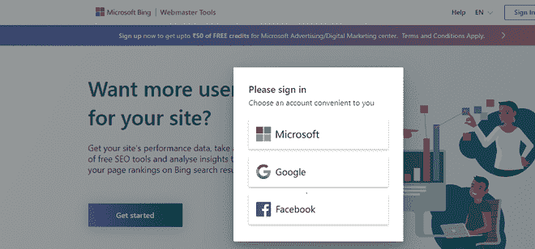
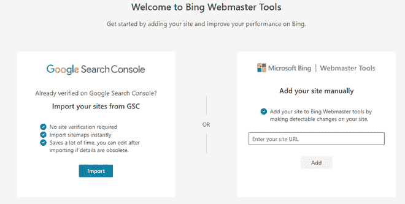
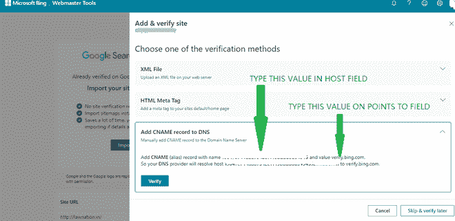

# 如何在必应站长工具上提交自己的网站？

> 原文:[https://www . geesforgeks . org/如何提交您的网站-在 bing 上-网站管理员-工具/](https://www.geeksforgeeks.org/how-to-submit-your-website-on-bing-webmaster-tools/)

Bing 是微软旗下的搜索引擎，上了年纪被称为 MSN 搜索、Windows Live 搜索、Live Search。它像谷歌一样提供各种搜索选项。例如地图、视频、图像、文本等。

截至 2018 年 10 月，必应是仅次于谷歌和百度的全球第三大搜索引擎。1998 年第三季度，微软推出了名为 MSN Search 的搜索引擎，取代了默认的 Internet Explorer 搜索引擎，取代了 Google。当时，它是与搜索引擎索引和网络爬虫一起推出的，必应提供的搜索结果是 Inktomi Inc .的贡献。到那时，它的搜索算法已经有了许多改进。

对于图像搜索，它与第三方服务 Picsearch 合作。现在，在大量改进的帮助下，它已经是全球第二大搜索引擎。

作为一个网络开发者或所有者，你应该知道搜索引擎对一个网站有多重要。我们已经介绍了一篇关于[如何将您的网站提交到谷歌搜索控制台](https://www.geeksforgeeks.org/how-to-submit-your-website-to-google-search-console/)的文章，在这篇文章中，我们将发现如何将网站提交到必应网站管理员工具。

**第一步:**前往 Bing 站长工具，借助谷歌、脸书或微软账号**登录。**

**第二步:**在新页面这里，你会有两个选项一个是从谷歌搜索控制台导入网站，另一个是手动添加网站。

**第三步:**我们会选择手动选项，只需输入你的网址，点击添加即可。

**步骤 4:** 现在，在这里选择第三个选项进行验证，这是由 CNAME 记录，并前往您的域名系统提供商**。**

**提示:**在我们的案例中，域名系统提供商是 Godaddy，如果您已经更改了您的域名服务器，并将其添加到其他域名系统提供商以进行正确管理，您也可以前往您的域名系统提供商，然后您应该前往那里。

**第五步:**到 Godaddy 后在那里签到，点击管理产品，点击那里的三个点。

**第六步:**在这里你会发现很多 DNS 记录，点击新增，选择类型为 CNAME。此外，在主机字段(唯一代码)中键入值，并指向(verify.bing.com)，最后单击添加。

**第 7 步:**现在等待几分钟，因为域名系统的更改可能需要几分钟来反映，最后在必应网站管理员工具上单击验证。

现在，你的网站已经通过必应网站管理员的验证，必应机器人将在几天后访问你的网站，之后，你的网站将在必应搜索中被索引。此外，在此之后，您将看到必应站长的仪表板，在这里您可以管理您的搜索首选项以及必应站长工具的所有其他相关内容。