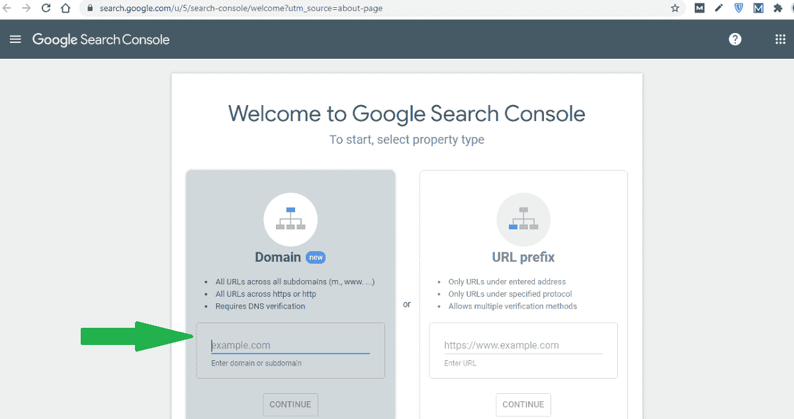
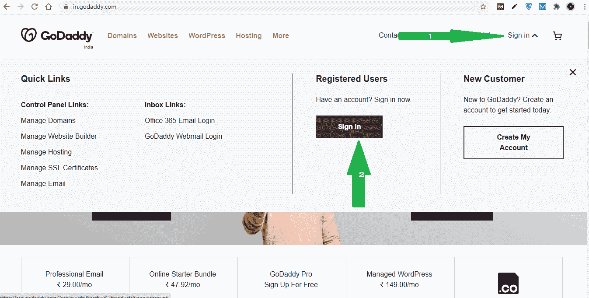
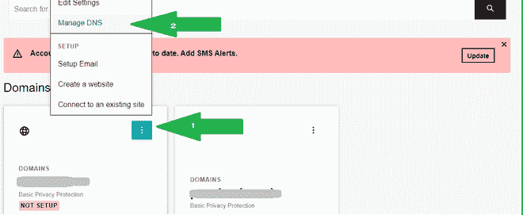
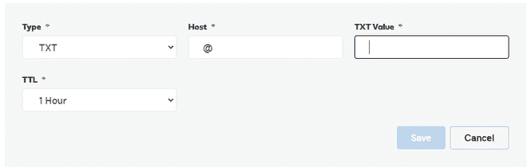
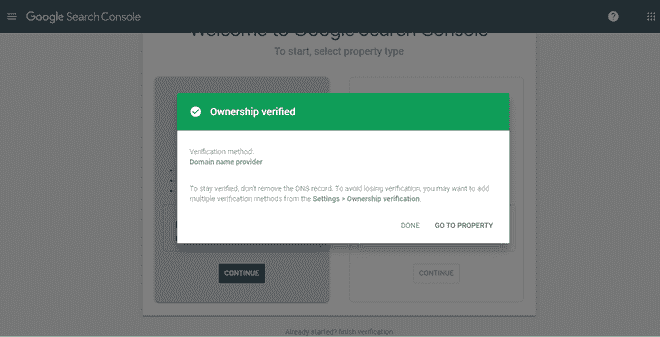

# 如何将网站提交到谷歌搜索控制台？

> 原文:[https://www . geesforgeks . org/如何将您的网站提交到谷歌搜索控制台/](https://www.geeksforgeeks.org/how-to-submit-your-website-to-google-search-console/)

谷歌搜索控制台是网站管理员可以检查索引状态和优化网站可见性的地方。以前，它被称为谷歌站长，但现在它已经改为谷歌搜索控制台。作为一个全栈 web 开发人员，我们应该熟悉谷歌的排名过程，以及搜索引擎优化是如何工作的。

我们必须创建谷歌喜欢的网络应用程序或网站，因为通过谷歌排名，它决定了一个网站将被数百万人使用，或者没有其他人知道该网站的名称。在谷歌上排名越靠前，网站的用户就会越多。根据专家的说法，谷歌根据 200 多个排名因素来决定一个网址的排名，在搜索引擎优化的前几个步骤中，将一个网站添加到搜索控制台。

在 GeeksforGeeks，我们已经讲述了搜索引擎优化及其各个方面:-

*   [搜索引擎优化(SEO) |基础知识](https://www.geeksforgeeks.org/search-engine-optimization-seo-basics/)
*   [搜索引擎优化类型](https://www.geeksforgeeks.org/types-of-seo/)
*   [移动搜索引擎优化(SEO)](Mobile Search Engine Optimization (SEO))

今天在这篇文章中，我们将了解如何告诉谷歌这是我们的网站，并请在您的搜索结果中对该网站进行排名。为此，我们必须将我们的网站添加到搜索控制台。

所以让我们开始一步一步来。

**第一步:**选择要添加到谷歌搜索控制台的新网站。现在，通过[点击这里](https://search.google.com/search-console/about)进入搜索控制台。

**第二步:**现在在这里输入你的域名，点击继续。

**第三步:**你会在这里看到一个弹出屏幕，上面有一个 DNS TXT 记录，复制那个 TXT 记录。

**步骤 4:** 在另一个选项卡中转到您的域名服务提供商，并登录仪表板。在我们这里，是**戈达迪。**

**提示:**其他 DNS 提供商的流程几乎相同。

**第五步:**登录后会有你的域名列表。在这里点击三个点，然后点击**管理域名系统**

**步骤:6** 现在，在新页面上，您将获得默认和先前创建的 DNS 记录列表。

在这里，点击添加选择类型为 TXT，给出类型“@”，将复制的 TXT 值粘贴在值字段中，也留下 TTL 1 小时，最后点击保存。

**步骤:7** 回到谷歌搜索控制台，点击验证。你会在屏幕上看到一个绿色的勾号，表示你的网站已经过验证。

完成了！希望你喜欢这篇文章。

在将您的网站提交到谷歌搜索控制台后，谷歌机器人将在一周或更早的时间内访问您的网站，并在谷歌搜索上显示您的网站。