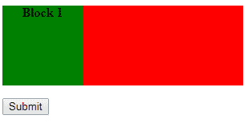
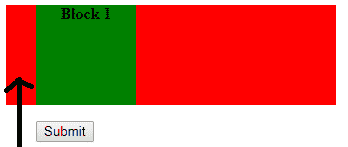
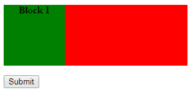
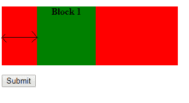

# 如何用制表符代替多个非中断空格(nbsp)？

> 原文:[https://www . geesforgeks . org/how-tab-space-而不是-multi-non-breaking-spaces-nbsp/](https://www.geeksforgeeks.org/how-to-tab-space-instead-of-multiple-non-breaking-spaces-nbsp/)

在 CSS 属性中**填充**和**边距**可以用来定位空格，而不是非中断空格。

**使用填充属性:**

通过使用填充属性，我们可以在元素的任何方向(即顶部、右侧、底部、左侧)从元素的边界给出任意数量的空间。这里我们只处理空格，所以我们只需要两个填充属性，即左填充和右填充。

**语法:**

```htmlhtml

padding-left : value;
or
padding-right : value;

```

**参数:**不需要参数。

**示例:**

```htmlhtml
<!DOCTYPE html>
<html>

<head>
<script src=
"https://ajax.googleapis.com/ajax/libs/jquery/3.3.1/jquery.min.js">
</script>
    <style>
        div {
            width: 300px;
            height: 100px;
            background-color: red;
        }

        P {
            width: 100px;
            height: 100px;
            background-color: green;
            text-align: center;
            font-weight: bold;
        }
    </style>
    <script>
        $(document).ready(function() {
            $("button").click(function() {
                $("#demo").css("padding-left", "30px");
            });
        });
    </script>
</head>

<body>

    <div id="demo">

        <p> Block 1 </p>

        <button>Submit</button>
    </div>

</body>

</html>
```

**输出:**
点击前。

点击后。


**使用保证金属性:**

通过使用 margin 属性，我们可以在元素的任何方向(即顶部、右侧、底部、左侧)从元素的边界给定任意数量的空间。这里我们只处理空格，所以我们只需要两个边距属性，即左边距和右边距。

**语法:**

```htmlhtml

margin-left : value;
or
margin-right : value;

```

**参数:**不需要参数。

**示例:**

```htmlhtml
<!DOCTYPE html>
<html>

<head>
<script src=
"https://ajax.googleapis.com/ajax/libs/jquery/3.3.1/jquery.min.js">
</script>
    <style>
        div {
            width: 300px;
            height: 100px;
            background-color: red;
        }

        P {
            width: 100px;
            height: 100px;
            background-color: green;
            text-align: center;
            font-weight: bold;
        }
    </style>
    <script>
        $(document).ready(function() {
            $("button").click(function() {
                $("#demo").css("margin-left", "60px");
            });
        });
    </script>
</head>

<body>

    <div>

        <p id="demo"> Block 1 </p>

        <button>Submit</button>
    </div>

</body>

</html>
```

**输出:**
点击前。

点击后。
