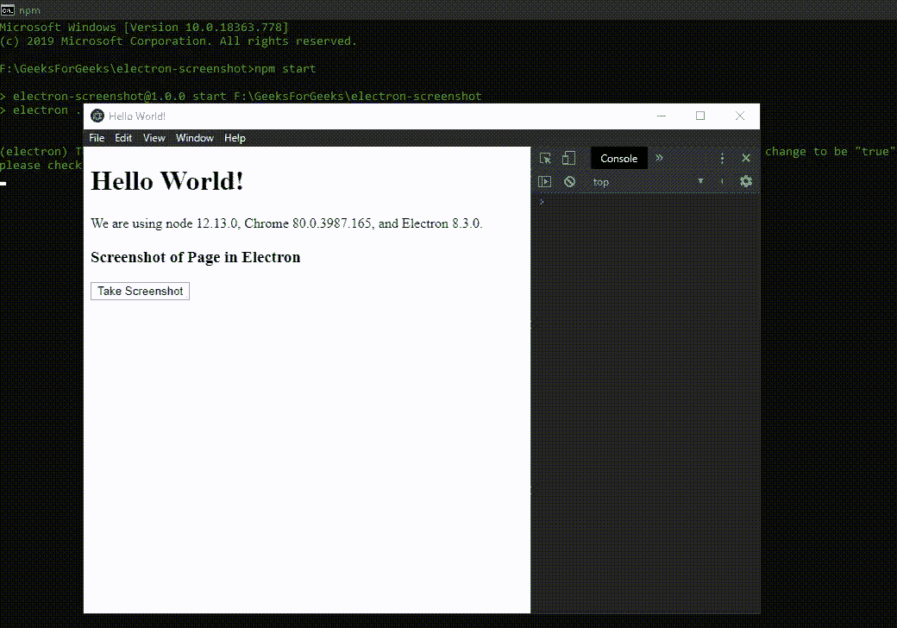

# 如何在电竞中截图？

> 原文:[https://www . geesforgeks . org/电子截图操作指南/](https://www.geeksforgeeks.org/how-to-take-screenshots-in-electronjs/)

[**electronijs**](https://www.geeksforgeeks.org/introduction-to-electronjs/)是一个开源框架，用于使用能够在**Windows****macOS**和 **Linux** 操作系统上运行的 HTML、CSS 和 JavaScript 等 web 技术构建跨平台原生桌面应用。它将 Chromium 引擎和 [**NodeJS**](https://www.geeksforgeeks.org/introduction-to-nodejs/) 结合成一个单一的运行时。

电子支持在桌面应用中从**网页**内生成 PDF 文件 和 [**打印文件**](https://www.geeksforgeeks.org/printing-in-electronjs/) 。除了这些功能，Electron 还提供了一种方法，通过该方法，我们可以拍摄**网页**的截图，并使用**浏览器窗口**对象和**网络内容**属性的实例方法将其作为图像文件保存到本机系统上。电子内部使用 **NativeImage** 类处理图像，因此我们还要求 **nativeImage** 模块的实例方法将相应的 **NativeImage** 转换为 **PNG** 或 **JPEG** 格式，然后才能保存到本机系统中。对于 [**将文件**](https://www.geeksforgeeks.org/save-files-in-electronjs/) 保存到本机系统，我们将使用电子中**对话框**模块的实例方法。本教程将演示如何在电子版中拍摄网页截图，并将它们保存到原生系统中。

我们假设您熟悉上述链接中介绍的先决条件。电子要工作， [**节点**](https://www.geeksforgeeks.org/introduction-to-nodejs/) 和 [**npm**](https://www.geeksforgeeks.org/node-js-npm-node-package-manager/) 需要预装在系统中。

**示例:**按照 [**中给出的步骤在电子表格**](https://www.geeksforgeeks.org/generate-pdf-in-electronjs/) 中生成 PDF，设置基本的电子应用程序。复制文章中提供的 **main.js** 文件和**index.html**文件的样板代码。还要对**包. json** 文件进行必要的更改，以启动电子应用程序。我们将继续使用相同的代码库构建我们的应用程序。设置电子应用程序所需的基本步骤保持不变。

**package.json:**

```htmlhtml
{
  "name": "electron-screenshot",
  "version": "1.0.0",
  "description": "Screenshot in Electron",
  "main": "main.js",
  "scripts": {
    "start": "electron ."
  },
  "keywords": [
    "electron"
  ],
  "author": "Radhesh Khanna",
  "license": "ISC",
  "dependencies": {
    "electron": "^8.3.0"
  }
}

```

根据项目结构创建**资产**文件夹。我们将使用**资产**文件夹作为默认路径来存储应用程序拍摄的截图图像。
**输出:**此时，我们的基本电子应用程序设置完毕。启动应用程序后，我们应该会看到以下结果。

[](https://media.geeksforgeeks.org/wp-content/uploads/20200512225834/Output-1105.png)

**电子版截图:****浏览器窗口**实例、**网站内容**属性和**对话框**模块是**主进程**的一部分。要在**渲染器进程**中导入和使用**浏览器窗口**对象和**对话框**模块，我们将使用电子**远程**模块。

**index.html**:在该文件中添加以下片段。**截图按钮**还没有任何相关功能。要进行更改，请在 **index.js** 文件中添加以下代码。

## 超文本标记语言

```htmlhtml
<h3>Screenshot of Page in Electron</h3>
<button id="screenshot">
  Take Screenshot
</button>
```

**index.js** :在该文件中添加以下代码片段。

## java 描述语言

```htmlhtml
const electron = require("electron");
const BrowserWindow = electron.remote.BrowserWindow;
const path = require("path");
const fs = require("fs");

// Importing dialog module using remote
const dialog = electron.remote.dialog;

// let win = BrowserWindow.getAllWindows()[0];
let win = BrowserWindow.getFocusedWindow();

var screenshot = document.getElementById("screenshot");
screenshot.addEventListener("click", (event) => {
    win.webContents
        .capturePage({
            x: 0,
            y: 0,
            width: 800,
            height: 600,
        })
        .then((img) => {
            dialog
                .showSaveDialog({
                    title: "Select the File Path to save",

                    // Default path to assets folder
                    defaultPath: path.join(__dirname, 
                                           "../assets/image.png"),

                    // defaultPath: path.join(__dirname, 
                    // '../assets/image.jpeg'),
                    buttonLabel: "Save",

                    // Restricting the user to only Image Files.
                    filters: [
                        {
                            name: "Image Files",
                            extensions: ["png", "jpeg", "jpg"],
                        },
                    ],
                    properties: [],
                })
                .then((file) => {
                    // Stating whether dialog operation was 
                    // cancelled or not.
                    console.log(file.canceled);
                    if (!file.canceled) {
                        console.log(file.filePath.toString());

                        // Creating and Writing to the image.png file
                        // Can save the File as a jpeg file as well,
                        // by simply using img.toJPEG(100);
                        fs.writeFile(file.filePath.toString(), 
                                     img.toPNG(), "base64", function (err) {
                            if (err) throw err;
                            console.log("Saved!");
                        });
                    }
                })
                .catch((err) => {
                    console.log(err);
                });
        })
        .catch((err) => {
            console.log(err);
        });
});
```

**解释:****win . webcontents . capturepage(矩形)**实例方法简单的抓取**矩形**对象指定的网页截图。省略**矩形**对象将捕获整个可见的**网页**，即整个可见的**浏览器窗口**实例。它接受以下参数。

*   **矩形:对象(可选)****矩形**对象。它由定义矩形及其在网页/屏幕上的位置所需的以下参数组成。
    *   **x:整数****X**矩形原点的坐标。在这种情况下，X 坐标表示要捕捉的网页/屏幕的坐标。
    *   **y:整数**矩形原点的 **Y** 坐标。在这种情况下，Y 坐标表示要捕捉的网页/屏幕的坐标。
    *   **宽度:整数**矩形的**宽度**。在这种情况下，它表示要捕捉的网页/屏幕的**宽度**。
    *   **高度:整数**矩形的**高度**。在这种情况下，它表示要捕捉的网页/屏幕的**高度**。

**win . webcontents . capturepage()**实例方法返回一个 **Promise** ，并在成功截图时用 **NativeImage** 实例解析。我们需要使用 **nativeImage** 模块的实例方法将这个 **NativeImage** 实例转换为 **JPEG** 或 **PNG** ，然后才能将其保存在本机系统上。

*   **image.toPNG(选项)**此实例方法通过返回包含图像的 **PNG** 编码数据的 NodeJS Buffer，将 **NativeImage** 实例转换为 **PNG** 格式。我们将使用此方法返回的缓冲区将图像写入**。png** 文件如代码所示使用 [**fs**](https://www.geeksforgeeks.org/node-js-file-system/) 模块。PNG 文件的默认编码是 **base64** 。它接受以下参数。
    *   **选项:对象(可选)****选项**对象由单个参数组成，即**比例因子:双(可选)**表示图像的比例因子(缩放)。默认情况下，取值为 **1.0** 。
*   **image . to peg(quality)**此实例方法通过返回包含图像的 **JPEG** 编码数据的 NodeJS BUffer，将 **NativeImage** 实例转换为 **JPEG** 格式。我们将使用此方法返回的缓冲区将图像写入**。jpeg** 文件如代码所示使用 [**fs**](https://www.geeksforgeeks.org/node-js-file-system/) 模块。JPEG 文件的默认编码是 **base64** 。它接受以下参数。
    *   **质量:整数**该值不能为空。它可以接受介于 **0** 和 **100** 之间的值。该值代表图像的质量因子， **0** 为最低质量， **100** 为最高质量图像。

**对话框**模块的**对话框. showSaveDialog(选项)**实例方法用于与原生文件系统交互，打开一个系统对话框，通过获取用户指定的文件路径将文件保存在本地。默认情况下，我们将指定**资源**文件夹的文件路径，并将图像文件保存为 **PNG** 格式，名称为**image.png**。有关如何限制用户使用**对话框的 PNG/JPEG 格式和属性的更多信息，请参考 [**在电子文档中保存文件**](https://www.geeksforgeeks.org/save-files-in-electronjs/) 。
在**渲染器进程**中获取当前**浏览器窗口**实例，可以使用**浏览器窗口**对象提供的一些*静态*方法。**

*   **BrowserWindow . getallwindow():**此方法返回一个活动/打开的 BrowserWindow 实例数组。在这个应用程序中，我们只有一个活动的**浏览器窗口**实例，它可以直接从数组中引用，如代码所示。
*   **浏览器窗口. getFocusedWindow():** 此方法返回在应用程序中聚焦的**浏览器窗口**实例。如果没有找到当前浏览器窗口实例，则返回**空值**。在这个应用程序中，我们只有一个活动的**浏览器窗口**实例，可以使用这个方法直接引用它，如代码所示。

**输出:**

[](https://media.geeksforgeeks.org/wp-content/uploads/20200603213524/Output-15.gif)