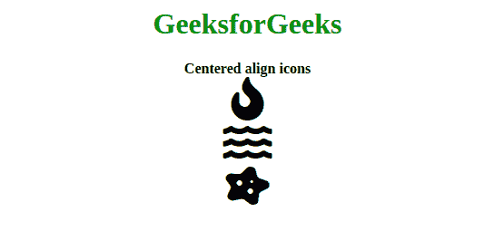

# 如何瞄准所有 Font Awesome 图标并居中对齐？

> 原文:[https://www . geesforgeks . org/how-to-target-all-font-awesome-icons-and-align-center/](https://www.geeksforgeeks.org/how-to-target-all-font-awesome-icons-and-align-them-center/)

Font Awesome 是一个很棒的工具包，开发者可以用它来获取基于 CSS 和 LESS 的图标。网上还有其他图标包，但 Font Awesome 在开发者社区更受欢迎。它有大量免费使用的图标。

最喜欢的字体牛逼图标居中方式是给每个 **[< i >标签](https://www.geeksforgeeks.org/html-i-tag/)** 分配一个**居中**类。将宽度设置为 100%，让每个图标水平覆盖 100%的区域。此外，文本对齐然后根据所使用的宽度将图标居中。

如果我们想在我们的窗口上定位我们的字体真棒图标，并使用以下方法将它们对齐到中心

*   **Example 1:** Adding a custom class in all **<i> tag**. This method can be used for all Font Awesome Icons on a page.
    **Program:**

    ```html
    <!DOCTYPE html>
    <html>
        <head>
            <script src=
    "https://kit.fontawesome.com/a6e2755b4d.js" 
                    crossorigin="anonymous">
            </script>
            <style>
                .center {
                    text-align: center;
                    width: 100%;
                }
            </style>
        </head>
        <body>
            <center>
                <h1 style="color: green;">
                  GeeksforGeeks
                </h1>
                <b>
                    Centered align icons
                </b>
            </center>
            <br>
            <i class="fas fa-fire fa-3x center"></i>
            <i class="fas fa-water fa-3x center"></i>
            <i class="fas fa-disease fa-3x center"></i>
        </body>
    </html>
    ```

    **输出:** 

*   **Example 2:** Adding a custom class in a **div** tag. This method can only be used for a section of website dedicated to Font Awesome Icons.
    **Program:**

    ```html
    <!DOCTYPE html>
    <html>
        <head>
        <script src=
    "https://kit.fontawesome.com/a6e2755b4d.js" 
                crossorigin="anonymous">
        </script>
        <style>
        .center {
            text-align:center;
            width:100%;
        }
        </style>
    </head>
        <body>
            <center>
                <h1 style="color: green;">
                  GeeksforGeeks
                </h1>
                <b>
                    Centered align icons
                </b>
            </center>
            <br>
            <div class="center">
                <i class="fas fa-fire fa-3x"></i>
                <br>
                <i class="fas fa-water fa-3x"></i>
                <br>
                <i class="fas fa-disease fa-3x"></i>
            </div>
        </body>
    </html>

    ```

    **输出:** 

*   **Example 3:** Adding a **[HTML <center> tag](https://www.geeksforgeeks.org/html-center-tag/)** for a particular section. This method can only be used for a section of a website dedicated to Font Awesome Icons.

    ```html
    <!DOCTYPE html>
    <html>
        <head>
        <script src=
    "https://kit.fontawesome.com/a6e2755b4d.js" 
                crossorigin="anonymous">
        </script>
    </head>
        <body>
            <center>
                <h1 style="color: green;">
                  GeeksforGeeks
                </h1>
                <b>
                    Centered align icons
                </b>
                <br>
                <i class="fas fa-fire fa-3x"></i>
                <br>
                <i class="fas fa-water fa-3x"></i>
                <br>
                <i class="fas fa-disease fa-3x"></i>
            </center>
        </body>
    </html>
    ```

    **输出:** 