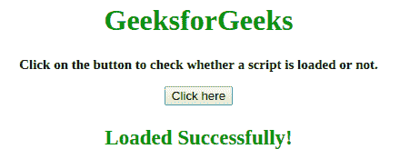
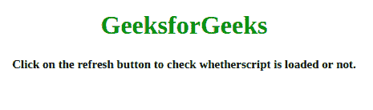

# 如何判断`<script>`标签是否加载失败？

> 原文:[https://www . geesforgeks . org/如何判断脚本标签加载失败/](https://www.geeksforgeeks.org/how-to-tell-if-a-script-tag-failed-to-load/)

问题是识别传递的脚本是否使用 JavaScript 成功加载。下面讨论两种方法:

**方法 1:**

*   将变量 loaded 设置为 false。
*   在
*   将**设置为加载**参数，如果加载的脚本设置为加载=真。

**示例:**这个示例说明了上面讨论的方法。

```
<!DOCTYPE HTML> 
<html> 

<head> 
    <title> 
        How to tell if a script tag failed
        to load in JavaScript ?
    </title>

    <script>
        var loaded = false;
    </script>

    <script src=
"https://ajax.googleapis.com/ajax/libs/jquery/3.4.1/jquery.min.js"
                onload="loaded=true;" >
    </script>
</head> 

<body style = "text-align:center;"> 

    <h1 style = "color:green;"> 
        GeeksgorGeeks 
    </h1>

    <p id = "GFG_UP" style = 
        "font-size: 15px; font-weight: bold;">
    </p>

    <button onclick = "gfg_Run()"> 
        Click here
    </button>

    <p id = "GFG_DOWN" style =
        "font-size: 23px; font-weight: bold; color: green; ">
    </p>

    <script>
        var el_up = document.getElementById("GFG_UP");
        var el_down = document.getElementById("GFG_DOWN");

        el_up.innerHTML = "Click on the button to check "
                    + "whether script is loaded or not."; 

        function gfg_Run() {
            if(loaded) {
                el_down.innerHTML = "Loaded Successfully!";
            }
            else {
                el_down.innerHTML = "Not loaded!";
            }
        }         
    </script> 
</body> 

</html>
```

**输出:**

*   **点击按钮前:**
    
*   **点击按钮后:**
    

**方法 2:**

*   将变量 loaded 设置为 false。
*   在
*   将**设置为加载**参数，如果加载了脚本，则触发警报。
*   如果不是，那么检查加载的变量，如果它等于假，那么脚本没有加载。

**示例:**该示例遵循上面讨论的方法。

```
<!DOCTYPE HTML> 
<html> 

<head> 
    <title> 
        How to tell if a script tag failed
        to load in JavaScript ?
    </title>

    <script>
        var loaded = false;
    </script>

    <script src="" 
        onload="alert('Script loaded!'); loaded=true;" >
    </script>
</head> 

<body style = "text-align:center;" id = "body"> 

    <h1 style = "color:green;" > 
        GeeksforGeeks 
    </h1>

    <p id = "GFG_UP" style = 
            "font-size: 15px; font-weight: bold;">
    </p>

    <script>
        var el_up = document.getElementById("GFG_UP");
        el_up.innerHTML = "Click on the refresh button "
            + "to check whether script is loaded or not.";

        if(!loaded) {
            alert("Script not loaded!");
        }
    </script> 
</body> 

</html>
```

**输出:**

*   **点击按钮前:**
    
*   **点击刷新按钮后:**
    