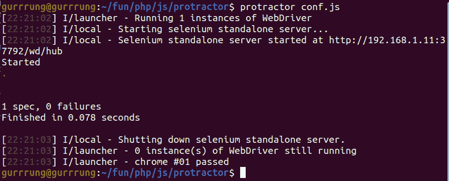

# 如何用量角器测试一个元素的标签名？

> 原文:[https://www . geeksforgeeks . org/如何使用量角器测试元素标签的名称/](https://www.geeksforgeeks.org/how-to-test-the-name-of-tag-of-an-element-using-protractor/)

**量角器**是为 Angular 和 AngularJS 应用开发的端到端测试框架。它像一个真正的用户一样，在一个真正的浏览器中运行与它交互的应用程序。在本文中，我们将测试元素标签的名称。

**先决条件:** [量角器的安装和设置](https://www.geeksforgeeks.org/angularjs-end-to-end-e2e-testing-protractor-installation-and-setup/)

**进场:**

*   我们将创建一个基本的测试程序，在其中我们将测试元素标签的名称。
*   所有量角器测试都将有一个包含配置的文件，这将是启动测试的初始文件。
*   Let’s create this file with the name **conf.js**.

    conf . js:t1]

    ## java 描述语言

    ```htmlhtml
    exports.config = {

        // Capabilities to be passed to the
        // webdriver instance.
        capabilities: {
            'browserName': 'chrome'
        },

        // Framework to use. Jasmine is recommended.
        framework: 'jasmine',

        // Spec patterns are relative 
        // to the current working directory when
        // protractor is called.
        specs: ['test.js'],

        // Options to be passed to Jasmine.
        jasmineNodeOpts: {
            defaultTimeoutInterval: 30000
        },

        // Url for the file
        baseUrl: 'file://' + __dirname + '/',

        onPrepare: function () {
            browser.resetUrl = 'file://';
        }
    };
    ```

*   现在让我们创建一个名为**test.html**的 HTML 文件，它将包含要测试的元素。

    ## 超文本标记语言

    ```htmlhtml
    <!DOCTYPE html>
    <html lang="en">

    <head>
        <meta charset="UTF-8">
        <meta name="viewport" content=
          "width=device-width, initial-scale=1.0">
        <title>Testing</title>
    </head>

    <body>

        <!-- The element to be tested -->
        <section id="sample-element">
            Inner text
        </section>
    </body>

    </html>
    ```

*   现在让我们创建我们的测试文件 **test.js** 。在这个文件中，我们将访问一个 HTML 文件，并测试元素标签的名称。
*   浏览器是量角器创建的全局，用于浏览器级命令，如使用**浏览器导航，获取**。
*   The **describe** and **it** syntax is from the Jasmine framework where **describe** is a description of your test while **it** is the steps for the test.

    名为 **test.js:** 的规范文件

    ## java 描述语言

    ```htmlhtml
    describe('Protractor Demo App', function () {
        it('should have a tagname', function () {
            // Disabling waiting for angular
            browser.waitForAngularEnabled(false)

            // Get our html file for testing
            browser.get('test.html');

            // Test if the element with id 'sample-element'
            // has the tag 'section'
            let sampleDiv = element(by.id('sample-element'));
            expect(sampleDiv.getTagName()).toBe('section');
        });
    });
    ```

*   最后，我们准备使用下面给出的命令运行我们的文件:

    ```htmlhtml
    protractor conf.js
    ```

*   这将运行配置文件，测试将如下图所示运行:

**输出:**

