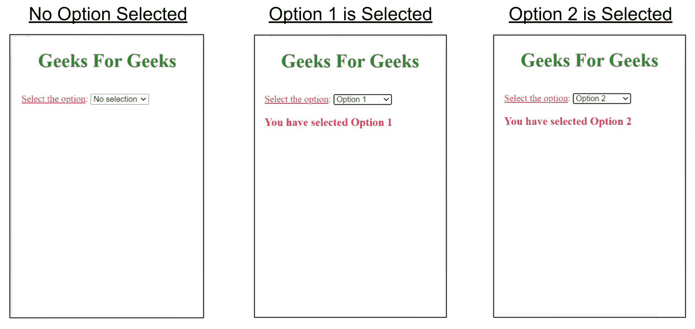

# 如何在谷歌 amp 中使用 amp-bind 切换除法的可见性？

> 原文:[https://www . geeksforgeeks . org/如何在 google-amp/](https://www.geeksforgeeks.org/how-to-toggle-the-visibility-of-division-using-amp-bind-in-google-amp/) 中切换分部使用 amp-bind 的可见性


**简介:**有时候你想给你的 AMP 页面增加自定义的交互性，让你的页面看起来更用户友好，更用户调用。虽然 AMP 的预建组件有限，所以做 amp-bind 就是为了克服这个问题。它帮助开发人员在不使用 AMP 的预构建组件的情况下为页面添加自定义交互性。

**设置:**要在页面中使用 amp-bind，您必须在文档的标题中导入其脚本。

```html
<script async custom-element="amp-bind" src=
"https://cdn.ampproject.org/v0/amp-bind-0.1.js">
</script>
```

谷歌 amp 的 amp-bind 由三个主要概念组成:

1.  **状态:**状态变量负责基于用户动作的页面更新。定义一个状态变量是非常重要的。
2.  **表达式:**它们就像是用来指代状态的 JavaScript 表达式。
3.  **绑定:**它们是一种特殊的属性，用于通过表达式将元素的属性链接到状态。

**示例:**根据所选选项动态隐藏和显示分区。

```html
<!DOCTYPE html>
<html amp>

<head>
    <meta charset="utf-8" />
    <title>GeeksForGeeks | amp-bind</title>

    <link rel="canonical" href=
"https://amp.dev/documentation/examples/components/amp-bind/index.html" />

    <meta name="viewport" content="width=device-width,
            minimum-scale=1, initial-scale=1" />

    <script async src=
        "https://cdn.ampproject.org/v0.js">
    </script>

    <!-- Import amp-bind component in the header -->
    <script async custom-element="amp-bind" 
        src="https://cdn.ampproject.org/v0/amp-bind-0.1.js">
    </script>

    <style amp-boilerplate>
        body {
            -webkit-animation:
                -amp-start 8s steps(1, end) 0s 1 normal both;

            -moz-animation:
                -amp-start 8s steps(1, end) 0s 1 normal both;

            -ms-animation:
                -amp-start 8s steps(1, end) 0s 1 normal both;

            animation:
                -amp-start 8s steps(1, end) 0s 1 normal both;
        }

        @-webkit-keyframes -amp-start {
            from {
                visibility: hidden;
            }

            to {
                visibility: visible;
            }
        }

        @-moz-keyframes -amp-start {
            from {
                visibility: hidden;
            }

            to {
                visibility: visible;
            }
        }

        @-ms-keyframes -amp-start {
            from {
                visibility: hidden;
            }

            to {
                visibility: visible;
            }
        }

        @-o-keyframes -amp-start {
            from {
                visibility: hidden;
            }

            to {
                visibility: visible;
            }
        }

        @keyframes -amp-start {
            from {
                visibility: hidden;
            }

            to {
                visibility: visible;
            }
        }
    </style>

    <noscript>
        <style amp-boilerplate>
            body {
                -webkit-animation: none;
                -moz-animation: none;
                -ms-animation: none;
                animation: none;
            }
        </style>
    </noscript>

    <style amp-custom>
        h1 {
            color: forestgreen;
        }
    </style>
</head>

<body>
    <center>
        <h1>Geeks For Geeks</h1>
    </center>

    <!-- This sample toggles the visibility of 
        two divs based on a input selection. 
        AMP provides the [`hidden` attribute], 
        which we use to hide and show the two 
        divs. Some elements, such as the `select` 
        element, fire [events] we can use to 
        update state -->
    <div style="padding: 1em; color: crimson;">
        <label><u>Select the option</u>: </label>
        <select on="change:AMP.setState
                    ({option: event.value})">
            <option value="0">No selection</option>
            <option value="1">Option 1</option>
            <option value="2">Option 2</option>
        </select>
        <br />

        <div hidden [hidden]="option != 1">
            <h3>You have selected Option 1</h3>
        </div>

        <div hidden [hidden]="option != 2">
            <h3>You have selected Option 2</h3>
        </div>
    </div>
</body>

</html>
```

**输出:**
