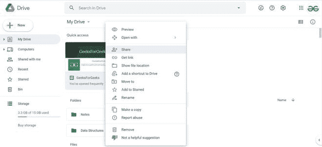
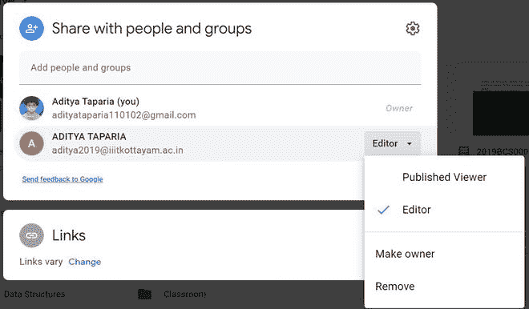
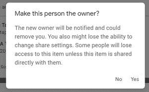

# 如何在新谷歌网站中转移所有权？

> 原文:[https://www . geesforgeks . org/如何在新的谷歌网站上转移所有权/](https://www.geeksforgeeks.org/how-to-transfer-ownership-in-new-google-sites/)

有时你想把你网站的全部所有权转让给别人，这可以通过在谷歌网站上制作的网站来实现。您可以通过任何人的 Gmail 帐户将您在谷歌网站上创建的网站的所有权转让给他们。要转移所有权，请执行以下步骤:

*   去你的谷歌驱动器的同一账户，搜索该网站。

*   选择要传输的网站，并进入其“共享”权限窗口。如果您尚未添加所需的人员，并且选择他作为所有者，则可以添加人员。

*   当您选择他作为所有者后，将出现一个确认对话框，点击是，然后完成。

通过这种方式，您可以将网站的所有权转让给任何其他人。

**限制:**

*   这种转移的唯一限制是，如果你是 G 西装用户，你不能将所有权从你的 G 西装域之外转移给任何人。