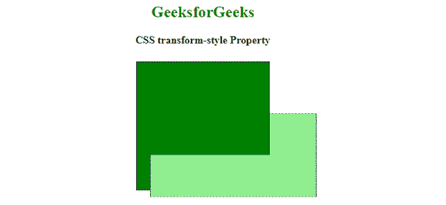
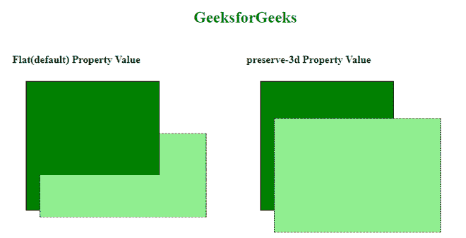

# 如何变换子元素保留 3D 变换？

> 原文:[https://www . geeksforgeeks . org/如何转换-子元素-保留-3d-transformations/](https://www.geeksforgeeks.org/how-to-transform-child-elements-preserve-the-3d-transformations/)

[CSS **变换样式**](https://www.geeksforgeeks.org/css-transform-style-property/#:~:text=The%20transform%2Dstyle%20property%20is,the%20plane%20of%20the%20element.) 属性用于变换子元素以保留 3D 变换。*变换样式*属性用于指定元素的子元素位于三维空间中，或者相对于元素平面展平。元素的*保留-3d* 属性值，可以保留其子元素的 3d 变换。

**语法:**

```html
transform-style: preserve-3d
```

**属性值:**

*   **保留-3d:** 该值使子元素能够保留其 3d 位置。

**例 1:**

## 超文本标记语言

```html
<!DOCTYPE html>
<html>
  <head>
    <style>
      h2 {
        color: green;
      }
      .parent {
        margin: 20px;
        border: 1px double;
        height: 200px;
        width: 200px;
        background-color: green;
        transform: rotateX(15deg);
        /* Now its child's 3d-position is preserved which means 
              childrens of the this element should be positioned
              in the 3D-space not in a plane */
        transform-style: preserve-3d;
      }
      .child {
        margin: 20px;
        border: 1px dashed;
        height: 250px;
        width: 250px;
        background-color: lightgreen;
        transform: rotateX(45deg);
      }
    </style>
  </head>

  <body>
    <center>
      <h2>GeeksforGeeks</h2>
      <b>CSS transform-style Property</b>

      <div class="parent">
        <div class="child"></div>
      </div>
    </center>
  </body>
</html>
```

**输出:**



变换样式:保留 3d

**例 2:**

## 超文本标记语言

```html
<!DOCTYPE html>
<html>
  <head>
    <style>
      h2 {
        color: green;
      }
      .parent {
        margin: 20px;
        border: 1px double;
        height: 200px;
        width: 200px;
        background-color: green;
        transform: rotateX(15deg);
        /* Now its child's 3d-position is preserved which means 
            childrens of the this element should be positioned
            in the 3D-space not in a plane */
        transform-style: preserve-3d;
      }
      .child {
        margin: 20px;
        border: 1px dashed;
        height: 250px;
        width: 250px;
        background-color: lightgreen;
        transform: rotateX(45deg);
      }

      .gfg1 {
        margin: 20px;
        border: 1px double;
        height: 200px;
        width: 200px;
        background-color: green;
        transform: rotateX(15deg);
        /* flat is default value whose children element 
             are lying in the plane of the element itself */
        transform-style: flat;
      }

      .gfg2 {
        margin: 20px;
        border: 1px dashed;
        height: 250px;
        width: 250px;
        background-color: lightgreen;
        transform: rotateX(45deg);
      }
    </style>
  </head>

  <body>
    <center>
      <h2>GeeksforGeeks</h2>
      <br />
      <table>
        <tr>
          <td width="350px">
            <div>
              <b>Flat(default) Property Value</b>

              <div class="parent">
                <div class="child"></div>
              </div>
            </div>
          </td>
          <td width="350px">
            <div>
              <b>preserve-3d Property Value</b>

              <div class="gfg1">
                <div class="gfg2"></div>
              </div>
            </div>
          </td>
        </tr>
      </table>
    </center>
  </body>
</html>
```

**输出:**



平整并保留 3d 属性