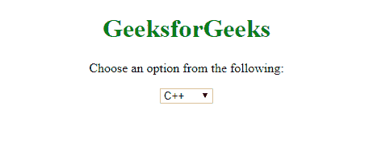
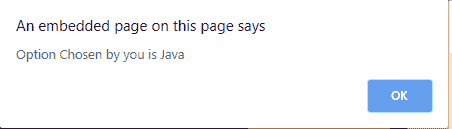
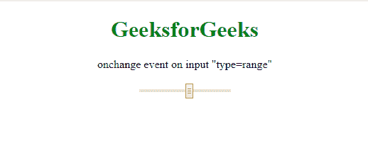
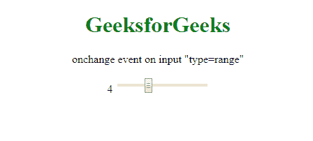

# 在 Firefox 中拖动时如何在输入类型=range 上触发 onchange 事件？

> 原文:[https://www . geesforgeks . org/how-to-trigger-on-change-event-on-input-type range-in-Firefox 中的拖动操作/](https://www.geeksforgeeks.org/how-to-trigger-onchange-event-on-input-typerange-while-dragging-in-firefox/)

**Onchange:** 当用户改变*选择*元素的状态时，Onchange 执行一个 JavaScript。该属性仅在元素变得不聚焦时出现。

**语法:**

```
<select onchange="function()">

```

**属性值:**作用于 **<选择>** 元素，提交值后触发给定的 JavaScript。

**示例:**

```
<!DOCTYPE html>
<html>

<head>
    <title>Onchange</title>
    <script type="text/javascript">
        function Optionselection(select) {
            var chosen = select.options[select.selectedIndex];
            alert("Option Chosen by you is " + chosen.value);
        }
    </script>
</head>

<body>
    <center>
        <h1 style="color:green">GeeksforGeeks</h1>
        <p>Choose an option from the following:</p>

        <select onchange="Optionselection (this)">
            <option value="C++" />C++
            <option value="Java" />Java
            <option value="Python" />Python
        </select>
    </center>
</body>

</html>
```

**输出:**
**前:**


**之后:**


范围滑块是一种常见的用户界面设计，用于展示当用户移动滑块时所描绘的值的即时变化。上述浏览器(包括 chrome)并非如此。
虽然，有人可能会说 Firefox 展示了正确的行为，因为 **onchange** 事件只在控件失去焦点时执行(无论是鼠标拖动还是键盘)。但是，为了显示随滑块移动而变化的值，需要将**应用于“T4”事件属性。**

**Oninput:** 很像 onchange 事件，这个属性在接收用户输入值时工作。主要区别是当元素的值改变时，它会立即执行。

**语法:**

```
<element oninput = "script">
```

**说明解决方案的程序:**

```
<!DOCTYPE html>
<html>

<head>
    <title>onchange event on input type=range</title>
</head>

<body>
    <center>
        <h1 style="color:green">GeeksforGeeks</h1>
        <p>onchange event on input "type=range"</p>

        <span id="value"></span>
        <input type="range" 
               min="1"
               max="10" 
               step="1" 
               oninput="DisplayChange(this.value)">
        <script>
            function DisplayChange(newvalue) {
                document.getElementById(
                  "value").innerHTML = newvalue;
            }
        </script>
    </center>
</body>

</html>
```

**输出:**
**前:**


**之后:**
