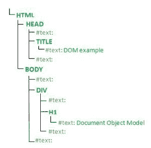
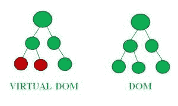
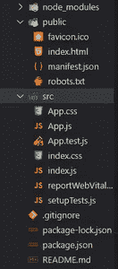
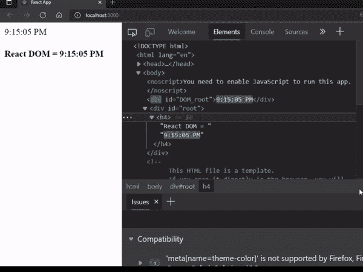

# 如何通过虚拟 DOM 理解？

> 原文:[https://www . geesforgeks . org/如何通过虚拟 dom 理解/](https://www.geeksforgeeks.org/how-to-understand-by-virtual-dom/)

[DOM](https://www.geeksforgeeks.org/dom-document-object-model/) 是一个文档对象模型，它将 [XML](https://www.geeksforgeeks.org/xml-basics/) 或 [HTML](https://www.geeksforgeeks.org/html-tutorials/) 文档的内容表示为树形结构，以便程序可以在文档结构、样式和内容方面进行读取、访问和更改。

让我们看看 DOM 是如何解析文档的。考虑下面的示例 HTML 代码。

## 超文本标记语言

```html
<html>

<head>
    <title>DOM example</title>
<body>
    <div>
        <h1>Document Object Model</h1>
    </div>
</body>
</head>

</html>
```

上面的代码创建了如下所示的树结构:



DOM 结构

现在我们对 DOM 有了一个基本的概念，如果你仍然不确定，请在这里学习[。](https://www.geeksforgeeks.org/dom-document-object-model/)

**虚拟 DOM:** 名字本身就说是虚拟创建的 DOM。虚拟 DOM 与 DOM 完全一样，它具有 DOM 所具有的所有属性。但主要的区别是，每当一个代码运行时，JavaScript 框架会立即更新整个 DOM，这导致了缓慢的性能。而虚拟 DOM 只更新 DOM 的修改部分。让我们理解清楚:

运行代码时，网页被分成不同的模块。所以，虚拟 DOM 将其与 DOM 进行比较，并检查是否有任何差异。如果它发现了差异，那么 DOM 只更新被修改的部分，而另一部分保持不变。



如上图所示，虚拟 DOM 不同于 DOM，现在 DOM 更新的是不同的子组件，其他的保持完全一样。这提高了性能。

现在让我们看一个虚拟 DOM 如何工作的例子:

**创建反应应用程序:**

*   **步骤 1:** 使用以下命令创建一个 react 应用程序。

```html
npx create-react-app foldername
```

*   **步骤 2:** 使用以下命令将您的目录更改为新创建的文件夹。

```html
cd foldername
```

**项目结构:**如下图:



项目结构

**实现:**在各自的文件中写下以下代码。

**文件名:index.html**

## 超文本标记语言

```html
<!DOCTYPE html>
<html lang="en">

<head>
    <title>React App</title>
</head>

<body>
    <div id="DOM_root"></div>
    <div id="root"></div>
</body>

</html>
```

**文件名:index.js**

## java 描述语言

```html
import React from "react";
import ReactDOM from "react-dom";

function time() {

  // DOM using HTML syntax
  document.getElementById("DOM_root").innerHTML
    = new Date().toLocaleTimeString();

  // Virtual DOM using react syntax
  const Virtual_element = React.createElement(
    "h4",
    null,
    "React DOM =  ",
    new Date().toLocaleTimeString()
  );

  ReactDOM.render(Virtual_element, 
    document.getElementById("root"));
}

setInterval(time, 1000);
```

**运行应用程序的步骤:**从项目的根目录使用以下命令运行应用程序:

```html
npm start
```

**输出:**打开浏览器，右键点击屏幕，选择**检查。**可以看到如下输出。



从上面的输出可以看到，整个 **div** 元素随着 DOM 中的时间在更新。而在虚拟 DOM 中，只有 **h4** 元素在更新，其他元素保持不变。所以这表明虚拟 DOM 找到了修改的部分，并且只更新了那个修改的部分。